# 既存データの地図データと属性データ
本教材は、「既存データの地図データと属性データの実習用教材」です。GISで利用できる地図データや属性データのダウンロード手法について解説しています。データのダウンロードには、WEBブラウザを用いています。  
講義用教材として、[地理情報科学教育用スライド（GIScスライド）]の2章が参考になります。  

本教材を使用する際は、[利用規約]をご確認いただき、これらの条件に同意された場合にのみご利用下さい。

[地理情報科学教育用スライド（GIScスライド）]:http://curricula.csis.u-tokyo.ac.jp/slide/2.html
[利用規約]:../../../../master/利用規約.md

**Menu**
-----
**国・地方自治体のGISデータのダウンロード**
- [国土交通省のGISデータ基盤地図情報(国土地理院)](#国土交通省のGISデータ基盤地図情報(国土地理院))
- [国土交通省のGISデータ国土数値情報](#国土交通省のGISデータ国土数値情報)
- [環境省のGISデータ](#環境省のGISデータ)
- [総務省のGISデータ](#総務省のGISデータ)
- [その他のGISデータ](#その他のGISデータ)
- [オープンデータ](#オープンデータ)

**スライド教材**  
スライドのダウンロードは[こちら]
[こちら]:../../../../raw/master/GISオープン教材/07_既存データの地図データと属性データ/既存データの地図データと属性データ.pptx

----------
## <a name = 国土交通省のGISデータ基盤地図情報(国土地理院)>国土交通省のGISデータ基盤地図情報(国土地理院)

[国土地理院]のサイトにアクセスする。  
地図・空中写真・地理調査をクリックし、基盤地図情報をクリックする。
[国土地理院]:<http://www.gsi.go.jp/>

基盤地図情報のダウンロードをクリックし、ログインを行う。  
※登録をしていない場合は、新規登録を行う。

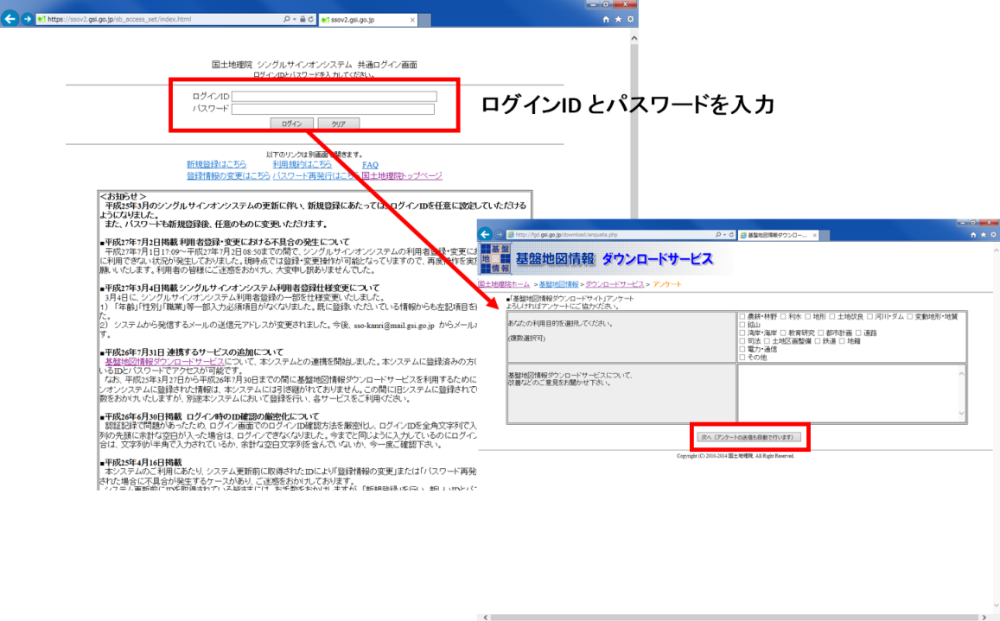
ログインIDとパスワードを入力する。  
アンケートを入力し、次へをクリックする。

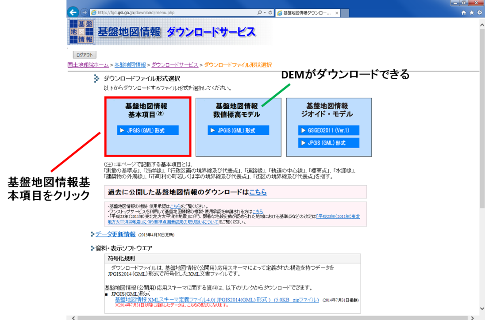
基盤地図情報基本項目をクリックし、基盤地図情報のダウンロード画面へ進む。

ダウンロードしたい基盤地図情報基本項目にチェックをいれ場所を選択し 次へ をクリックする。  
全てチェックをクリックし、まとめてダウンロードをクリックする。  
Zipファイルを解凍し、中のファイルを確認する。

### 基盤地図情報ビューアをダウンロードする

[基盤地図情報サイト](http://fgd.gsi.go.jp/download/menu.php) からビューアをダウンロードし、データをshapeファイルに変換する。

ダウンロードしたZipファイルを解凍し、.exeファイルを開くと、ビューアが立ち上がる。

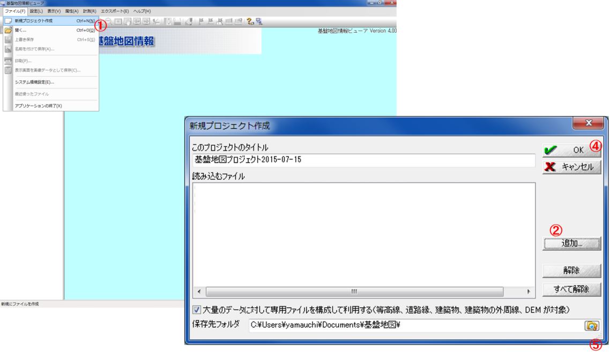
①ファイルを開き、新規プロジェクト作成をクリックする。  
②追加からダウンロードしたファイルを選択。  
③保存先フォルダを作成し、指定する。  
④OKをクリック。  
しばらくすると、データが表示される。
読み込むデータの量によってフリーズすることがあるので注意する。

①エクスポートをクリックする。  
②シェープファイルを選択する。  
③8系を選択する（データによって変わるため注意する）。  
④全データ領域を出力にチェック（データ量によって変えること）する。
⑤全てにチェックをつける（データ量や目的によって変えること）する。  
⑥出力先のフォルダを選択する。  
⑦OKをクリックする。  
※変換が終わるまで時間がかかる（途中でフリーズの可能性あり）。  

  [▲メニューへもどる]  
[▲メニューへもどる]:既存データの地図データと属性データ.md#menu
## <a name = 国土交通省のGISデータ国土数値情報>国土交通省のGISデータ国土数値情報

[国土数値情報]のサイトにアクセスする。

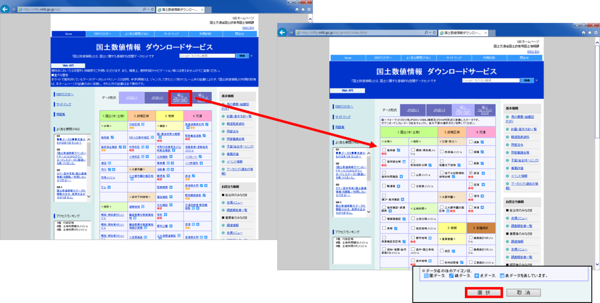
統一フォーマット（SHP・GML）をクリックする。
必要な項目にチェックをいれて、下段の選択をクリックする。
[国土数値情報]:<http://nlftp.mlit.go.jp/ksj/>

地域にチェックをいれ選択をクリックする。  
ダウンロードしたい項目にチェックをいれ、選択をクリックする。

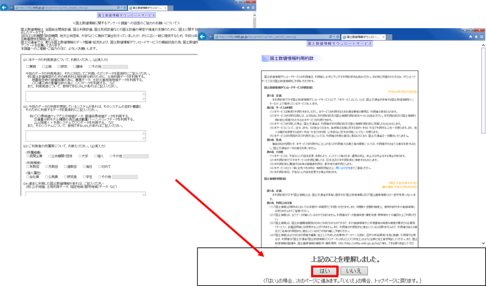
アンケートに回答し、利用約款を読み はい をクリックする。

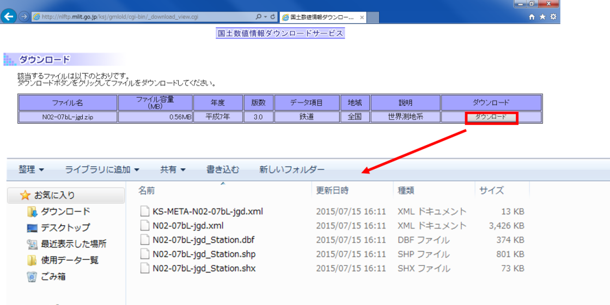
ダウンロードをクリックする。  
ダウンロードしたファイルを解凍し、中のファイルを確認する。

  [▲メニューへもどる]  
## <a name = 環境省のGISデータ>環境省のGISデータ
[生物多様性]のサイトにアクセスする。

[生物多様性]:<http://www.biodic.go.jp/J-IBIS.html>
自然環境GISをクリックする。
KMLファイルとShapeファイルが選択できる。

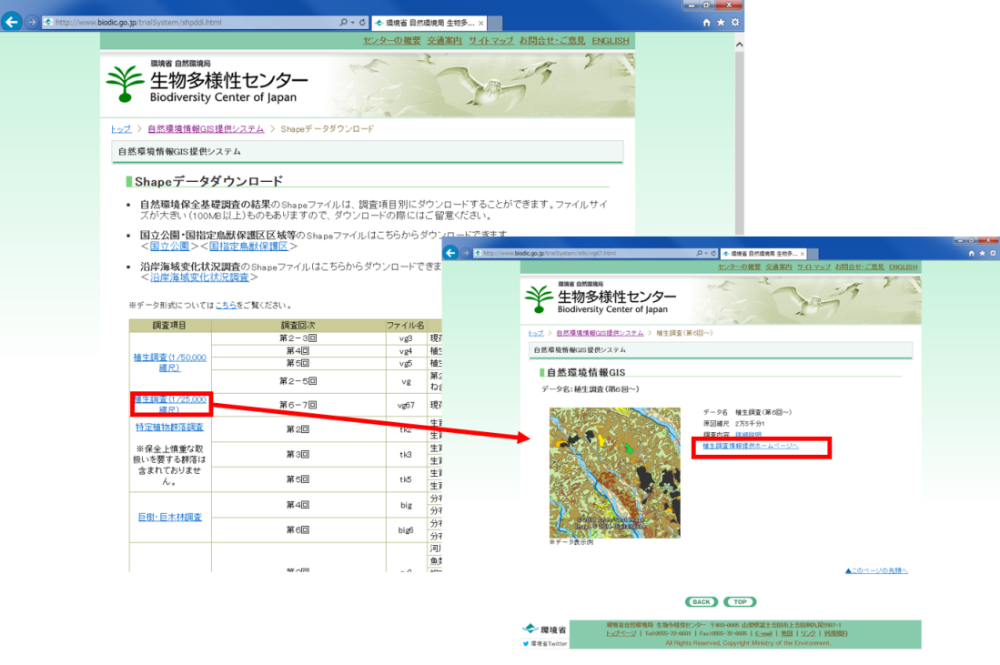
取得したいデータを選択し、ダウンロード画面へ進む。

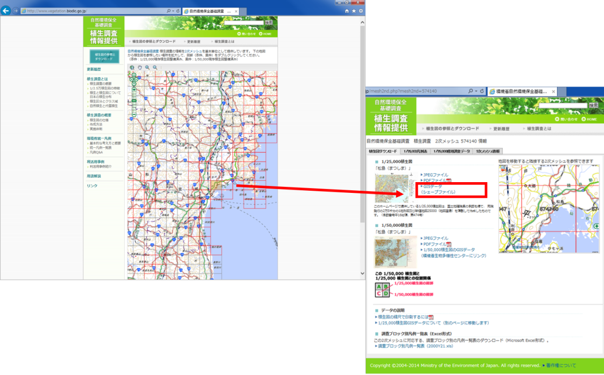
地図で場所を選択し、GISデータ（シェープファイル）をダウンロードする。

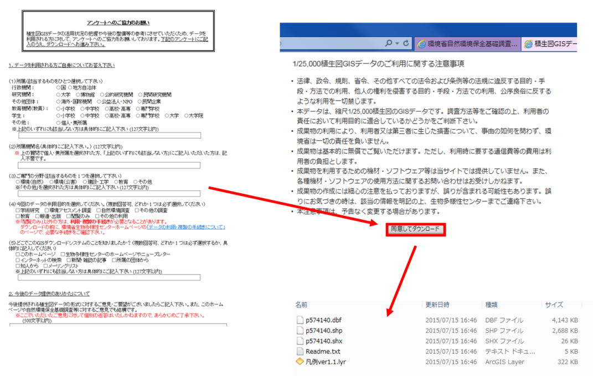
アンケートに回答し、注意事項に同意し、データのダウンロードを行う。

  [▲メニューへもどる]  
## <a name = 総務省のGISデータ>総務省のGISデータ
[e-Stat]のサイトにアクセスする。
このサイトでは、国勢調査、経済センサス、事務所・企業統計調査、農林業センサスなどがダウンロードできる。
[e-Stat]:<http://www.e-stat.go.jp/SG1/estat/eStatTopPortal.do>
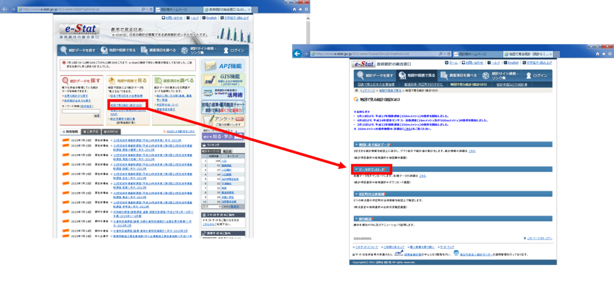
地図で見る統計（統計GIS）をクリックし、データダウンロードをクリックする。

①調査の種類を選択する。  
②調査の年代、データ種類を選択する。  
③調査の項目を選択する。  
④統計各種データダウンロードへをクリックする。

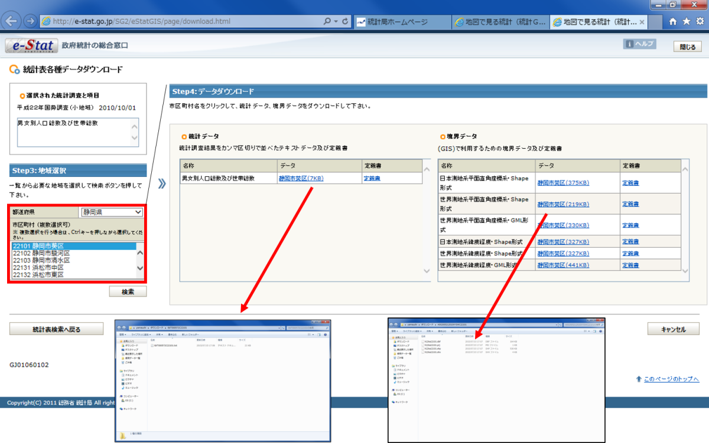
地域を選択してデータをダウンロードする。
境界データをダウンロードする際は、データの違いに注意する。

  [▲メニューへもどる]  
## <a name = その他のGISデータ>その他のGISデータ
### 属性データを地図化するためのデータ
[Municipality map]のサイトにアクセスする。
市区町村区域のGISデータをダウンロードすることができる。
[Municipality map]:<http://www.tkirimura.com/mmm/>

ダウンロードしたい年月を選択し、区域データを生成するをクリックする。

### 地方自治体のGISデータ
地方自治体は様々なデータをWeb GISで公開している。
ダウンロードできるものと、閲覧のみのものがある。  

(例)

* [ぎふ県域統合型GIS]
* [おかやま全県統合型GIS]    
* [静岡県統合基盤地理情報システム]
* [長野県統合型地理情報システム]
* [京都府・市町村共同_統合型地理情報システム（GIS）]

[ぎふ県域統合型GIS]:https://gis-gifu.jp/gifu/portal/index.html
[おかやま全県統合型GIS]:http://www.gis.pref.okayama.jp/map/top/index.asp
[静岡県統合基盤地理情報システム]:http://www.gis.pref.shizuoka.jp
[京都府・市町村共同_統合型地理情報システム（GIS）]:http://g-kyoto.gis.pref.kyoto.lg.jp/g-kyoto/top/
[長野県統合型地理情報システム]:http://www3.pref.nagano.lg.jp/gis/top/

[▲メニューへもどる]  

## <a name = オープンデータ>オープンデータ
>オープンデータとは、政府において、オープンデータとは、「機械判読に適したデータ形式で、二次利用が可能な利用ルールで公開されたデータ」であり「人手を多くかけずにデータの二次利用を可能とするもの」のことを言います。  
[総務省オープンデータ戦略の推進]より引用
[総務省オープンデータ戦略の推進]:<http://www.soumu.go.jp/menu_seisaku/ictseisaku/ictriyou/opendata/>

- 自治体が、様々な情報をCSV、Shapeデータで配信している。
- オープンデータを利用した地図アプリなども普及している。

### オープンデータの公開例
公開されているオープンデータの例  

* [福井県鯖江市]
* [千葉県流山市]
* [神奈川県横浜市（よこはまオープンデータカタログ（試行版））]
* [北海道室蘭市（むろらんオープンデータライブラリ）]
* [静岡県（ふじのくにオープンデータカタログ）]

[福井県鯖江市]:http://www.city.sabae.fukui.jp/pageview.html?id=12768
[千葉県流山市]:http://www.city.nagareyama.chiba.jp/10763/index.html
[神奈川県横浜市（よこはまオープンデータカタログ（試行版））]:http://www.city.yokohama.lg.jp/seisaku/seisaku/opendata/catalog.html
[北海道室蘭市（むろらんオープンデータライブラリ）]:http://g-kyoto.gis.pref.kyoto.lg.jp/g-kyoto/top/
[静岡県（ふじのくにオープンデータカタログ）]:http://open-data.pref.shizuoka.jp/

[▲メニューへもどる]  

**その他のライセンス**  
本教材で利用しているキャプチャ画像の出典やクレジットについては、[その他のライセンスについて]よりご確認ください。
[その他のライセンスについて]:../その他のライセンスについて.md
