# 点データの分析
本教材は、「点データの分析」の実習用教材です。GISソフトウェア（QGIS）を用いて、点データを可視化し分析する手法について解説しています。
講義用教材として、[地理情報科学教育用スライド（GIScスライド）]の4章が参考になります。  

本教材を使用する際は、[利用規約]をご確認いただき、これらの条件に同意された場合にのみご利用下さい。

[地理情報科学教育用スライド（GIScスライド）]:http://curricula.csis.u-tokyo.ac.jp/slide/4.html
[利用規約]:../../../master/利用規約.md
**Menu**
------
**視覚的分析**
* [点の分布密度](#点の分布密度)
* [メッシュによる点密度の表示](#メッシュによる点密度の表示)
* [行政区内の点密度](#行政区内の点密度)
* [カーネル密度推計](#カーネル密度推計)

**数理的分析**
* [CrimeStatのインストール](#CrimeStatのインストール)
* [平均最近隣距離法](#平均最近隣距離法)
* [K-関数法](#K-関数法)
* [標準偏差距離と標準偏差楕円](#標準偏差距離と標準偏差楕円)

**使用データ**

* 「国土交通省国土政策局「[国土数値情報]（島根県　行政区域、道路、消防署、医療施設データ）」を加工し（座標変換EPSG:2445 ）、利用」

[国土数値情報]:http://nlftp.mlit.go.jp/ksj/index.html

**スライド教材**  
スライドのダウンロードは[こちら](https://github.com/yamauchi-inochu/demo/raw/master/GIS%E3%82%AA%E3%83%BC%E3%83%97%E3%83%B3%E6%95%99%E6%9D%90/14_%E7%82%B9%E3%83%87%E3%83%BC%E3%82%BF%E3%81%AE%E5%88%86%E6%9E%90/%E7%82%B9%E3%83%87%E3%83%BC%E3%82%BF%E3%81%AE%E5%88%86%E6%9E%90.pptx)

-------
## 視覚的分析

## 点の分布密度
QGISで国土数値情報の病院のデータを表示する。
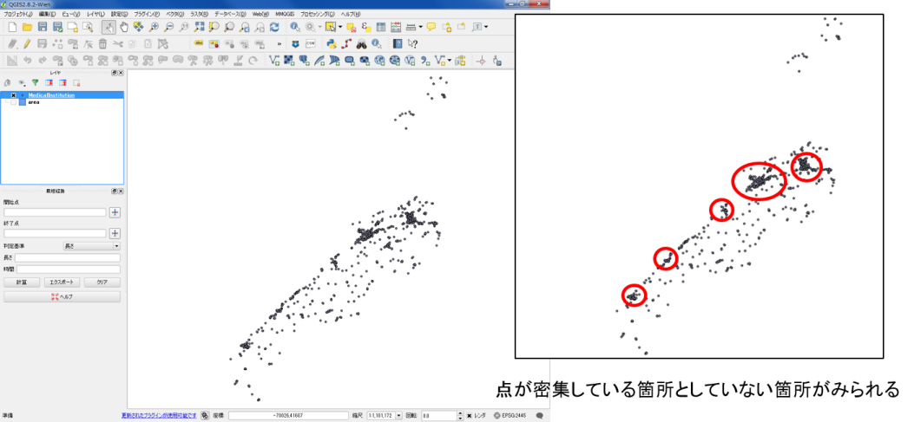  
点が密集していることはわかるが、地域ごとの密度の違いはよくわからない  
→　メッシュや行政区画ごとに密度を求める

## メッシュによる点密度の表示
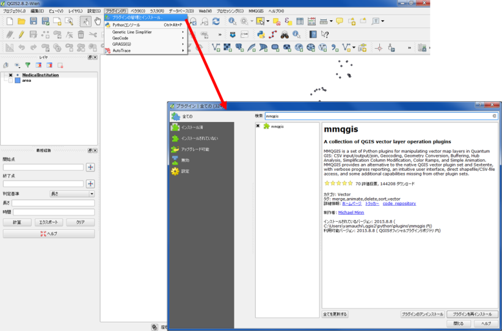  
プラグイン＞プラグインの管理とインストール  
mmqgisプラグインを検索し、インストールする。

### メッシュの作成
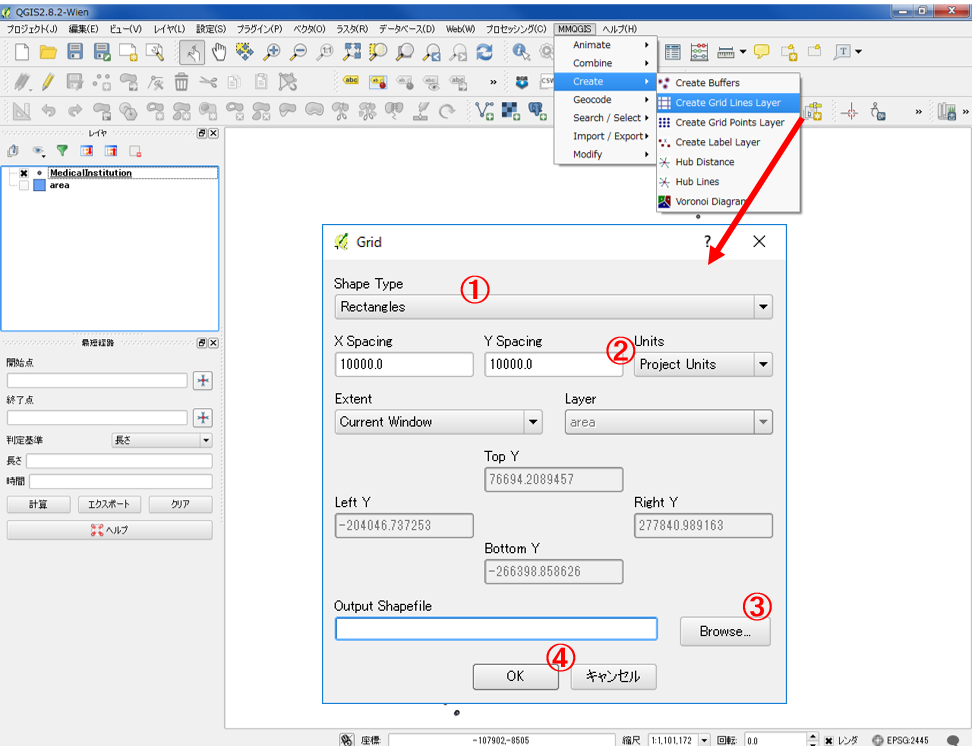  
MMQGIS＞Create＞Create Grid Lines Layer  
出力先を指定し、H Spacingを10000（m）にする。　　
V Spacingを10000（m）にする。10km×10kmのメッシュを作成する。  
Retangle(polygon)を選択し、OKをクリックする。  
最後に、座標系を選択する（今回は、EPSG:2445）。  
※　表示範囲にメッシュが作成されるため、点データの領域にズームし全体を表示しておく。

  
10km×10kmのメッシュが作成できた。

### メッシュ内のポイント数を計算する
  
ベクタ＞解析ツール＞ポリゴン内の点の数を数える
入力ポリゴンベクタレイヤにメッシュを指定し、入力ポイントベクタレイヤに病院のレイヤを指定する。  
出力フィールド名を入力し、出力先と新規データー名を入力して、OKをクリックする。

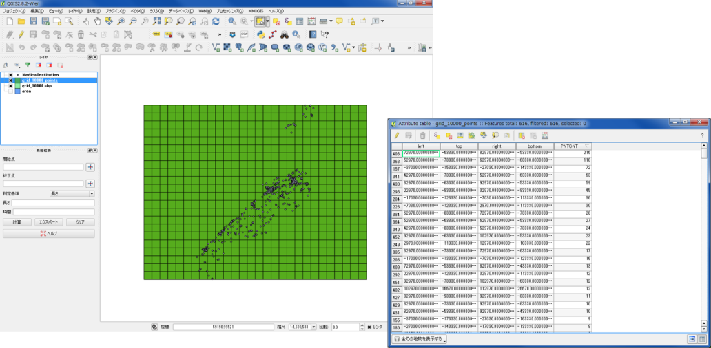  
メッシュ内のポイント数を含んだ、新規ポリゴンが作成された。  
属性テーブルを開き、一番端の列のデータを並び替えて表示すると、計算結果が追加されている。  
メッシュ内のポイント数をもとに色分けを行う。  

### メッシュ内のポイント数で色分けする
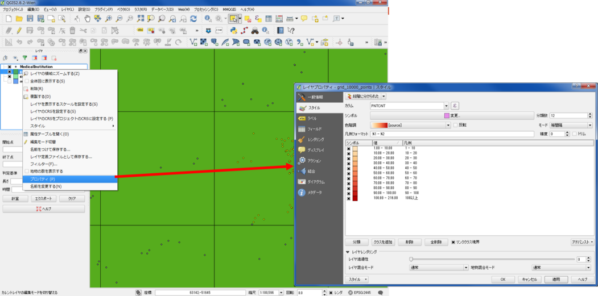  
ポリゴン内のポイント数に応じて色分けを行う。

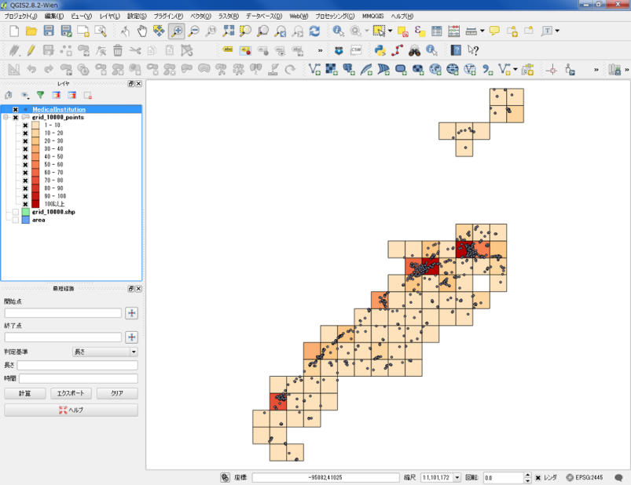  
メッシュごとに病院の密度が可視化された。
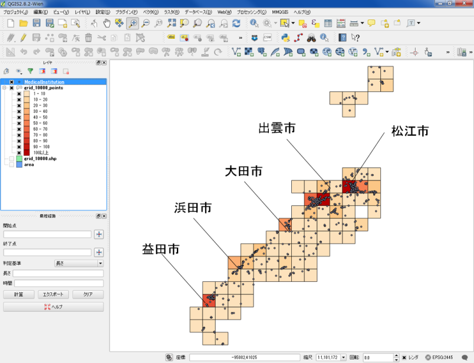  

## 行政区内の点密度
※その前に、デイゾルブして、行政区画を簡素化しておく（次スライドを参照）
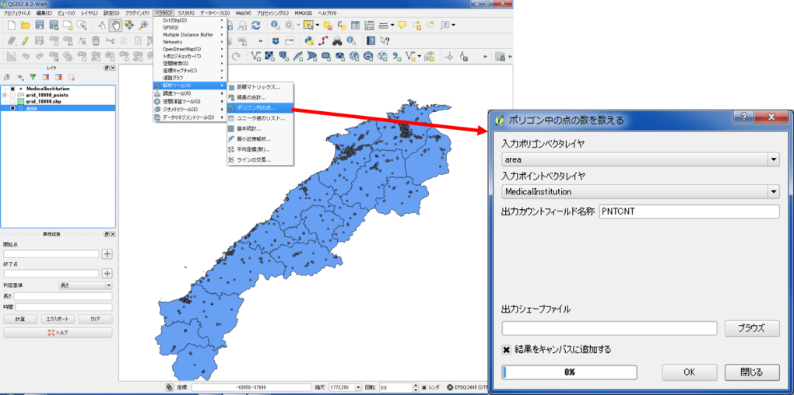  
入力レイヤに行政区画のポリゴンを指定し、融合フィールドに市町村名のフィールドを選択する。

行政区画のポリゴンをディゾルブする。
  
ベクタ＞空間演算ツール＞融合  
入力レイヤに行政区画のポリゴンを指定し、融合フィールドに市町村名のフィールドを選択する。

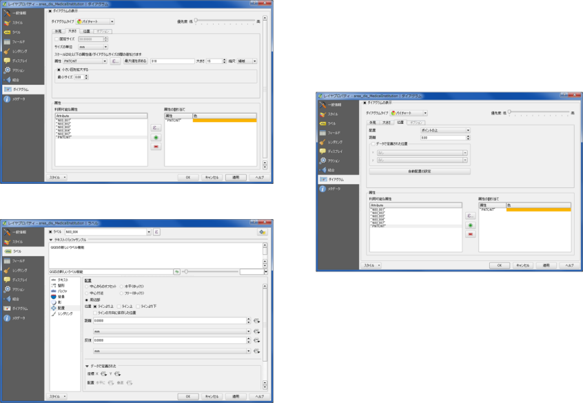  
計算結果の表示の設定する。  
プロパティから表示やラベル設定を調整する。

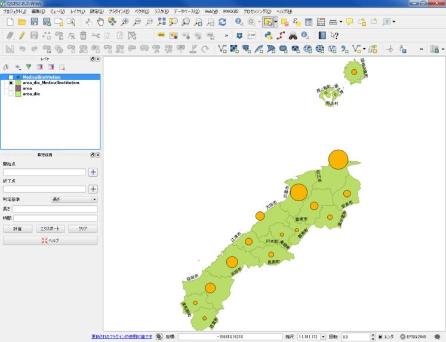  
行政区画ごとのポイント数を円の大きさで表現した。

## カーネル密度推計
カーネル密度分析は犯罪発生マップなどに用いられる手法で、カーネル関数を用いてポイントの分布密度を連続的な密度局面としてモデル化する手法です。今回の場合は、医療機関数を病人の発生個所と仮定しています。  

ヒートマッププラグインをインストールする。
（ヒートマッププラグインについては、[QGISユーザガイド]を参照）
  
[QGISユーザガイド]:http://docs.qgis.org/2.2/ja/docs/user_manual/plugins/plugins_heatmap.html

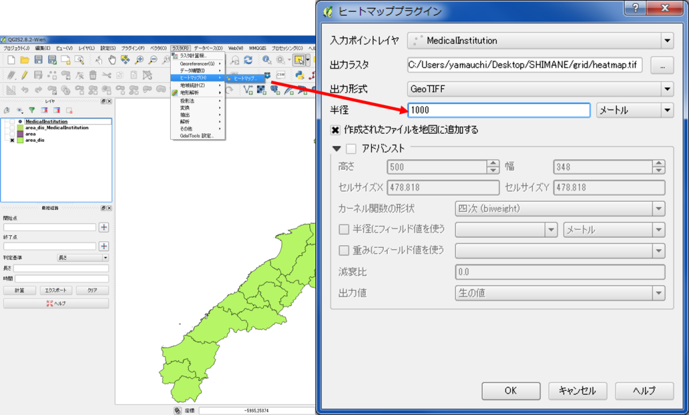  
入力ポイントレイヤと出力ラスタを設定し、半径(バンド幅)を1ｋｍに設定する。

  
出力されたラスタの配色を設定し、表示する。

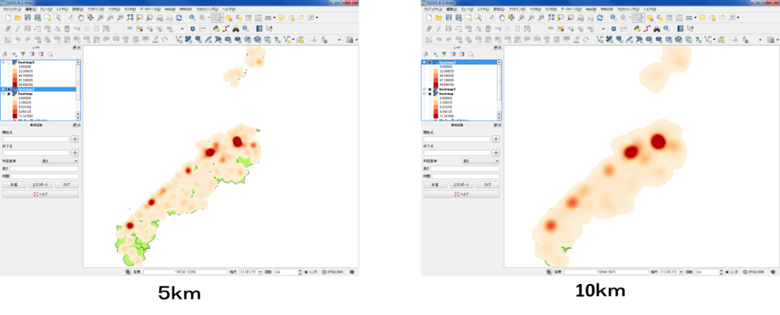  
半径の値を変えると、値が変化し平滑なカーネルが出力される。  
バンド幅を広くとったカーネルは広域的傾向把握に有効である。一方で、局地的な値への対応が難しくなる。そのため、バンド幅の設定には注意が必要。

[▲メニューへもどる]

## 数理的分析
数理的分析では、CrimeStatを使用した点分布パターンの分析を行う。

## CrimeStatのインストール
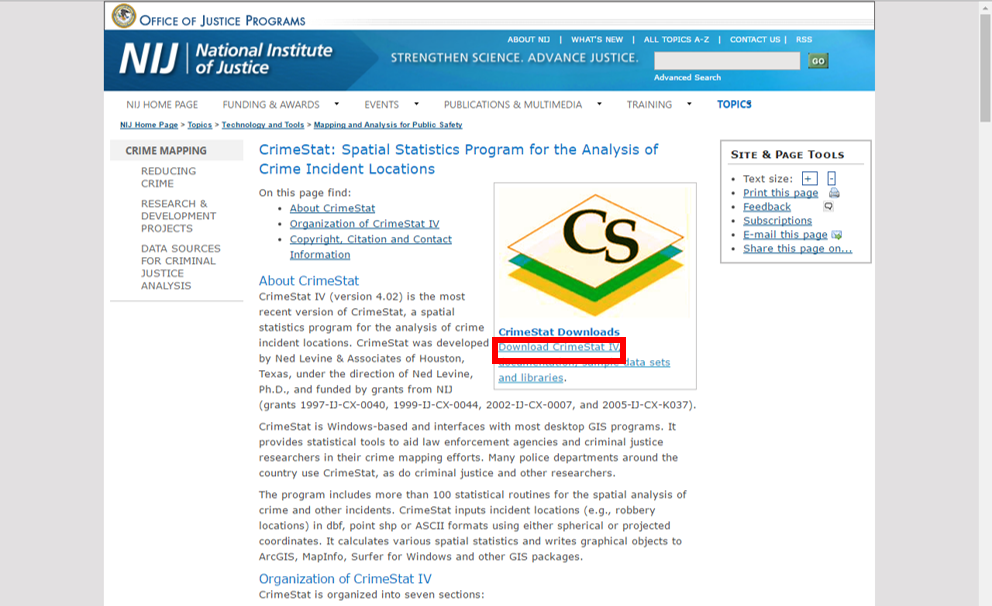  
[NIJのサイト]にアクセスし、CrimeStat IV をダウンロードし、解凍後に.exeファイルを起動する。

[NIJのサイト]:http://nij.gov/topics/technology/maps/Pages/crimestat.aspx

### 起動とデータのインポート
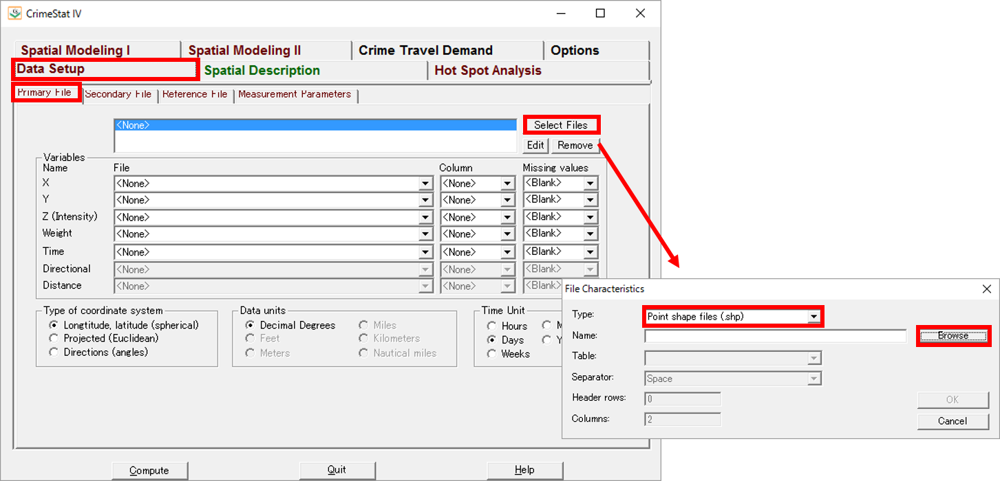  
crimestat.exeをダブルクリックし、CrimeStatを起動する。  
Data Setupタグから、分析したいデータを選択する。  
Data Setup > Primary File > Select Files(typeで.shpを選択し、Browseからファイルを指定) 。  

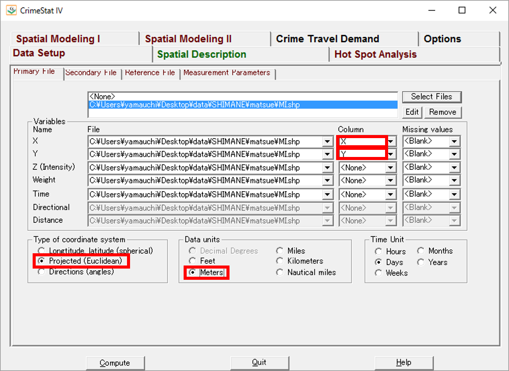
Columから、ポイントデータのX,Yを指定する。  
projectedとMetersにそれぞれチェックをつける。  

[▲メニューへもどる]

## 平均最近隣距離法
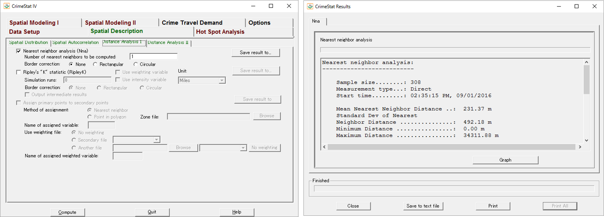
Spatial description >  Distance Analysis I　を選択する。  
Nearest neighbor analysis にチェックをつけ、Computeをクリックする。   

[▲メニューへもどる]

## K-関数法
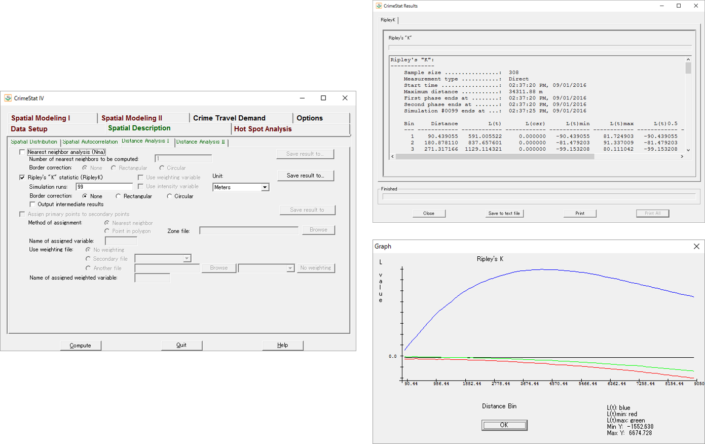
Spatial description >  Distance Analysis　を選択する。  
Ripley’s K statistic(Ripley K)にチェックをいれUnitをMetersとし、Computeをクリックする。  

[▲メニューへもどる]

## 標準偏差距離と標準偏差楕円
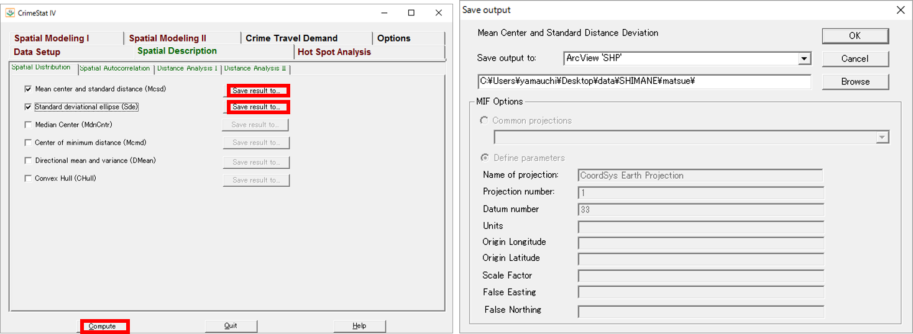
Spatial description > Spatial Distribution　を選択する。  
Save result to をクリックし、ファイルの形式と出力先のフォルダを指定する（事前にフォルダを作成しておく）。  
項目ごとに出力先の指定後、computeをクリックする(指定したフォルダに出力される)。  

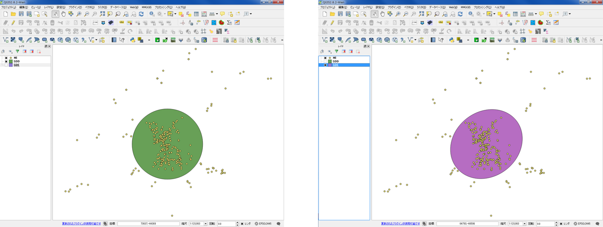
ポイントデータと計算結果をQGISで表示する。
標準偏差距離がSDD.shp、標準偏差楕円がSDE.shpとなって出力されている。

[▲メニューへもどる]
[▲メニューへもどる]:点データの分析.md#menu

**その他のライセンス**  
本教材で利用しているキャプチャ画像の出典やクレジットについては、[その他のライセンスについて]よりご確認ください。
[その他のライセンスについて]:../その他のライセンスについて.md
