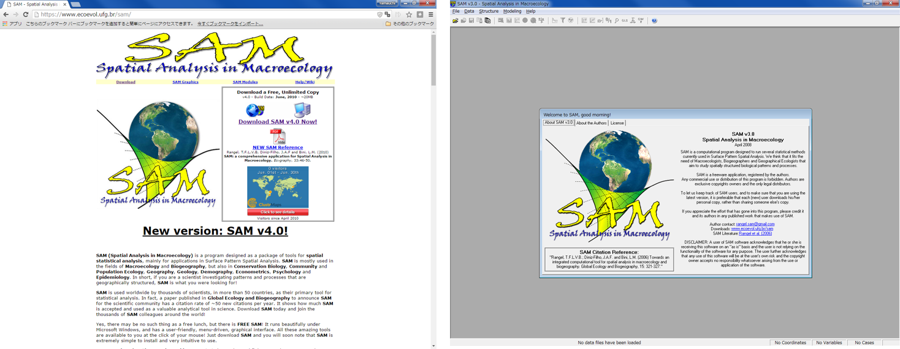
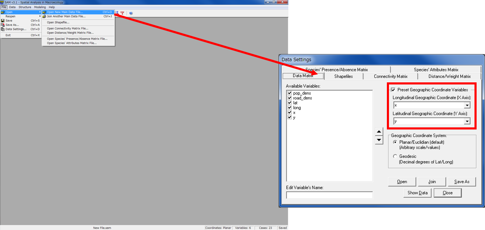
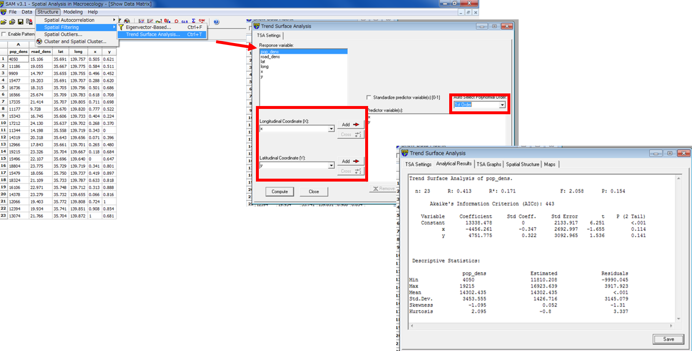
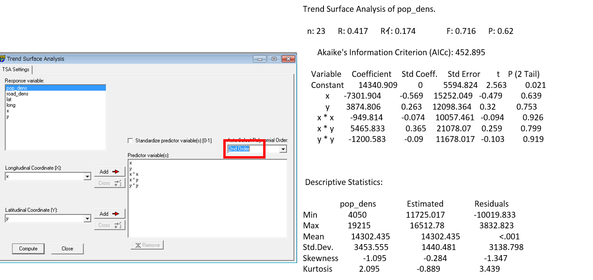
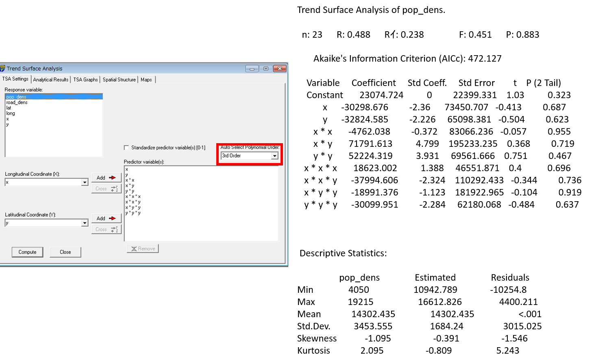
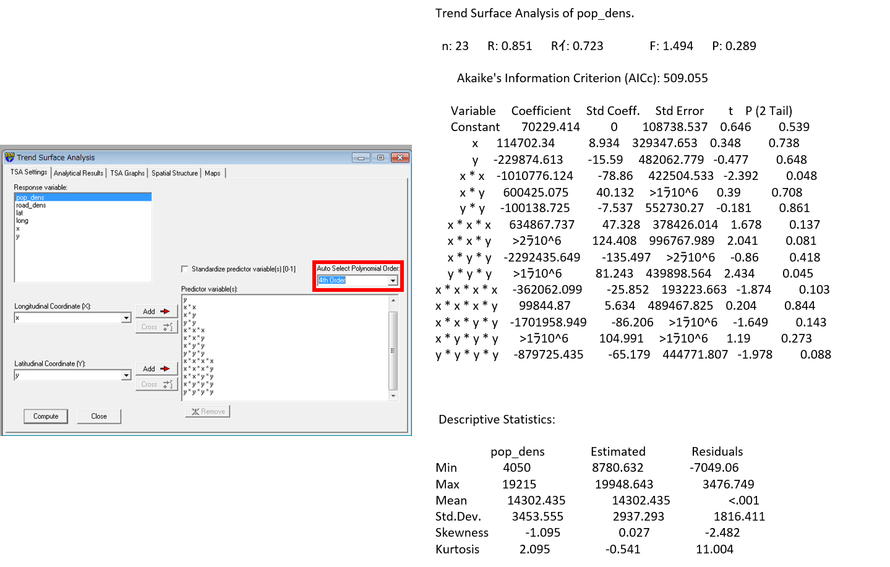

# 傾向面分析
本教材は、「傾向面分析」の実習用教材です。GISソフトウェアを用いた、ラスタデータの分析の手法について解説しています。ソフトウェアには、無償で利用できるSAMを用いています。  
講義用教材として、[地理情報科学教育用スライド（GIScスライド）]の4章が参考になります。  

本教材を使用する際は、[利用規約]をご確認いただき、これらの条件に同意された場合にのみご利用下さい。

[地理情報科学教育用スライド（GIScスライド）]:http://curricula.csis.u-tokyo.ac.jp/slide/4.html
[利用規約]:../../../master/利用規約.md

**Menu**
------
* [SAMのインストール](#SAMのインストール)
* [第1次傾向面分析](#第1次傾向面分析)
* [第2次傾向面分析](#第2次傾向面分析)

**使用データ**
* 『地理情報科学 GISスタンダード』 p98、表16-1を引用し、CSVデータを作成

**スライド教材**  
スライドのダウンロードは[こちら]
[こちら]:../../../../raw/master/教材/傾向面分析/傾向面分析.pptx

----------

## SAMのインストール
以下では、SAMを利用して傾向面分析を行う。  
[SAMのダウンロードサイト]にアクセスし、ダウンロード後にインストールし、SAMを起動する。  
（ダウンロード時に登録が必要、ダウンロードページ最下部のold versionから3.1をインストールする）
  

[SAMのダウンロードサイト]:https://www.ecoevol.ufg.br/sam/

[▲メニューへもどる]

## 第1次傾向面分析
File>Open>Open New Main Data Fileを選択し、txtファイルを読み込む。  
Preset Geographic Variables のX Axis と Y Axisに値を入力し「close」をクリックする。  
  

Structure>Spatial Filtering>Trend Surface Analysisを選択する。  
Response variableから人口密度の列を選択した状態で XとYを選択し、Auto Select Polynomial Order から1st Orderを選択し、Computeをクリックすると処理が開始され第1次傾向面が計算される。  

[▲メニューへもどる]

## 第2次傾向面分析
2nd Orderを選択し、Computeをクリックすると処理が開始され第2次傾向面が計算される。  
同様の手法で第4次傾向面まで求めることができる。  

### 第3次傾向面分析

### 第4次傾向面分析

[▲メニューへもどる]:傾向面分析.md#Menu

**その他のライセンス**  
本教材で利用しているキャプチャ画像の出典やクレジットについては、[その他のライセンスについて]よりご確認ください。
[その他のライセンスについて]:../その他のライセンスについて.md
