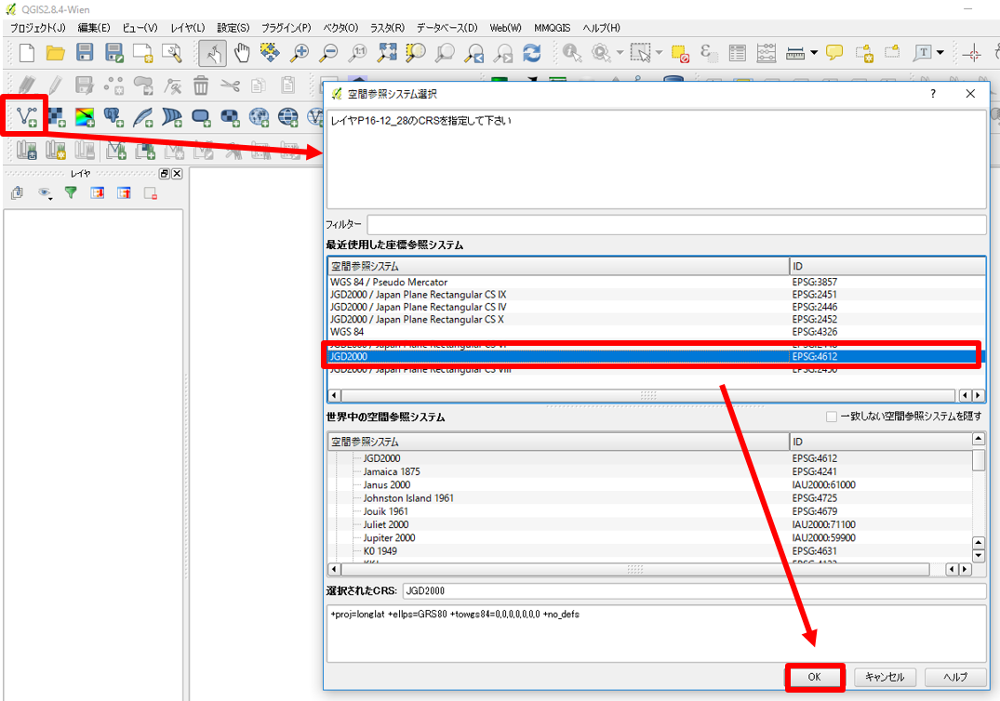
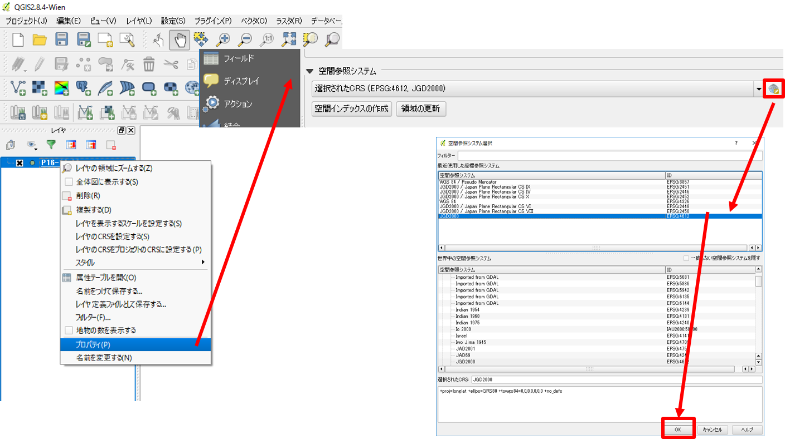

#よくある質問とエラー
以下は、教材を利用した実習におけるよくある質問とエラーについてまとめたものです。

## GIS操作全般

### データ読み込みについて
* .ZIPのファイルは解凍作業が必要
* shapeファイルは複数のファイルの総称をいう(読み込みの際は.shpファイルを選択する)
* 文字コードは、日本語の場合shift-JISかutf-8を選択（文字化けする場合は、「QGISのレイヤ>プロパティ>一般情報>データソースエンコーディング」より変更）

### 新規ベクトルレイヤと属性テーブルの追加
* QGISで新規にラインやポリゴンを作成する場合は、作成後に右クリックが必要
* データ型に注意し、新規レイヤや属性テーブルの追加を行う。

 >「名称」はカラム名、「タイプ」はデータ型にあわせる、「幅」と「精度」は入力するデータによる。  
「タイプ」・・・値が整数ならInteger、小数を含むならReal、テキストならStringとなる。    
「幅」＞桁数、「精度」＞表示する小数の位  

### シンボル（ポイントやラインの形状）変更、ラベルの追加
* ラベルは、プロパティ>ラベル から、ラベルにチェックをいれ、ラベルを表示したい属性テーブルを選択し、OKをクリックする

### 地理座標系と投影座標系
|座標系|単位|
|---|---|
|地理座標系|緯度経度|
|投影座標系|メートル|

* 座標系については[esriジャパンの GIS 基礎解説](https://www.esrij.com/gis-guide/coordinate-and-spatial/coordinate-system/)が詳しい

## ジオリファレンス
### ジオリファレンスの注意点：QGISの場合
* GCPの位置が偏りすぎないようにする（まず、四隅をおさえる）
* 5箇所程度GCPが取得で来たら、ジオリファレンスの開始をクリックする
* QGISの操作画面に画像を反映させてから、細かい修正をするとよい
* GCPテーブルのresidual（誤差）の値を確認し、大きすぎる値を消去するとよい
* GCPを保存しておくと、次回も利用できる
* GCPを付けた画像は、「名前を付けて保存」からGeotiff形式で保存する

## プラグイン
### タイルレイヤプラグインの注意点

* 第1回の課題ファイルから、QGISのなかにあるTileフォルダを任意の場所に移動しておく。 QGIS>Webからタイルレイヤプラグインを起動し、設定から任意の場所に置いたTileフォルダーを選択する。
* 背景画像の表示は、座標系とズームレベル（拡大レベル）に注意する
* 使わないタイルは、消しておくと表示がスムーズになる

## 測地座標系の変換
### 国土数値情報の変換
国土数値情報のデータは、世界測地系の緯度経度で提供されているため、平面直角座標系で利用する場合は、変換が必要になる。以下にその手順を示す。なお、本教材では、QGIS2.8はJGD2011に対応していない場合があるため、JGD2011のデータもJGD2000をとして扱っている。  

まず、ダウンロードしたデータをQGISで読み込む。
読み込んだ際に、下の図のようなうウィンドウがでたら、JGD2000を選択し、OKをクリックする。  
  

ウィンドウが出ない場合は、レイヤウィンドウ上で読み込んだレイヤを右クリックし、一般情報の空間参照システムをJGD2000にし、OKをクリックする。  
  

以上のように、測地座標系の初期設定が完了させた上で、空間座標の変換を行う。空間座標の変換は、[空間データ]の教材を参照すること。  
また、よくある間違いとして、空間座標の変換をプロパティ＞一般情報から行うという例がある。QGISでは、プロパティから空間座標の変換はできないため、必ず名前を付けて保存から変換すること。  

[e-Stat]:http://www.e-stat.go.jp
[地理院タイル]:http://maps.gsi.go.jp/development/ichiran.html
[その他のライセンスについて]:../その他のライセンスについて.md
[▲メニューへもどる]:空間データ.md#menu
[QGISビギナーズマニュアル]:../../QGISビギナーズマニュアル/QGISビギナーズマニュアル.md
[Google Maps Geocoding API]:https://developers.google.com/maps/documentation/geocoding/intro?hl=ja
[KTGIS.net]:http://ktgis.net/gcode/geocoding.html
[裾野市オープンデータ]:http://www.city.susono.shizuoka.jp/ma/organization/susono-open-data.php
[鯖江市オープンデータ]:http://www.city.sabae.fukui.jp/pageview.html?id=12768
[GISの基本概念]:../01_GISの基本概念/GISの基本概念.md
[CSVアドレスマッチングサービス]:http://newspat.csis.u-tokyo.ac.jp/geocode-cgi/geocode.cgi?action=start
[susono_emergency_shelter.csv]:https://github.com/yamauchi-inochu/demo/blob/master/GISオープン教材/課題/sample/susono_sample.zip?raw=true
[平面直角座標系の対象表](http://www.gsi.go.jp/LAW/heimencho.html)
[課題ページ]:../課題/課題ページ/空間データ.md
