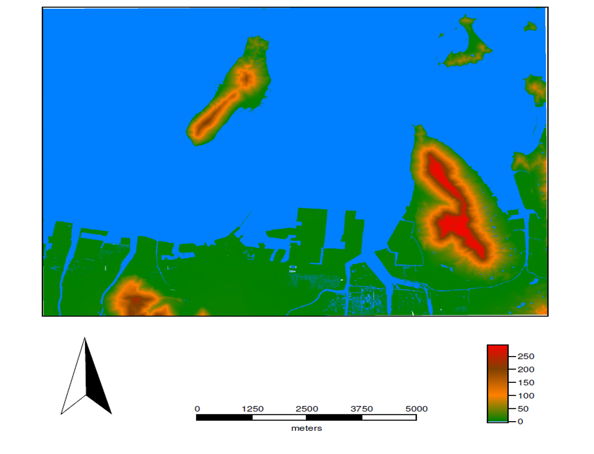

# 実習ページ:GIS入門

 本実習は、
**Menu**
--------
* [QGIS入門](#QGIS入門)
* [GRASS入門](#GRASS入門)

>実習時の注意点やメモを[作業メモ]をご参照ください。

## QGIS入門

### QGIS入門の課題
　QGISは、無償で利用できるオープンソースのGISです。
提出する地図は、凡例、方位、縮尺バー、タイトル（学籍番号、氏名、地図名）をレイアウトしたものとします。本課題と対応する教材は、[QGISビギナーズマニュアル]および[GRASSビギナーズマニュアル]の教材となります。

**課題１**  
QGISとプラグインを用いて、任意の地域の地図を作成しなさい。なお、使用するタイル（背景地図）は基本測量成果に該当しないものとする。
（必要な場合は、サンプルデータ[fkuchiyama_sample.zip](https://github.com/yamauchi-inochu/demo/blob/master/GISオープン教材/実習課題/sample/fkuchiyama_sample.zip?raw=true)を使用すること）

**完成例**  

**手順**  

① サンプルデータを読み込む  
② タイルレイヤープラグインかOpenLayersPluginを用いて背景地図を読み込む  
③ 地図をレイアウトする   

#### 学習ポイント：空間データの特徴とGISソフトウェアの活用

* ベクトルデータとラスターデータの違い
* QGISとプラグインについての理解
* 属性テーブルとプロパティについての理解
* 地図のレイアウト

------

**課題2**  
GRASS GISを用いて、高松市の地形(標高)概観図を作成しなさい。  

**手順**  

① QGISを用いてマップセットを作成する  
② GRASS GISでマップセットを読み込む  
③ カラーを調整し、地図をレイアウトする  

#### 学習ポイント：GRASS GISの操作

* マップセットが作成できたか

[△メニューへもどる]
-------------

#### 完成例で使用したデータ
本ページで使用しているデータの出典については、該当する教材よりご確認ください。

[△メニューへもどる]:実習ページ/GIS入門.md#menu
[作業メモ]:https://github.com/yamauchi-inochu/demo/blob/master/GISオープン教材/実習課題/作業メモ.md
[QGISビギナーズマニュアル]:../QGISビギナーズマニュアル/QGISビギナーズマニュアル.md
[GRASSビギナーズマニュアル]:../GRASSビギナーズマニュアル/GRASSビギナーズマニュアル.md
[既存データの地図データと属性データ]:../07_既存データの地図データと属性データ/既存データの地図データと属性データ.md
[空間データ]:../08_空間データ/空間データ.md
[空間データの結合・修正]:../10_空間データの統合・修正/空間データの統合・修正.md
[視覚的伝達]:../21_視覚的伝達/視覚的伝達.md
[政府統計局e-stat]:https://www.e-stat.go.jp/SG1/estat/eStatTopPortal.do
[国土数値情報]:http://nlftp.mlit.go.jp/ksj/
[基本的な空間解析]:../11_基本的な空間解析/基本的な空間解析.md
[ネットワーク分析]:../12_ネットワーク分析/ネットワーク分析.md
[領域分析]:../13_領域分析/領域分析.md
[点データの分析]:../14_点データの分析/点データの分析.md
[ラスタデータの分析]:../15_ラスタデータの分析/ラスタデータの分析.md
[空間補間]:../18_空間補間/空間補間.md
