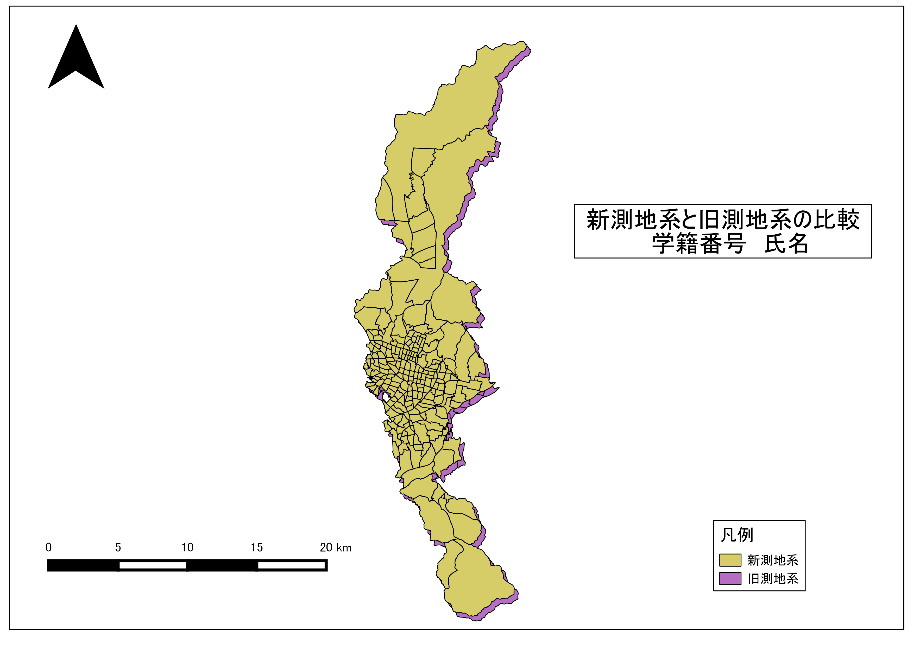
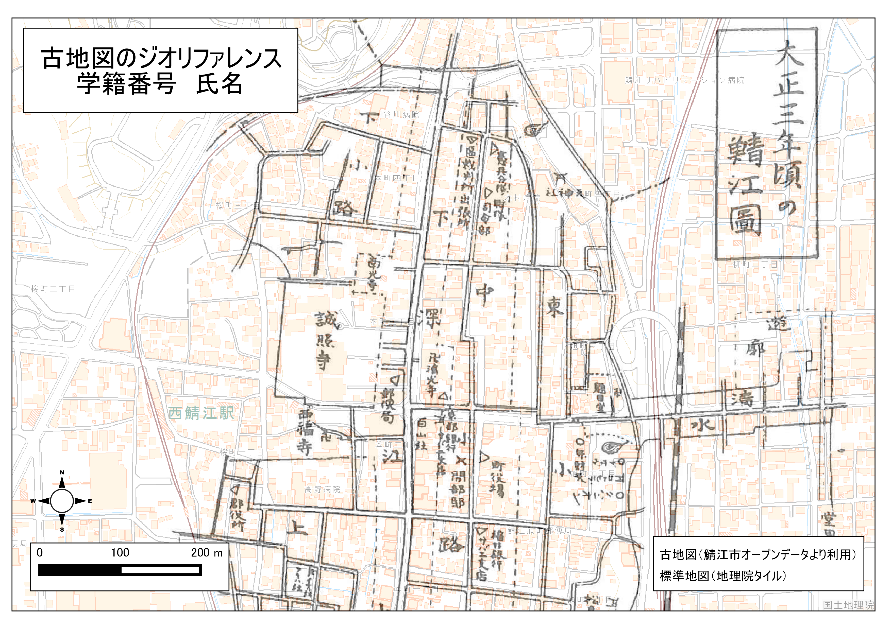
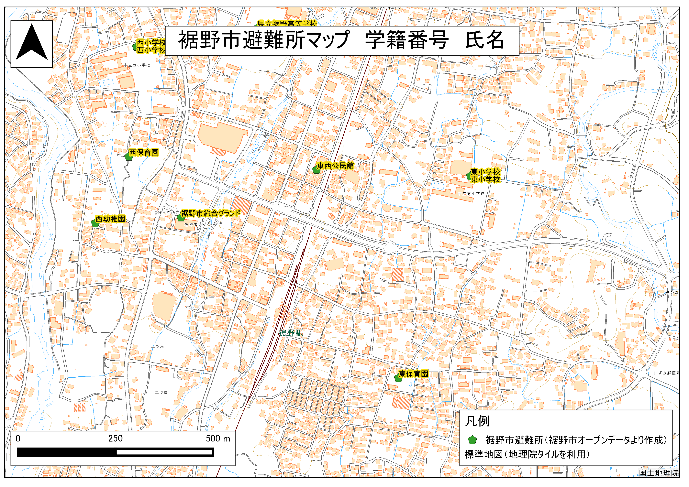
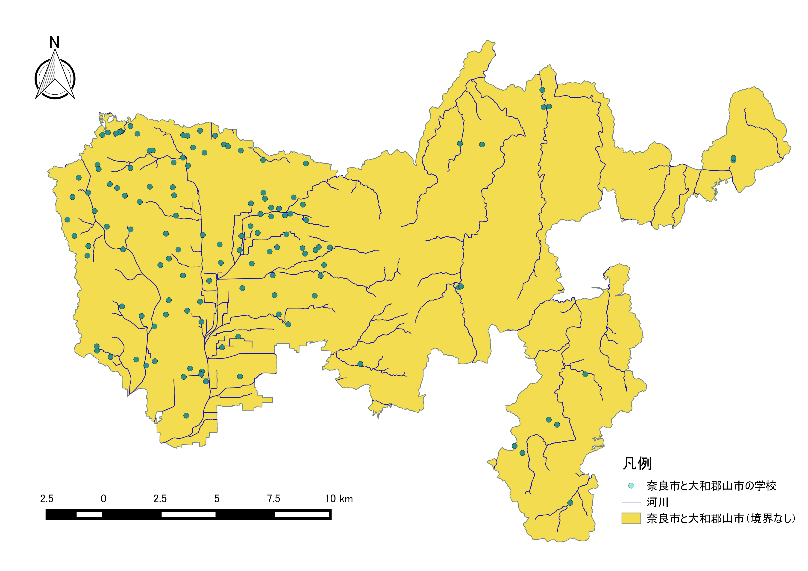
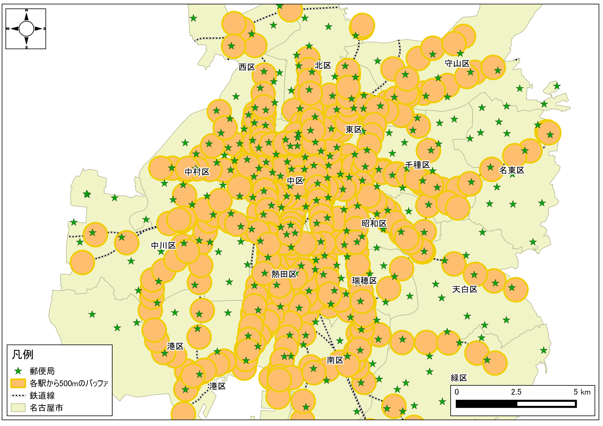
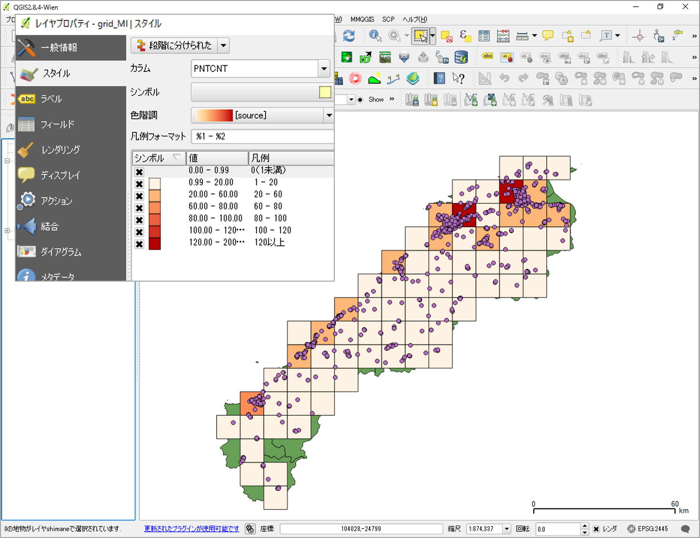
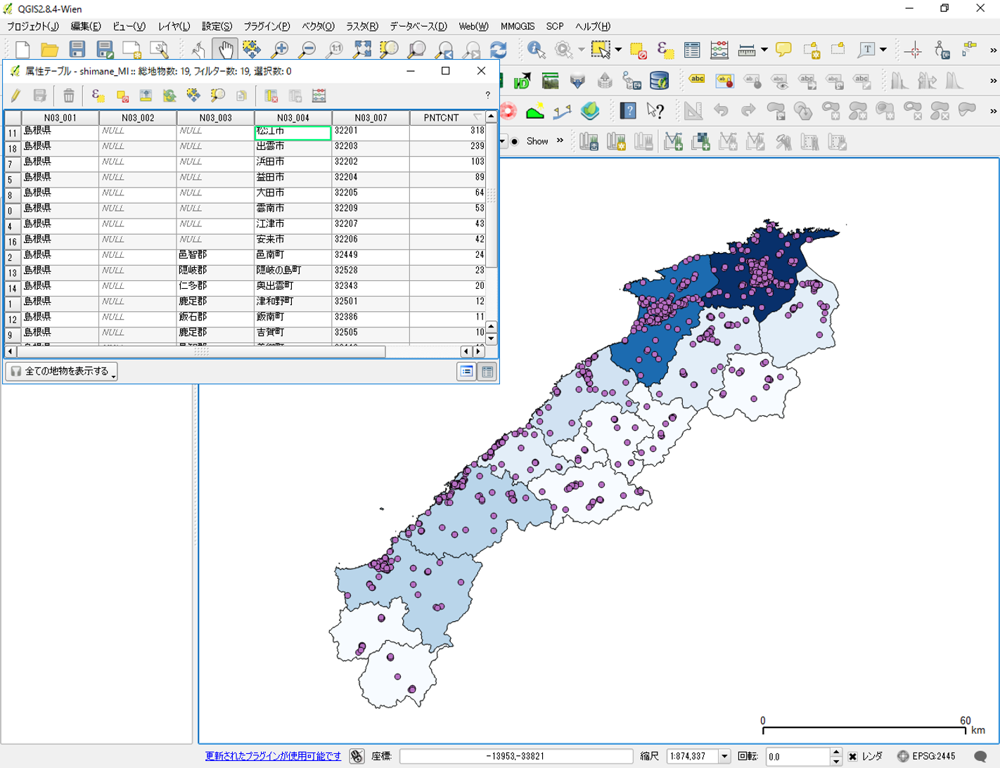
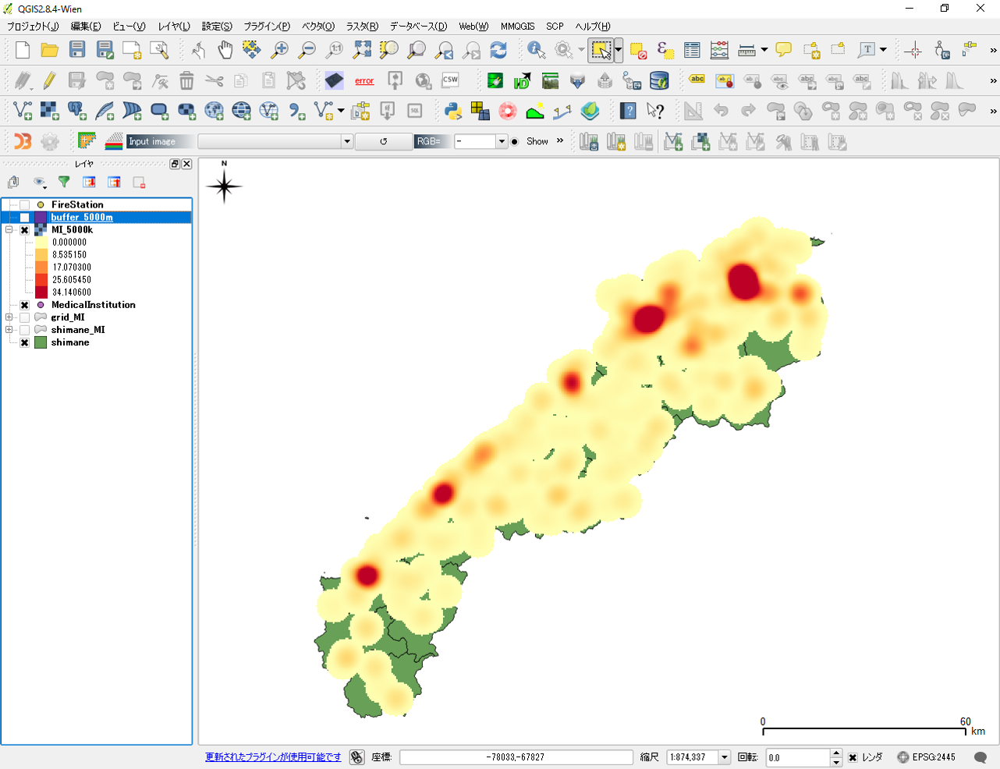
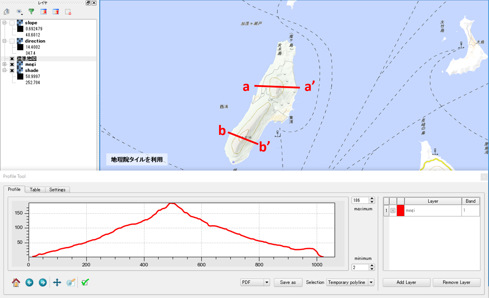
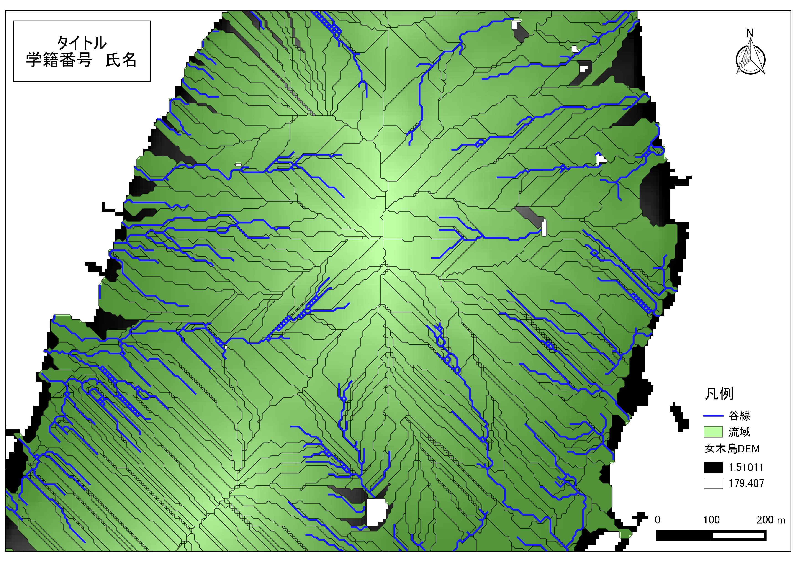

#全7回実習授業用ページ
　このページは、全7回の実習授業を想定し授業内容と課題を構成したものです。各課題に対応した教材や完成例を参考に地図を作成してください。作成する地図は、凡例、方位、縮尺バー、タイトル（地図名 等）をレイアウトしてください。また、課題によっては、300～400字程度のレポート作成が必要です。  

**Menu**

* [第一回実習：GIS入門](#第一回実習)
* [第二回実習：座標変換、ジオリファレンス、ジオコーディング](#第二回実習)
* [第三回実習：データの作成とカルトグラム](#第三回実習)
* [第四回実習：基本的な空間解析と最短経路検索](#第四回実習)
* [第五回実習：バッファと点密度の可視化](#第五回実習)
* [第六回実習：地形解析と空間補間](#第六回実習)
* [第七回実習：](#第七回実習)

**※ 実習の細かい補足は、[作業メモ]に記載しています。**  

---

## 第一回実習

### 第一回実習と課題
　GISでは、地理空間情報の可視化、編集、分析などができます。この実習では入門編として、QGISを用いた地理空間情報の可視化と地図のレイアウトを行います。QGISは、無償で利用できるオープンソースのGISです。[QGISビギナーズマニュアル]を参考にインストールした後、実習を進めてください。[QGISビギナーズマニュアル]と以下の手順を参考に、QGISとサンプルデータ（平成26年8月豪雨の聞き取りデータ）を用いて、課題1に該当する地図とレポートを作成してください。GIS初学者は、本教材を進める前に[GISの基本概念]の教材を確認しておいてください。  

#### 課題1-1  
　平成26年8月豪雨後に実施した京都府福知山市でのフィールド調査（インタビュー）データを用いて、完成例のような地図を作成してください。各地点の被災状況に差がある理由とその理由を証明するために必要なレイヤについて考え、300文字程度でまとめてください。作成する地図は、凡例、方位、縮尺バー、タイトルをレイアウトしたものとします。本課題と対応する教材は、[QGISビギナーズマニュアル]および[GRASSビギナーズマニュアル]の教材となります。  

**データ**  
サンプルデータ[fkuchiyama_sample.zip](https://github.com/yamauchi-inochu/demo/blob/master/GISオープン教材/実習課題/sample/fkuchiyama_sample.zip?raw=true)

**完成例**  

作成する地図は、調査地点、凡例、方位、縮尺バー、タイトル等をレイアウトしたものとします。

**手順**  
⓪　[QGISのインストール](../../QGISビギナーズマニュアル/QGISビギナーズマニュアル.md#インストールする)  
①　[QGISでサンプルデータを読み込む](../../QGISビギナーズマニュアル/QGISビギナーズマニュアル.md#データの読み込み)  
②　[タイルレイヤープラグインで地理院タイルを読み込む](../../QGISビギナーズマニュアル/QGISビギナーズマニュアル.md#プラグイン)  
③　[属性情報の確認をする](../../QGISビギナーズマニュアル/QGISビギナーズマニュアル.md#属性テーブル)  
※　選択ツールなどを用いて各地点ごとの水害の被害状況を確認する  
④　[ポイントのスタイルを調整する](../../QGISビギナーズマニュアル/QGISビギナーズマニュアル.md#プロパティ)  
⑤　[地図をレイアウトする](../../QGISビギナーズマニュアル/QGISビギナーズマニュアル.md#地図のレイアウト)   

※　提出時に図のタイトル、名前、学籍番号を記載する方法：プリントコンポーザーから、新規ラベルの追加 > アイテムプロパティ > メインプロパティ（タイトル等の入力） > 外観,フォント（文字のサイズ調整)  

[△メニューへもどる]

---

## 第二回実習

### 第二回実習と課題
　この実習は、空間座標の変換、ジオリファレンス、ジオコーディングなどデータの保持する位置情報の変換やデータに位置情報を付加する手法について学ぶためのものです。GISでデータ分析をする場合、データの空間座標に注意する必要があります。データによって空間座標が異なっていると、位置ズレが生じ、データの処理が行えないことがあります。データに空間座標を付加する場合にも、注意が必要になります。  
　手順とGISオープン教材の[空間データ]の教材を参考に、以下の課題2-1～2-3を行ってください。実習で利用するデータの一部は、[既存データの地図データと属性データ]の教材を参考にダウンロードしてください。GIS初学者は、本教材を進める前に[GISの基本概念]の教材を確認しておいてください。

#### 課題2-1:空間座標の変換
　[政府統計局e-stat]（平成２２年国勢調査（小地域））より、任意地域の日本測地系緯度経度・Shape形式と世界測地系平面直角座標系・Shape形式のデータをダウンロードし、両データが重なり合わない地図を作成してください。  

※　最新の測地系はJGD2011であるが、QGIS2.8.4ではJGD2011の変換ができないため、本実習ではJGD2000を新測地系としている（2.14は、JGD2011に対応している）。

**完成例**  

**手順**  
①　e-statから任意の地域の異なる測地系のshapeファイル（平面直角座標系）をダウンロードする  
②　QGISでデータを表示する（デフォルトでは、ずれて表示されないため、右下のボタンから、オンザフライ投影をクリックし、チェックをはずす）  
③　QGISビギナーズマニュアルを参考に、地図をレイアウトする  
④　レイアウト後に旧測地系データを新測地系に変換する（地図データが重なればOK）  
⑤　新測地系に変換した投影座標系のデータを地理座標系に変換する。
⑥　QGISの作業ファイル（.qgs）に任意の名前をつけ保存し、画面を閉じる

[△メニューへもどる]

---

#### 課題2-2:ジオリファレンス  
　ジオリファレンスは、位置情報のもたない画像などのデータに位置情報を持たせる際に用いる手法です。鯖江市のオープンデータより古地図007をダウンロードし、地理院タイルをもとにGCPを取得し、完成例のようにジオリファレンスした図を作成してください（なお、地理院タイルが利用できない場合は、基盤地図情報2500基本項目鯖江市道路等を利用する。ベクトルデータを用いたジオリファレンスの方が、データの位置精度が高くなる）。  

**完成例**  

**手順**  
① [鯖江市のオープンデータ](http://www.city.sabae.fukui.jp/pageview.html?id=12768)より古地図007をダウンロードする。  
② [sabae_sample](https://github.com/yamauchi-inochu/demo/blob/master/GISオープン教材/実習課題/sample/sabae_sample.zip?raw=true)とタイルレイヤプラグインを用いて地理院タイル（標準地図など）を読み込んでおく（高い位置精度を求める場合は、基盤地図情報の道路縁等を用いることが望ましい。）  
④ 古地図を読み込みQGISのジオリファレンサーを起動する  
⑤ ジオリファレンサーの利用法を参考に、古地図007にGCP(Ground Control Point)を付加する(完全には一致しないため、おおまかでよい)  
⑥ QGISビギナーズマニュアルを参考に、地図をレイアウトする(古地図のプロパティを開き、画像を透過すると良い)  
⑦ QGISの作業ファイル（.qgs）に任意の名前をつけ保存し、画面を閉じる  

[△メニューへもどる]

---

#### 課題2-3:ジオコーディング  
　ジオコーディングは、緯度経度や住所などの情報を保持したテキストファイル等を用いてGISで扱えるデータを作成する手法です。サンプルデータ[susono_emergency_shelter.csv](https://github.com/yamauchi-inochu/demo/blob/master/GISオープン教材/実習課題/sample/susono_sample.zip?raw=true)の住所を用いて、ジオコーディング（アドレスマッチング)を行い完成例のような地図を作成して下さい。

**完成例**  

**手順**  
① CSVアドレスマッチングサービスを用いて、サンプルデータに位置情報（X、Y）を付加する。  
② CSVデータを読み込みshapeファイルに変換する。  
③ 変換したShapeファイルの座標系を平面直角座標第８系に変換する  
④ QGISビギナーズマニュアルを参考に、地図をレイアウトする(古地図のプロパティを開き、画像を透過すると良い)  
⑤ QGISの作業ファイル（.qgs）に任意の名前をつけ保存し、画面を閉じる

[△メニューへもどる]

---

## 第三回実習
### 第三回実習と課題
　この実習は、背景地図をトレースした新規ベクトルデータ作成とカルトグラムの作成を行うものです。実習で使われる用語や概念は、[地理情報科学教育用スライド（GIScスライド）]の該当箇所を参照してください。
　手順とGISオープン教材の[ラスタデータの分析]の教材を参考に、以下の課題3-1、3-2にを行ってください。GIS初学者は、本教材を進める前に[GISの基本概念]の教材を確認しておいてください。

**実習用データ**  
　実習データは、国土地理院の基盤地図情報からダウンロードした宮城県石巻市周辺の5ｍDEMをエコリスのツールを用いて変換したものです。複数のラスタを結合した後に、世界測地系の平面直角座標系に変換しています。

* 国土地理院　「基盤地図情報　基本項目　石巻周辺 （574142、574143、574152、574153） 基盤地図情報　数値標高モデル　5ｍメッシュ　石巻周辺 （574142、574143、574152、574153）」
>ダウンロードと変換の手法は、[既存データの地図データと属性データ]教材と[ラスタデータの分析]教材を参考とする。座標系の変換手法は[空間データ]の教材を参考とする。

* 地理院タイル（国土地理院）
>タイルの利用は、[QGISビギナーズマニュアル]の教材を参考とする。

* 政府統計の総合窓口(e-Stat)東大阪市行政界shapeファイル

---

#### 課題3-1:新規ベクトルデータの作成
　この実習は、新規ベクトルデータの作成練習を目的としたものです。課題用に切り出したラスタデータと地理院タイルを用いて、下記の手順と[空間データの結合・修正]の教材を参考に、完成例のような地図を作成してください。地図の作成後、以下の設問の回答を各300字程度でまとめてください。

**設問**  
1. 「東日本大震災被災地震災後オルソ画像（2012年10月～2013）」の地理院タイルを用いて、日和山の植生ポリゴンを作成した後、同地域で地理院タイルから取得できる最古の空中写真（カラーのもの）と日和山の植生の変遷についての比較を行い、300字程度でまとめてください。  

**完成例**  

**手順**  

1. ラスタデータをQGISで読みこむ。  
2. ポイントの作成：地理院タイル（標準地図等）や課題データを利用し、任意の5地点の標高を調べポイントを作成する。属性は、id(Integer,幅2)、地名(String,幅20)、標高(Real,幅５〜６,精度2~3)とし、属性テーブルは、Id(通し番号)、付近の地名（もしくは建物名）、標高値を記入する。  
標準地図から標高値を求める場合は、地図から標高点を探す。ラスタから標高値を求める場合は、レイヤウィンドウでレイヤを選択した状態で、地物情報表示ツールのアイコンをクリックする。調べたい地点をクリックすると別ウィンドにレイヤ情報が表示される。  
3. ラインの作成：タイルレイヤプラグインを用いて背景地図（東日本大震災被災地震災後オルソ画像（2012年10月～2013））を表示し、旧北上川の橋をトレースする（なぞる）。  
※ラインの新規作成は、作成後右クリックで新規レイヤとして反映される。  
4. ポリゴンの作成：ライン作成時に利用した空中写真を用いて、日和山の植生が多くみられる部分のポリゴンを作成する（おおまかでよい）。  
※ポリゴンの新規作成は、作成後右クリックで新規レイヤとして反映される。  
5. 各レイヤごとに色分けやラベルの設定をする。ラベルは、プロパティ＞ラベル　から標高値もしくは、地名で設定する。  
6. 地図をレイアウトする。  

[△メニューへもどる]

---

#### 課題3-2:カルトグラム  
[政府統計局e-stat]から国勢調査（小地域）のデータ（市区町村の町丁目人口）を用いてカルトグラム(統計データに基づいて面積や距離を変形させた地図)を作成してください。

**完成例**  

**手順**  
①[政府統計局e-stat]のページから、「平成22年国勢調査（小地域）」を選択し（統計表は任意で指定する）、市区町村の境界データ（世界測地系平面直角座標系・Shape形式）をダウンロードする。  
②QGISでレイヤをデータを読み込み、画面左側に表示されるレイヤの一覧から対象のデータの上で右クリックし属性テーブルを開く。属性テーブルにJINKOの項目があるかを確認する。JINKOの値に0があると計算できないため、対象のテーブルを削除するか、値を1とする。  
③QGISの「プラグインの管理とインストール」から「Cartogram」プラグインをインストールする。  
④Cartogramプラグインを起動し、JINKOの値を用いてカルトグラムを作成する。  
⑤レイヤのプロパティを開き値を色分けする（人口ごとに色分けする/正確に分類する場合は、分類数の設定にはスタージェスの公式等を用いると良い）。  
⑥地図をレイアウトする。  

[△メニューへもどる]

---

## 第四回実習
### 第四回実習と課題

### 本日の実習と課題：基本的な空間解析とネットワーク分析
　この実習は、基本的な空間解析とネットワーク分析を行うものです。  
　課題4-1としてGISソフトウェア上で地物の大きさを計測する手法を学びます。課題4-2では、ベクトルデータの形状を用いて新規のデータを作成する手法を学びます。課題4-3では、道路データを用いて任意の地点間の最短経路検索を行うものです。無償で利用出来るデータを活用し、以下の4-1～4-3に該当する課題を行ってください。  
　提出する地図は、凡例、方位、縮尺バー、タイトル（学籍番号、氏名、地図名）をレイアウトしたものとします。本課題と対応する教材は、[基本的な空間解析]および[ネットワーク分析]の教材となります。  
　本実習と関係するGIS理論や概念などは、各教材の上段にリンクされている講義用教材を参照してください。

**実習用データ**  
　実習をはじめる前に、以下のデータをダウンロードしてください。なお、すべてのデータをJGD2000の平面直角座標系第Ⅵ系で統一する。e-satのデータは、世界測地系、JGD2000の平面直角座標系第Ⅵ系でダウンロードする。国土数値情報のデータはダウンロード後に「JGD2000の平面直角座標系第Ⅵ系」へ座標変換する。国土数値情報データの読み込み時に空間参照設定のウィンドウが表示されたら、JGD2000を選択する（今回の場合）。

* [国土数値情報] 奈良県の行政区域、学校、河川、道路データ
　※道路データは、旧 統一フォーマット形式GML(JPGIS2.1)からダウンロードする。
* [政府統計局e-Stat] 奈良市、大和郡山市の境界データ（統計データは不要なため任意のもので良い）

  >ダウンロード手法は、[既存データの地図データと属性データ]の教材を参考とする。座標系の変換手法は[空間データの教材中の投影変換（地理座標系から投影座標系）](https://github.com/yamauchi-inochu/demo/blob/master/GIS%E3%82%AA%E3%83%BC%E3%83%97%E3%83%B3%E6%95%99%E6%9D%90/08_%E7%A9%BA%E9%96%93%E3%83%87%E3%83%BC%E3%82%BF/%E7%A9%BA%E9%96%93%E3%83%87%E3%83%BC%E3%82%BF.md#投影変換地理座標系から投影座標系)の教材を参考とする。

[△メニューへもどる]

---

#### 課題4-1:GISを用いた周長と面積の自動計測**  
　GISで示される地物は、位置や形状が座標で管理されています。そのためGIS上で、周長や面積計算を行うことができます。課題1は、属性テーブルから自動で面積と周長を計算する手法を学ぶものです。奈良県のデータを[国土数値情報]からダウンロードし、以下の手順と[基本的な空間解析]の教材を参考に、処理を行い課題フォームの質問（課題1）に回答してください。

**手順**  
1. QGISで、[国土数値情報]からダウンロードした奈良県の行政区域を読み込む。  
2. 編集モード切替ボタンをクリックし、属性テーブルを開く。  
3. 新規属性テーブルを作成し、各市町村ポリゴンごとに周長を計測する。  
4. 同じように新規属性テーブルを作成し、各市町村ポリゴンごとに面積を計測する。  
5. 属性テーブルから山添村を探し、周長と面積確認し、課題フォームの質問に回答する。  
6. 編集モード切替ボタンを再度クリックし、編集を完了させる。  
※ 編集を完了（保存）しないとデータは更新されない。  

[△メニューへもどる]

---

#### 課題4-2:ベクトルデータの形状を用いた新規レイヤの作成  
　ベクトルデータには、形状、位置、属性等が含まれています。この課題では、それらの情報を解析し新規レイヤを取得する手法を学びます。GISで解析をする場合、空間データの範囲が適切であるかということが重要になります。例えば東京都の駅数を計算する場合には、東京都の範囲のみのデータで十分ですが、国土数値情報でダウンロードできるデータは全国分のものになります。この場合、分析に必要のない範囲のデータを含んでいるため、分析用に東京都の範囲のデータを抽出する必要があります。課題2では、必要な範囲を求め、レイヤとして作成する手法を学ぶものです。以下の手順と[基本的な空間解析]の教材を参考に、奈良県内の学校のうち、奈良市と大和郡山市に位置するものを抽出し、課題フォームの質問（課題2）より地図をアップロードしてください。なお、提出する地図は、位置関係が分かるように範囲内の河川（または道路:課題3との関係上道路データの方が望ましい）が抽出されたものとします。
  >以下の用語のリンク先は、[PSCO用語集](http://www.pasco.co.jp/recommend/word/word092/)を利用

**完成例**  

**手順**  
1. [政府統計局e-stat]からダウンロードしたデータと課題1で使用したデータを読み込む。  
2. 奈良市と大和郡山市のポリゴンを一つに、[マージ](http://www.pasco.co.jp/recommend/word/word092/)する。  
3. マージしたポリゴンを行政界のないポリゴン（奈良市と大和郡山市が一つになっている）にするため、[デイゾルブ](http://www.pasco.co.jp/recommend/word/word091/)する。  
4. 河川レイヤ（または、道路）を読み込み、対象範囲を用いて[インターセクト](http://www.pasco.co.jp/recommend/word/word094/)する（対象範囲の切り取りのため）。  
5. 奈良市と大和郡山市の学校、行政区ポリゴン、河川などのレイヤをレイアウトし、地図を作成する（完成例を参照）

[△メニューへもどる]

---

#### 課題4-3:QGISで最短経路検索  
　課題3は、ネットワーク分析を行うものです。ネットワーク分析とはネットワークデータ（ライン等）を用いて、経路検索や到達圏分析などを行うものです。詳しくは、[ネットワーク分析]の教材を参照してください。課題3は、QGISで簡単にできるネットワーク分析の手法として最短経路検索の手法を学ぶものです。以下の手順と[ネットワーク分析]を参考に、任意の2点間の最短経路（標高などのコストを含まない）を求め、課題フォームの質問（課題3）に回答してください。なお、分析用のデータは、課題4-2で学んだ手法を用いて作成してください。

**完成例**  

**手順**  
1. 課題4-2で作成した奈良市と大和郡山市がマージされたポリゴンを用いて道路を抽出する。  
2. レイヤウィンドウのポイントデータの上で右クリックし、プロパティからラベルを表示する。  
3. 上段ウィンドウのアイコンのないグレーの個所で右クリックし、最短経路にチェックをいれ、道路グラフプラグインを起動する。    
※表示されない場合は、プラグインの管理とインストールでチェックが有効になっているか確認する。  
4. ベクタ＞道路グラフをクリックし、使用するラインレイヤを設定し、「OK」をクリックする。  
※ネットワーク分析では、分析用にポイントと接合したグラフ（ライン）を作成する(今回の課題では、プラグインを使ってその処理を省略しているが、GRASS GISのネットワーク分析ではグラフの作成手法を解説している)。  
5. レイヤウィンドウで道路を選択した状態で、分析したい開始点と終了点の右横アイコンをクリックし、地図上で任意の2地点（学校のポイント付近）地点をクリックする（座標を設定する）。その後、計算をクリックすると長さと時間が算出される。  
6. 最短経路ウィンドウから長さと時間を確認し、課題フォームの質問に回答する（記入欄に「○○学校と○○学校との最短距離は○○.○○kmでした」の○○の語句を埋めて回答してください）。  

[△メニューへもどる]

---

## 第五回実習
### 第五回実習と課題
　この実習では、点データ（point）データから、新たな領域のデータを作成と領域内の点データ計測および数に応じた可視化を行います。課題5-1では、[国土数値情報]からダウンロードした点データを用いて、その点から一定の領域をポリゴンとして抽出する手法を学びます。課題5-2～5-4では、領域内に含まれるポイント数を計測と可視化を行います。以下の1～4に該当する課題を行い、課題フォームより地図提出または質問に回答してください。本課題と対応する教材は、[領域分析]および[点データの分析]の教材となります。本実習と関係するGIS理論や概念などは、各教材の上段にリンクされている講義用教材を参照してください。

**実習用データ**  
　実習をはじめる前に、以下のデータをダウンロードしてください。なお、すべてのデータをJGD2000の平面直角座標系第Ⅲ系で統一してください。国土数値情報のデータはダウンロード後に「JGD2000の平面直角座標系第Ⅲ系」へ座標変換する。国土数値情報データの読み込み時に空間参照設定のウィンドウが表示されたら、JGD2000を選択する（今回の場合）。表示されない場合は、プロパティ>一般情報>空間参照システムからJGD2000を設定後、名前を付けて保存で平面直角座標系を設定してから変換を行う。

* [国土数値情報] 「国土交通省国土政策局「国土数値情報（島根県　行政区域(H28)、消防署（H24）、医療機関データ（H26））」

  >ダウンロード手法は、[既存データの地図データと属性データ]の教材を参考とする。座標系の変換手法は[空間データの教材中の投影変換（地理座標系から投影座標系）](https://github.com/yamauchi-inochu/demo/blob/master/GIS%E3%82%AA%E3%83%BC%E3%83%97%E3%83%B3%E6%95%99%E6%9D%90/08_%E7%A9%BA%E9%96%93%E3%83%87%E3%83%BC%E3%82%BF/%E7%A9%BA%E9%96%93%E3%83%87%E3%83%BC%E3%82%BF.md#投影変換地理座標系から投影座標系)の教材を参考とする。また、プロパティ>一般情報>空間参照システムで、座標系を選択してもデータそのものの座標は変換されない（もともとの座標系を選択しておく必要がある）。変換する場合は新たにデータを書き出す＝「名前を付けて保存」する必要がある。

#### 課題5-1:消防署から5㎞のバッファと1㎞ごとのバッファの作成  
　以下の手順と[領域分析]の教材(とくに、「バッファによる領域分析」の項目)を参考に、[国土数値情報]からダウンロードした消防署のデータを用いて、5㎞の[バッファ](http://www.pasco.co.jp/recommend/cook/cook062/)を作成する。作成するバッファは消防署から5㎞のものと5㎞間を1㎞ごとに区分けした多重リングバッファを作成後、地図をレイアウトし設問に回答してください。  
　バッファは、対象物からある一定の領域を求める処理です。バッファで抽出された領域は、例えば、コンビニエンスストアの新規出店者が、出店するコンビニから1000m以内の地物を検索したい場合等に、分析用の領域ポリゴンとして使われます。課題5-1では、バッファ（分析用の領域ポリゴン作成）のみ行います。

**設問**  
* 島根県内にある医療機関のうち、消防署から5km圏内に該当する医療機関の個数を回答してください。

**完成例**  

※ 凡例中の消防署から5㎞圏内は、各消防署から5㎞の範囲ではなく、各消防署からの5㎞圏内を算出し融合したもの。  
※ 凡例の記載については、各自で工夫すること。  

**手順**  

1. ダウンロードしたデータ（行政区域、医療機関、消防署）をQGISで読み込む  
2. ベクタ＞空間演算ツール＞バッファから半径5㎞のバッファを作成する。  
※設定でバッファの結果を融合にチェックをいれておく。  
3. 1㎞ごとの多重リングバッファを作成するため、プラグインの管理とインストールから、Multi-distance bufferをインストールする。  
4. Multi-distance bufferプラグインを起動し、多重リングバッファを作成する。  
5. 地図をレイアウトする。地図は、医療機関、消防署からの5㎞バッファ、1㎞ごとの多重リングバッファ、行政区域が入っているものとする。レイアウトについては、[QGISビギナーズマニュアル]を参照する。また、行政区域のラベル表示は任意とする（その場合ディゾルブ処理をすると見やすい）  
6. 空間クエリプラグインで、消防署から5㎞圏内に該当する医療機関の数を計測する。

[△メニューへもどる]

---

#### 課題5-1:10㎞メッシュ内の医療機関数の計測  
　点データを分析する際は、分析に用いる領域の形状や大きさに影響されます。課題5-2では、対象地域内に均一な大きさのメッシュポリゴンを作成し、メッシュ内に含まれるポイントの計測を行います。この手法は、行政区域などに影響されずポイントの密度を計測するのに有効です。以下の手順と[点データの分析]教材を参考に処理を行い、課題5-2の設問に回答してください。

**設問**  
* 病院数の多い地域の特徴（位置や人口数などの関係から）を300字程度で簡単にまとめてください。

**完成例**  

**手順**  

1. プラグイン＞プラグインの管理とインストールから、mmqgisプラグインを検索し、インストールする。  
2. 10㎞メッシュを作成する（メッシュは、現在の表示領域で作成するため注意する）。
3. メッシュ内のポイントを計算する（警告が出た場合は、作成した10㎞メッシュを新しく名前を付けて保存で書き出し、再度実行する）。
4. メッシュ内のポイント数で色分けする（段階は任意で調整）。  
※ 数値として色分けできない場合は、属性テーブル>編集モードオン>フィールド計算機>新しいフィールドを作成するをチェックする。出力フィールド名を任意で入力し、出力フィールドタイプを整数値にする。検索ウィンドウの下からフィールドと値をクリックし、病院数を計算したフィールドをダブルクリックする。左のウィンドウに計算したフィールドのカラム名が表示されたのを確認し、OKをクリックする。この処理を行ったうえで、値の配色を行う。  
5. 設問に回答する。  

#### ポリゴン内のポイント計算ができない場合(QGIS2.16以上の場合)  
　QGIS2.18等の最新版では、ベクトルメニューから解析ツールの「ポリゴン内のポイント数」が選択できない。その場合は、プロセッシングツールかMMQGISプラグインを使用する。

* プロセッシングツールの場合・・・・プロセッシング(c)＞ツールボックスを起動し、検索ウィンドウに「points in polygon」と入力すると、「ポリゴン内のポイント数」が利用できる。

* MMQGISの場合・・・プラグイン(p)>プラグインの管理とインストールからMMQGISをインストールする。MMQGIS>Combine>Spatial Joinを選択する。上から、10kmメッシュ（Output Shape Layer）、Contain(Spatial Operation)、病院（Data Layer）、Sumを設定し、出力ファイルの名前とパスを設定しOKをクリックする。文字化けしていたら、プロパティ>エンコーディングをutf-8にする。  

[△メニューへもどる]

---

#### 課題5-3:10㎞メッシュ内の医療機関数の計測  
　課題5-3では、行政区域のポリゴンを用いて、行政区内の医療機関を計測する手法を学びます。以下の手順と[点データの分析]の教材を参考に分析を行い、課題5-3の設問に回答してください。

**設問**
* 島根県で最も医療機関の数が少ない市町村を回答してください。

**完成例**  

**手順**  

1. 属性テーブルを市町村ごとに統一して作成するため、行政区ポリゴンを読み込み市町村でディゾルブする。  
2. 課題2と同様の手法で、市町村ごとの医療機関数を求める。  
3. 課題フォームの質問に回答する。

[△メニューへもどる]

---

#### 課題5-4:カーネル密度分析によるヒートマップの作成  
　医療機関のデータを用いて、[カーネル密度分析](http://club.informatix.co.jp/?p=1176)を実行し、課題5-4の質問に回答してください。カーネル密度分析は犯罪発生マップなどに用いられる手法で、カーネル関数を用いてポイントの分布密度を連続的な密度局面としてモデル化する手法です（詳細は上記のリンクを参照）。今回の場合は、医療機関数を病人の発生個所と仮定しています。以下の手順と[点データの分析]教材を参考に完成例のような地図を作成し、設問に回答してください。  

**設問**  
* カーネル密度分析について、バンド幅を広くとったカーネルと狭くとったカーネルによる分析結果の違いについて300字程度で回答してください。  

**完成例**  

**手順**  

1. 医療機関のデータを読み込む。    
2. ラスタ＞ヒートマップを選択し、密度値を計算する。バンド幅を5000とする。 スタイルを調整する場合は、プロパティ＞スタイル＞バンド表示のレイヤタイプから単バンド疑似カラーを選択する。詳しくは、[空間データの結合・修正]教材の[ラスタのモザイク](https://github.com/yamauchi-inochu/demo/blob/master/GIS%E3%82%AA%E3%83%BC%E3%83%97%E3%83%B3%E6%95%99%E6%9D%90/10_%E7%A9%BA%E9%96%93%E3%83%87%E3%83%BC%E3%82%BF%E3%81%AE%E7%B5%B1%E5%90%88%E3%83%BB%E4%BF%AE%E6%AD%A3/%E7%A9%BA%E9%96%93%E3%83%87%E3%83%BC%E3%82%BF%E3%81%AE%E7%B5%B1%E5%90%88%E3%83%BB%E4%BF%AE%E6%AD%A3.md#ラスタのモザイク)の項目を参照する。  
※ 今回はバンド幅によって、カーネルがどう平滑化されるかが、目視レベルで確認できれば良い。  

3. 同様の手法で、バンド幅(半径)を2500と10000のものを作成し、設問に回答しなさい。  

[△メニューへもどる]

---

## 第六回実習
### 第六回実習と課題
　この実習では、ラスタデータを用いた地形情報の可視化や分析と空間補間を行います。ラスターデータはベクトルデータと異なり、ピクセルごとに入力された値が分析に用いられます。データの特徴の違いについては、[GISの基本概念]のベクトルデータとラスタデータの項目を参照してください。本実習では、ピクセルごとに標高値が入力された数値標高モデルを用います。[数値標高モデル](http://www.gsi.go.jp/KIDS/KIDS16.html)は、DEM（Digital Elevation Model）とよばれます。このデータを用いて、地形の可視化や分析のを行います。また、この実習では各地点の標高点や地価（ベクターレイヤ）などのデータを用いて、未知の値を予測する空間補間も行います。 本課題と対応する教材は、[ラスタデータの分析]および[空間補間]の教材となります。実習ページより課題データをダウンロードし、実習を始めてください。  

**使用データ**

実習データ①    
　実習データは、国土地理院の基盤地図情報からダウンロードした香川県高松市周辺の5ｍDEMをエコリスのツールを用いて変換し、高松市北部の女木島周辺をトリミングしたものです。この手法については、[ラスタデータの分析]の教材をご参照ください。データの座標系は、世界測地系の平面直角座標Ⅳ系に設定しています。

実習データ②  
　国土地理院の基盤地図情報からダウンロードした標高点と国土数値情報からダウンロードした地価公示データを用います。東京23区の範囲をクリップしたデータを課題データとして用意しています。実習ページより課題データをダウンロードし、実習を始めてください。データの座標系は、世界測地系（JGD2000）の平面直角座標Ⅸ系に設定しています。

---

#### 課題6-1:数値標高モデルの視覚的分析
　DEMデータを用いて、標高区分図、傾斜区分図、傾斜方位図、陰影図、鳥瞰図を作成し、レイアウトを行い。女木島の地形的な特徴を整理し、400字程度でまとめてください。

**手順**  
1. 実習ページからダウンロードしたラスターデータをQGISで読み込む。  
2. プロパティ＞透過性からデータなしとする値>データ無しの値に0を入力する。  
3. ラスタ＞地形解析から傾斜、傾斜方位、陰影図を作成する。
4. 標高値、傾斜角、斜面方位（0°-360°）など、それぞれのラスターデータの値に応じて色分けを行い、標高区分図、傾斜区分図、傾斜方位図を作成する。  
5. 陰影図をレイヤ順序の最下層とし、各ラスタデータの透過性を30％ほどにし、地形情報を視覚化する。  
6. 平面では、確認しにくい箇所もあるため、プラグインの管理とインストールから、Qgis2threejsをインストールする。インストール後、起動し3Dモデルを作成する（鳥瞰図の作成）。  
7. 作成した標高区分図、傾斜区分図、傾斜方位図、陰影図、鳥瞰図を視覚的に分析し、女木島の地形的な特徴を簡単にまとる。

[△メニューへもどる]

---

#### 課題6-2:地形断面図
　DEMデータは、各セルに標高値を含んでいるため、複数のセルの標高値を利用し、断面図を作成することができます。本実習ではDEMデータを用いて、完成例のようにa-a'（女木島中央部北の標高186.3mを示す三角点付近をとおる西－東断線）, b-b'（女木島南部の標高216.0mを示す三角点付近をとおる北西-南東線）間の地形断面図を作成します。女木島北部と南部の断面形の特徴を整理し、400字程度でまとめてください。

**完成例**  

**手順**  
1. プラグインの管理とインストールから、Profile toolを検索し、インストールする。  
2. QGISで読み込んだDEMデータを用いて、Profile toolで断面系を作成する。  
3. 女木島北部と南部の断面形の特徴を整理し、400字程度でまとめる。  

※傾斜を比較する際は、ウィンドウの縦横比率や、取得した断面の長さに注意してください。

[△メニューへもどる]

---

#### 課題6-3:流域解析  
　この実習ではDEMデータを用いた、流域解析を行います。GRASS GISのプラグインを用いて、流域ポリゴンを作成し、流域とするセルの数を100として処理を行い、河川ごとに流域を抽出した地図を作成し、課題フォームから提出してください。
※今回は、河川ごとの細かい流域をグルーピングせず、支流、本流ごとの流域のものを作成する。

**完成例**  

この課題では、上の図のところまでできれば完了とします。河川ごとに流域をグルーピングし、下のような地図を作成することもできます。  

**手順**  
1. [ラスタデータの分析]教材と[GRASSビギナーズマニュアル]を参考に、QGISのGRASSプラグインを利用し、マップセットを作成する。マップセットの作成については、[GRASSビギナーズマニュアル]のQGISでのマップセット作成の項目を参照してください。  
2. マップセットに標高ラスタを読み込み、ラスタの範囲を設定する。  
3. 流域解析を選択し、流域の最小セルサイズ100とする。  
4. 流域と河川のラスタをベクトルに変換する。  
5. 名前を付けて保存でベクトルレイヤしたのちに、地図をレイアウトし、提出する。  

※ 地図が完成できなかった場合は、作業途中でレイアウトを行い、提出する地図中にできなかった理由を記載し（プリントコンポーザーのテキスト挿入機能）、提出してください。  

[△メニューへもどる]

---

#### 課題6-4:空間補間  
　空間補間は、観測値などの既知のデータを用いて、周辺のデータを予測する際に用いる手法です。例えば、地価が高いA点と500ｍ離れている同じ地価のB点があると仮定した場合、中間のエリアも同じくらいの値になることが予想できます。空間補間では、周辺に分布する既知の値に応じて、値を算出します。空間補間法には、複数の種類があるため、値の分状況や対象とするデータの特性に応じてそれらの手法を選択します。  
　今回の実習では、標高点のデータを不整三角網で、地価公示のデータをIDWで補間します。不整三角網は、近くの点を結び三角形で領域を分割し、角三角形ごとに値を補間する手法です。IDW（逆距離加重法）は、補間点から観測点までの距離（観測点までの距離の逆数）で重み付けを行い補間する手法です。詳しくは[講義用教材（8.　空間補間）](http://curricula.csis.u-tokyo.ac.jp/slide/4.html)の教材を参照してください。[空間補間]の教材を参考に、上記の2つの手法を用いて地図を作成し、設問に回答してください。

**設問**  
* 標高値を補間した結果と地価を補間した結果を比較し、隅田川以東の地域と標高の関係について300字程度でまとめてください。

**手順**  
1. 新たにQGISを立ち上げ、課題データを読み込む。  
2. ラスタ＞データ補間から、標高値を不整三角網法、地価公示をIDWで補間する。    
3. 補間したデータを確認し、標高値と地価公示のデータを比較し、設問に回答してください。  

[△メニューへもどる]

---

## 第七回実習
### 第七回実習と課題

#### 完成例で使用したデータ
本ページで使用しているデータの出典については、該当する教材よりご確認ください。

[△メニューへもどる]:実習ページ.md#menu

[QGISビギナーズマニュアル]:../../QGISビギナーズマニュアル/QGISビギナーズマニュアル.md
[GRASSビギナーズマニュアル]:../../GRASSビギナーズマニュアル/GRASSビギナーズマニュアル.md
[既存データの地図データと属性データ]:../../07_既存データの地図データと属性データ/既存データの地図データと属性データ.md
[空間データ]:../../08_空間データ/空間データ.md
[空間データの結合・修正]:../../10_空間データの統合・修正/空間データの統合・修正.md
[視覚的伝達]:../../21_視覚的伝達/視覚的伝達.md
[政府統計局e-stat]:https://www.e-stat.go.jp/SG1/estat/eStatTopPortal.do
[国土数値情報]:http://nlftp.mlit.go.jp/ksj/
[基本的な空間解析]:../../11_基本的な空間解析/基本的な空間解析.md
[ネットワーク分析]:../../12_ネットワーク分析/ネットワーク分析.md
[領域分析]:../../13_領域分析/領域分析.md
[点データの分析]:../../14_点データの分析/点データの分析.md
[ラスタデータの分析]:../../15_ラスタデータの分析/ラスタデータの分析.md
[空間補間]:../../18_空間補間/空間補間.md
[GISの基本概念]:../../01_GISの基本概念/GISの基本概念.md
[作業メモ]:../作業メモ.md
