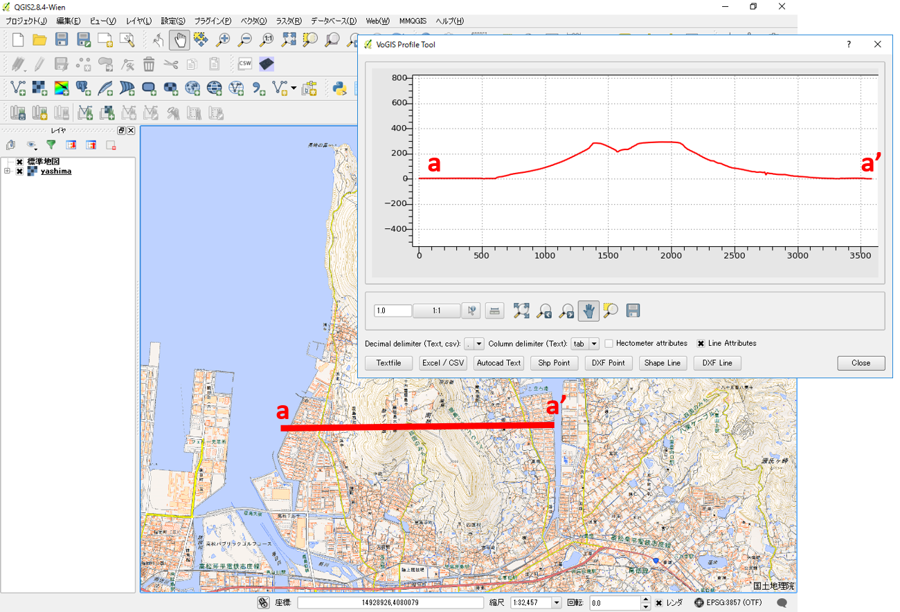
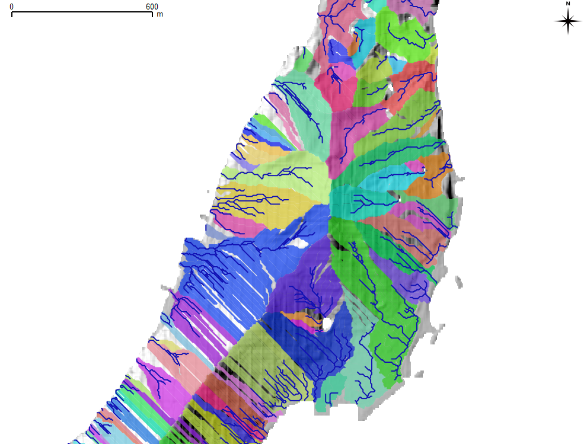
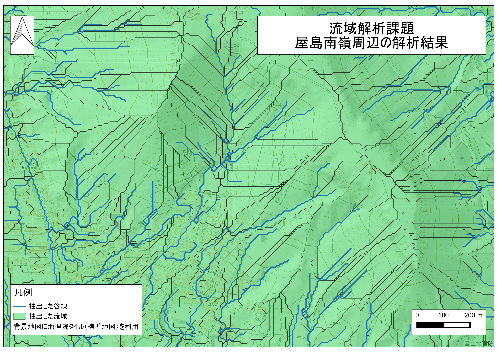

# ラスタデータの分析
　この実習では、ラスタデータを用いた地形情報の可視化や分析を行います。ラスターデータはベクトルデータと異なり、ピクセルごとに入力された値が分析に用いられます。
実習で使われる用語や概念は、[地理情報科学教育用スライド（GIScスライド）]の4章を参照してください。
　手順とGISオープン教材の[ラスタデータの分析]の教材を参考に、完成例のような地図が作成できれば、完了となります。実習で利用するデータの一部は、[既存データの地図データと属性データ]の教材を参考にダウンロードしてください。GIS初学者は、本教材を進める前に[GISの基本概念]の教材を確認しておいてください。  

**実習用データ**  

* 国土地理院「 基盤地図情報　数値標高モデル　5ｍメッシュ　高松周辺（513440）」
>香川県高松市周辺の5ｍDEMをエコリスのツールを用いて変換し、高松市北部の女木島周辺をトリミングしたものです。この手法については、[ラスタデータの分析]の教材をご参照ください。データの座標系は、世界測地系の平面直角座標Ⅳ系に設定しています。

* [国土数値情報] 「国土交通省国土政策局「国土数値情報（島根県　行政区域(H28)、消防署（H24）、医療機関データ（H26））」
>ダウンロード手法は、[既存データの地図データと属性データ]の教材を参考とする。座標系の変換手法は[空間データ]の教材を参考とする。

**Menu**
--------
- [数値標高モデルの視覚的分析](#数値標高モデルの視覚的分析)
- [地形断面図](#地形断面図)
- [ラスタ演算](#ラスタ演算)
- [流域解析](#流域解析)

-----------------

## <a name="数値標高モデルの視覚的分析"></a>数値標高モデルの視覚的分析
　DEMデータを用いて、標高区分図、傾斜区分図、傾斜方位図、陰影図、鳥瞰図を作成し、レイアウトを行い。女木島の地形的な特徴を整理し、400字程度でまとめてください。

**手順**  
1. 実習ページからダウンロードしたラスターデータをQGISで読み込む。  
2. プロパティ＞透過性からデータなしとする値>データ無しの値に0を入力する。  
3. ラスタ＞地形解析から傾斜、傾斜方位、陰影図を作成する。
4. 標高値、傾斜角、斜面方位（0°-360°）など、それぞれのラスターデータの値に応じて色分けを行い、標高区分図、傾斜区分図、傾斜方位図を作成する。  
5. 陰影図をレイヤ順序の最下層とし、各ラスタデータの透過性を30％ほどにし、地形情報を視覚化する。  
6. 平面では、確認しにくい箇所もあるため、プラグインの管理とインストールから、Qgis2threejsをインストールする。インストール後、起動し3Dモデルを作成する（鳥瞰図の作成）。  
7. 作成した標高区分図、傾斜区分図、傾斜方位図、陰影図、鳥瞰図を視覚的に分析し、女木島の地形的な特徴を簡単にまとる。

[△メニューへもどる]

--------

## <a name="地形断面図"></a>地形断面図
　DEMデータは、各セルに標高値を含んでいるため、複数のセルの標高値を利用し、断面図を作成することができます。本実習ではDEMデータを用いて、完成例のようにa-a'（女木島中央部北の標高186.3mを示す三角点付近をとおる西－東断線）, b-b'（女木島南部の標高216.0mを示す三角点付近をとおる北西-南東線）間の地形断面図を作成します。女木島北部と南部の断面形の特徴を整理し、400字程度でまとめてください。

**完成例**  


**手順**  
1. プラグインの管理とインストールから、Profile toolを検索し、インストールする。  
2. QGISで読み込んだDEMデータを用いて、Profile toolで断面系を作成する。  
3. 女木島北部と南部の断面形の特徴を整理し、400字程度でまとめる。  

※傾斜を比較する際は、ウィンドウの縦横比率や、取得した断面の長さに注意してください。

[△メニューへもどる]

--------

## <a name="ラスタ演算"></a>ラスタ演算
　この実習では、複数のラスタデータの範囲と値を組み合わせて、ラスタ演算をします。本実習では、標高データと課題1で作成した傾斜のデータを用いて、ラスタ計算機で標高150m以上、傾斜10°以下のエリアを抽出する解析を行います。[ラスタデータの分析]教材を参考に処理を行い、抽出したエリアの特徴や形状を300字程度でまとめまとめてください。

**手順**  
1. 標高と傾斜のデータをQGISで読み込みラスタからラスタ計算機を起動する。    
2. 出力ファイルを設定し、以下の式を参考に値を入力する。  
3. プロパティ＞スタイル＞単バンド疑似カラーを選択し、モードを等間隔、分類数を2とし、最小を0、最大を1とし分類をクリックする。0の値の色の不透明度を0％にするとみやすい。  
4. 抽出したエリアの特徴や形状を300字程度でまとめる。  


````
 ( "標高ラスタ@1"  >=  150 )  AND  ( "傾斜ラスタ@1" <= 10  )   
````

[△メニューへもどる]

--------

## <a name="流域解析"></a>流域解析  
　この実習ではDEMデータを用いた、流域解析を行います。GRASS GISのプラグインを用いて、流域ポリゴンを作成し、流域とするセルの数を100として処理を行い、河川ごとに流域を抽出した地図を作成し、課題フォームから提出してください。
※今回は、河川ごとの細かい流域をグルーピングせず、支流、本流ごとの流域のものを作成する。

**完成例**  


この課題では、上の図のところまでできれば完了とします。河川ごとに流域をグルーピングし、下のような地図を作成することもできます。  




**手順**  
1. [ラスタデータの分析]教材と[GRASSビギナーズマニュアル]を参考に、QGISのGRASSプラグインを利用し、マップセットを作成する。マップセットの作成については、[GRASSビギナーズマニュアル]のQGISでのマップセット作成の項目を参照してください。  
2. マップセットに標高ラスタを読み込み、ラスタの範囲を設定する。  
3. 流域解析を選択し、流域の最小セルサイズ100とする。  
4. 流域と河川のラスタをベクトルに変換する。  
5. 名前を付けて保存でベクトルレイヤしたのちに、地図をレイアウトし、提出する。  

※ 地図が完成できなかった場合は、作業途中でレイアウトを行い、提出する地図中にできなかった理由を記載し（プリントコンポーザーのテキスト挿入機能）、提出してください。  

[△メニューへもどる]

--------

#### 完成例で使用したデータ
本ページで使用しているデータの出典については、該当する教材よりご確認ください。

[△メニューへもどる]:空間データ.md#menu
[作業メモ]:https://github.com/yamauchi-inochu/demo/blob/master/GISオープン教材/実習課題/作業メモ.md
[QGISビギナーズマニュアル]:../../QGISビギナーズマニュアル/QGISビギナーズマニュアル.md
[GRASSビギナーズマニュアル]:../../GRASSビギナーズマニュアル/GRASSビギナーズマニュアル.md
[GISの基本概念]:../../01_GISの基本概念/GISの基本概念.md
[既存データの地図データと属性データ]:../../07_既存データの地図データと属性データ/既存データの地図データと属性データ.md
[空間データ]:../../08_空間データ/空間データ.md
[空間データの結合・修正]:../../10_空間データの統合・修正/空間データの統合・修正.md
[視覚的伝達]:../../21_視覚的伝達/視覚的伝達.md
[政府統計局e-stat]:https://www.e-stat.go.jp/SG1/estat/eStatTopPortal.do
[国土数値情報]:http://nlftp.mlit.go.jp/ksj/
[基本的な空間解析]:../../11_基本的な空間解析/基本的な空間解析.md
[ネットワーク解析]:../../12_ネットワーク解析/ネットワーク解析.md
[領域解析]:../../13_領域解析/領域解析.md
[点データの解析]:../../14_点データの解析/点データの解析.md
[ラスタデータの解析]:../../15_ラスタデータの分析/ラスタデータの分析.md
[空間補間]:../../18_空間補間/空間補間.md
