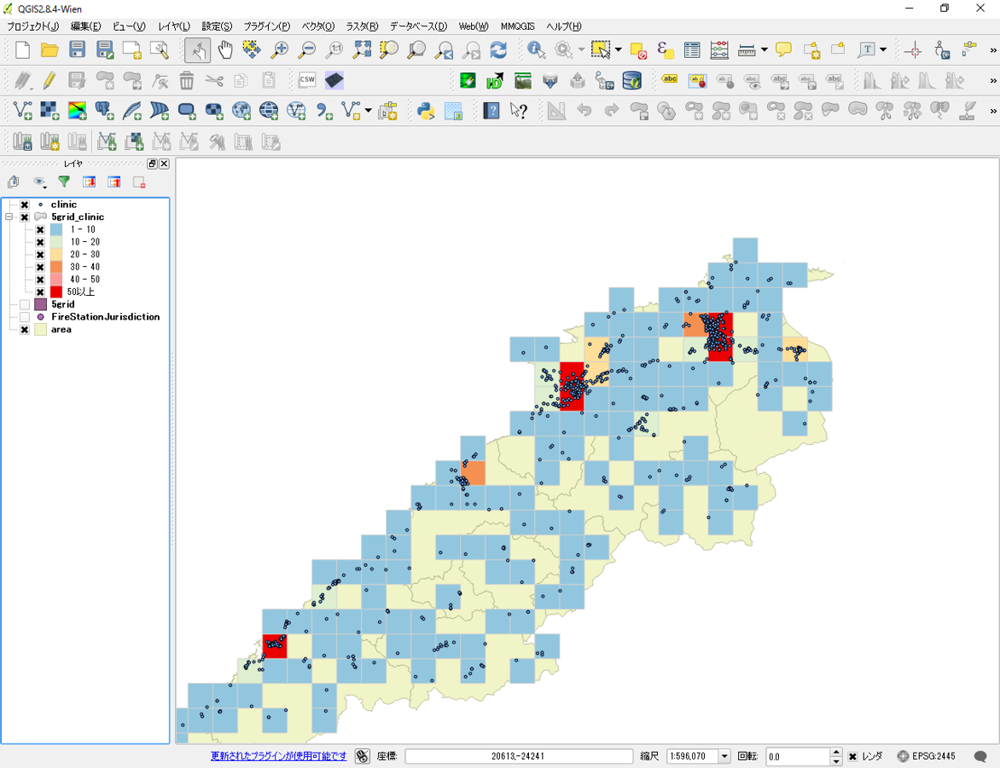

# 課題：点データの分析
　GISで点データの密度を可視化する場合、分析に用いる空間オブジェクトの形状や大きさを考慮する必要があります。この実習では、メッシュによる集計、行政区による集計、カーネル密度分析を用いて、点データを視覚的に分析します。点データの視覚的分析では、メッシュや行政区画などの空間集計に用いるオブジェクトの大きさに影響されるため注意します。実習で使われる用語や概念は、[地理情報科学教育用スライド（GIScスライド）]の4章を参照してください。
　手順とGISオープン教材の[点データの分析]の教材を参考に、完成例のような地図が作成できれば、完了となります。実習で利用するデータの一部は、[既存データの地図データと属性データ]の教材を参考にダウンロードしてください。GIS初学者は、本教材を進める前に[GISの基本概念]の教材を確認しておいてください。

**実習用データ**
　実習をはじめる前に、以下のデータをダウンロードしてください。なお、すべてのデータをJGD2000の平面直角座標系に統一して下さい国土数値情報のデータはダウンロード後に「JGD2000の平面直角座標系第Ⅵ系」へ座標変換する。国土数値情報データの読み込み時に空間参照設定のウィンドウが表示されたら、JGD2000を選択した後（QGIS2.8.4の場合）に変換の処理を行ってください。

* [国土数値情報] 「国土交通省国土政策局「国土数値情報（島根県　行政区域(H28)、消防署（H24）、医療機関データ（H26））」

>ダウンロード手法は、[既存データの地図データと属性データ]の教材を参考とする。座標系の変換手法は[空間データ]の教材を参考とする。

**Menu**
--------
- [メッシュによる点の計測](#メッシュによる点の計測)
- [行政区による点の計測](#行政区による点の計測)
- [カーネル密度分析](#カーネル密度分析)

-----------------

## メッシュによる点の計測
　この実習では、対象地域内に均一な大きさのメッシュポリゴンを作成し、メッシュ内に含まれるポリゴンを計測します。以下の手順と[点データの分析]教材を参考に処理を行い、地図を作成してください。また、地図を作成後に、病院数の多い地域の特徴（位置や人口数などの関係から）を300字程度で簡単にまとめてください。

**完成例**

**手順**

1. プラグイン＞プラグインの管理とインストールから、mmqgisプラグインを検索し、インストールする。
2. 5㎞メッシュを作成する（メッシュは、現在の表示領域で作成するため注意する）。
3. メッシュ内のポイントを計算する（警告が出た場合は、作成した5㎞メッシュを新しく名前を付けて保存で書き出し、再度実行する）。
4. メッシュ内のポイント数で色分けする（段階は任意で調整）。
※ 数値として色分けできない場合は、属性テーブル>編集モードオン>フィールド計算機>新しいフィールドを作成するをチェックする。出力フィールド名を任意で入力し、出力フィールドタイプを整数値にする。検索ウィンドウの下からフィールドと値をクリックし、病院数を計算したフィールドをダブルクリックする。左のウィンドウに計算したフィールドのカラム名が表示されたのを確認し、OKをクリックする。この処理を行ったうえで、値の配色を行う。
5. 病院数の多い地域の特徴を300字程度で回答する。

#### ポリゴン内のポイント計算ができない場合(QGIS2.16以上の場合)
　QGISの最新版では、ベクトルメニューから解析ツールの「ポリゴン内のポイント数」が選択できない。その場合は、プロセッシングツールかMMQGISプラグインを使用する。

* プロセッシングツールの場合・・・・プロセッシング(c)＞ツールボックスを起動し、検索ウィンドウに「points in polygon」と入力すると、「ポリゴン内のポイント数」が利用できる。

* MMQGISの場合・・・プラグイン(p)>プラグインの管理とインストールからMMQGISをインストールする。MMQGIS>Combine>Spatial Joinを選択する。上から、5kmメッシュ（Output Shape Layer）、Contain(Spatial Operation)、病院（Data Layer）、Sumを設定し、出力ファイルの名前とパスを設定しOKをクリックする。文字化けしていたら、プロパティ>エンコーディングをutf-8にする。

[△メニューへもどる]

---------------

## 行政区による点の計測

　この実習では、行政区域のポリゴンを用いて、行政区内の医療機関を計測します。以下の手順と[点データの分析]の教材を参考に分析を行い、完成例のような図を作成し、島根県で最も医療機関の数が少ない市町村を回答してください。

**完成例**

**手順**

1. 属性テーブルを市町村ごとに統一して作成するため、行政区ポリゴンを読み込み市町村でディゾルブする。
2. 行政区画のポリゴンを用いて、市町村ごとの医療機関数を求める。
3. 島根県で最も医療機関の数が少ない市町村を属性テーブルなどから検索し回答する。

[△メニューへもどる]

---------------

## カーネル密度分析

　医療機関のデータを用いて、[カーネル密度分析](http://club.informatix.co.jp/?p=1176)を実行します。カーネル密度分析は犯罪発生マップなどに用いられる手法で、カーネル関数を用いてポイントの分布密度を連続的な密度局面としてモデル化する手法です。今回の場合は、医療機関数を病人の発生個所と仮定しています。以下の手順と[点データの分析]教材のカーネル密度分析の教材を参考に、完成例のような図を作成してください。また、カーネル密度分析について、バンド幅を広くとったカーネルと狭くとったカーネルによる分析結果の違いについて300字程度で回答してください。

**完成例**

**手順**

1. 医療機関のデータを読み込む。
2. ラスタ＞ヒートマップを選択し、密度値を計算する。バンド幅を5000とする。 スタイルを調整する場合は、プロパティ＞スタイル＞バンド表示のレイヤタイプから単バンド疑似カラーを選択する。詳しくは、[空間データの結合・修正]教材の[ラスタのモザイク](https://github.com/yamauchi-inochu/demo/blob/master/GIS%E3%82%AA%E3%83%BC%E3%83%97%E3%83%B3%E6%95%99%E6%9D%90/10_%E7%A9%BA%E9%96%93%E3%83%87%E3%83%BC%E3%82%BF%E3%81%AE%E7%B5%B1%E5%90%88%E3%83%BB%E4%BF%AE%E6%AD%A3/%E7%A9%BA%E9%96%93%E3%83%87%E3%83%BC%E3%82%BF%E3%81%AE%E7%B5%B1%E5%90%88%E3%83%BB%E4%BF%AE%E6%AD%A3.md#ラスタのモザイク)の項目を参照する。
※ 今回はバンド幅によって、カーネルがどう平滑化されるかが、目視レベルで確認できれば良い。

3. 同様の手法で、バンド幅(半径)を2500と10000のものを作成し、設問に回答する。

[△メニューへもどる]

#### 完成例で使用したデータ
本ページで使用しているデータの出典については、該当する教材よりご確認ください。

[△メニューへもどる]:空間データ.md#menu
[作業メモ]:https://github.com/yamauchi-inochu/demo/blob/master/GISオープン教材/実習課題/作業メモ.md
[QGISビギナーズマニュアル]:../../QGISビギナーズマニュアル/QGISビギナーズマニュアル.md
[GRASSビギナーズマニュアル]:../../GRASSビギナーズマニュアル/GRASSビギナーズマニュアル.md
[GISの基本概念]:../../01_GISの基本概念/GISの基本概念.md
[既存データの地図データと属性データ]:../../07_既存データの地図データと属性データ/既存データの地図データと属性データ.md
[空間データ]:../../08_空間データ/空間データ.md
[空間データの結合・修正]:../../10_空間データの統合・修正/空間データの統合・修正.md
[視覚的伝達]:../../21_視覚的伝達/視覚的伝達.md
[政府統計局e-stat]:https://www.e-stat.go.jp/SG1/estat/eStatTopPortal.do
[国土数値情報]:http://nlftp.mlit.go.jp/ksj/
[基本的な空間解析]:../../11_基本的な空間解析/基本的な空間解析.md
[ネットワーク解析]:../../12_ネットワーク解析/ネットワーク解析.md
[領域解析]:../../13_領域解析/領域解析.md
[点データの解析]:../../14_点データの解析/点データの解析.md
[ラスタデータの解析]:../../15_ラスタデータの解析/ラスタデータの解析.md
[空間補間]:../../18_空間補間/空間補間.md
[点データの分析]:../../14_点データの分析/点データの分析.md
[地理情報科学教育用スライド（GIScスライド）]:http://curricula.csis.u-tokyo.ac.jp/slide/4.html
