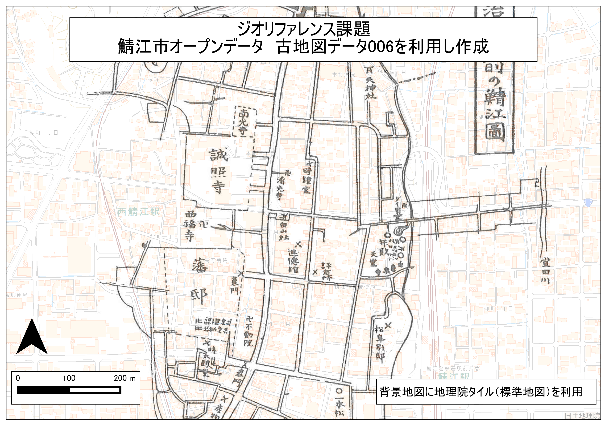
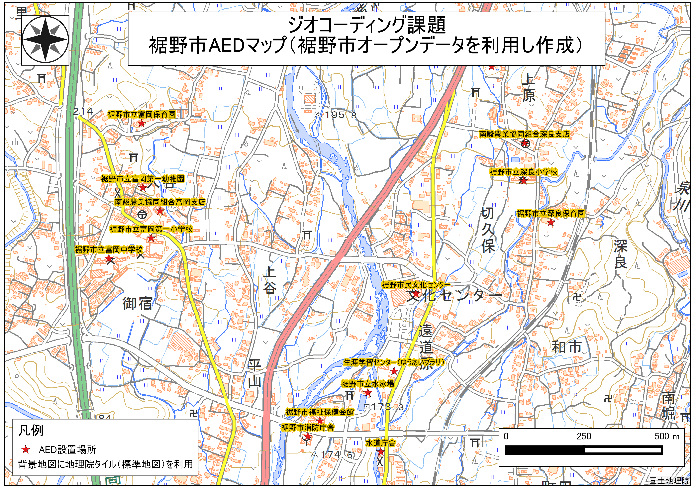

# 空間データ
　この実習は、空間座標の変換、ジオリファレンス、ジオコーディングなどデータの保持する位置情報の変換やデータに位置情報を付加する手法について学ぶためのものです。GISでデータ分析をする場合、データの空間座標に注意する必要があります。データによって空間座標が異なっていると、位置ズレが生じ、データの処理が行えないことがあります。データに空間座標を付加する場合にも、注意が必要になります。  
　手順とGISオープン教材の[空間データ]の教材を参考に、完成例のような地図が作成できれば、実習完了となります。実習で利用するデータの一部は、[既存データの地図データと属性データ]の教材を参考にダウンロードしてください。GIS初学者は、本教材を進める前に[GISの基本概念]の教材を確認しておいてください。

**Menu**
--------
* [空間座標の変換](#空間座標の変換)
* [ジオリファレンス](#ジオリファレンス)
* [ジオコーディング](#ジオコーディング)

## 空間座標の変換
　日本測地系と世界測地系のズレを示す地図を作成し、なぜズレが表示されるかについてWEB等で調べた後に、400字程度でまとめてください。また、地理座標系と投影座標系の違いについても400字程度でまとめてください。  
　データは、[政府統計局e-stat]（平成２２年国勢調査（小地域））より、任意地域の日本測地系緯度経度・Shape形式と世界測地系平面直角座標系・Shape形式のデータを用いて、両データが重なり合わない地図を作成してください。  

※　最新の測地系はJGD2011であるが、QGIS2.8.4ではJGD2011の変換ができないため、本実習ではJGD2000を新測地系としている（2.14は、JGD2011に対応）。

**完成例**  

**手順**  
①　e-statから任意の地域の異なる測地系のshapeファイル（平面直角座標系）をダウンロードする  
②　QGISでデータを表示する（デフォルトでは、ずれて表示されないため、右下のボタンから、オンザフライ投影をクリックし、チェックをはずす）  
③　QGISビギナーズマニュアルを参考に、地図をレイアウトする  
④　レイアウト後に旧測地系データを新測地系に変換する（地図データが重なればOK）  
⑤　新測地系に変換した投影座標系のデータを地理座標系に変換する。
⑥　QGISの作業ファイル（.qgs）に任意の名前をつけ保存し、画面を閉じる

-------
## <a name="ジオリファレンス">ジオリファレンス  
　ジオリファレンスは、位置情報のもたない画像などのデータに位置情報を持たせる際に用いる手法です。鯖江市のオープンデータより古地図007をダウンロードし、地理院タイルをもとにGCPを取得し、完成例のようにジオリファレンスした図を作成してください（なお、地理院タイルが利用できない場合は、基盤地図情報2500基本項目鯖江市道路等を利用する。ベクトルデータを用いたジオリファレンスの方が、データの位置精度が高くなる）。  

**完成例**  

**手順**  
① [鯖江市のオープンデータ](http://www.city.sabae.fukui.jp/pageview.html?id=12768)より古地図007をダウンロードする。  
② [sabae_sample](https://github.com/yamauchi-inochu/demo/blob/master/GISオープン教材/実習課題/sample/sabae_sample.zip?raw=true)とタイルレイヤプラグインを用いて地理院タイル（標準地図など）を読み込んでおく（高い位置精度を求める場合は、基盤地図情報の道路縁等を用いることが望ましい。）  
④ 古地図を読み込みQGISのジオリファレンサーを起動する  
⑤ ジオリファレンサーの利用法を参考に、古地図007にGCP(Ground Control Point)を付加する(完全には一致しないため、おおまかでよい)  
⑥ QGISビギナーズマニュアルを参考に、地図をレイアウトする(古地図のプロパティを開き、画像を透過すると良い)  
⑦ QGISの作業ファイル（.qgs）に任意の名前をつけ保存し、画面を閉じる  

-------

## ジオコーディング**  
　ジオコーディングは、緯度経度や住所などの情報を保持したテキストファイル等を用いてGISで扱えるデータを作成する手法です。サンプルデータ[susono_emergency_shelter.csv](https://github.com/yamauchi-inochu/demo/blob/master/GISオープン教材/実習課題/sample/susono_sample.zip?raw=true)の住所を用いて、ジオコーディング（アドレスマッチング)を行い完成例のような地図を作成して下さい。

**完成例**  

**手順**  
① CSVアドレスマッチングサービスを用いて、サンプルデータに位置情報（X、Y）を付加する。  
② CSVデータを読み込みshapeファイルに変換する。  
③ 変換したShapeファイルの座標系を平面直角座標第８系に変換する  
④ QGISビギナーズマニュアルを参考に、地図をレイアウトする(古地図のプロパティを開き、画像を透過すると良い)  
⑤ QGISの作業ファイル（.qgs）に任意の名前をつけ保存し、画面を閉じる

[△メニューへもどる]

#### 完成例で使用したデータ
本ページで使用しているデータの出典については、該当する教材よりご確認ください。

[△メニューへもどる]:空間データ.md#menu

[作業メモ]:https://github.com/yamauchi-inochu/demo/blob/master/GISオープン教材/実習課題/作業メモ.md
[QGISビギナーズマニュアル]:../../QGISビギナーズマニュアル/QGISビギナーズマニュアル.md
[GRASSビギナーズマニュアル]:../../GRASSビギナーズマニュアル/GRASSビギナーズマニュアル.md
[GISの基本概念]:../../01_GISの基本概念/GISの基本概念.md
[既存データの地図データと属性データ]:../../07_既存データの地図データと属性データ/既存データの地図データと属性データ.md
[空間データ]:../../08_空間データ/空間データ.md
[空間データの結合・修正]:../../10_空間データの統合・修正/空間データの統合・修正.md
[視覚的伝達]:../../21_視覚的伝達/視覚的伝達.md
[政府統計局e-stat]:https://www.e-stat.go.jp/SG1/estat/eStatTopPortal.do
[国土数値情報]:http://nlftp.mlit.go.jp/ksj/
[基本的な空間解析]:../../11_基本的な空間解析/基本的な空間解析.md
[ネットワーク分析]:../../12_ネットワーク分析/ネットワーク分析.md
[領域分析]:../../13_領域分析/領域分析.md
[点データの分析]:../../14_点データの分析/点データの分析.md
[ラスタデータの分析]:../../15_ラスタデータの分析/ラスタデータの分析.md
[空間補間]:../../18_空間補間/空間補間.md
