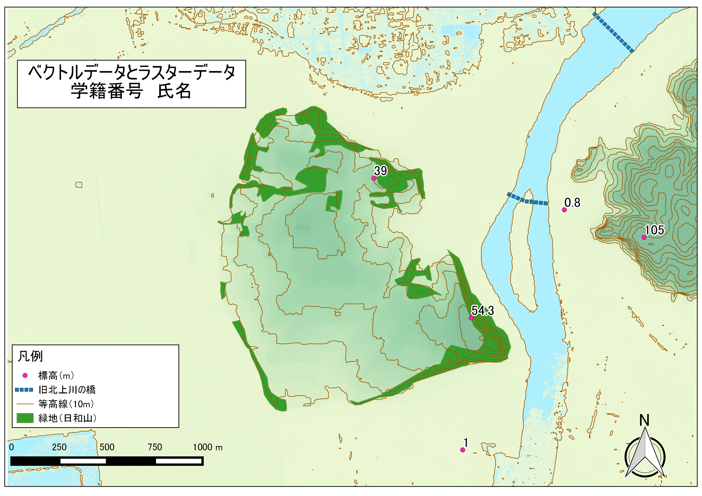

# 課題：空間データの統合・修正
　この実習は、既存のラスタデータの結合による新規ラスターデータ作成と背景地図をトレースした新規ベクトルデータ作成を行うものです。実習で使われる用語や概念は、[地理情報科学教育用スライド（GIScスライド）]の4章を参照してください。
　手順とGISオープン教材の[ラスタデータの分析]の教材を参考に、完成例のような地図が作成できれば、実習完了となります。GIS初学者は、本教材を進める前に[GISの基本概念]の教材を確認しておいてください。  

**実習用データ**  
　実習データは、国土地理院の基盤地図情報からダウンロードした宮城県石巻市周辺の5ｍDEMをエコリスのツールを用いて変換したものです。座標系は世界測地系の平面直角座標系に統一しています。

* 国土地理院　「基盤地図情報　基本項目　石巻周辺 （574142、574143、574152、574153） 基盤地図情報　数値標高モデル　5ｍメッシュ　石巻周辺 （574142、574143、574152、574153）」
>ダウンロードと変換の手法は、[既存データの地図データと属性データ]教材と[ラスタデータの分析]教材を参考とする。座標系の変換手法は[空間データ]の教材を参考とする。

* 地理院タイル（国土地理院）
>タイルの利用は、[QGISビギナーズマニュアル]の教材を参考とする。

**Menu**
--------
- [ラスタデータのクリップと等高線作成](#ラスタデータのクリップと等高線作成)
- [新規ベクトルデータの作成](#新規ベクトルデータの作成)

-----------------

## ラスタデータのクリップと等高線作成
　この実習では、既存のラスタデータを用いて任意の範囲で切り抜く実習を行います。また、対象範囲内の等高線抽出や標高値の取得も行います。以下の手順と[空間データの結合・修正]教材を参考に、実習を行い、作成した等高線と地物情報表示ツールで任意地点の標高値が取得できれば、完了となります。

**手順**  
1. [ラスターデータの分析]基盤地図情報から5ｍDEMをダウンロードし、変換後にQGISで読み込む。  
2.  旧北上川右岸の日和山を中心とし、ラスタデータを任意の範囲で切り抜き、新規ラスタの配色をプロパティから調整する（任意の値で設定）。  
3. クリップしたラスタデータを用いて、10m間隔で等高線を抽出する。  
4. 地物情報表示ツールを[QGISビギナーズマニュアル]で確認し、ツールを起動し、任意の地点の標高を調べる。  
レイヤウィンドウでクリップしたラスタを選択した状態で、地物情報表示ツールのアイコンをクリックする。調べたい地点をクリックすると別ウィンドウにレイヤ情報（標高）が表示される。  

[△メニューへもどる]  

--------

## 新規ベクトルデータの作成
　この実習は、新規ベクトルデータの作成練習を目的としたものです。前の課題で作成したラスタデータと地理院タイル（東日本大震災被災地震災後オルソ画像（2012年10月～2013））を用いて、下記の手順と[空間データの結合・修正]の教材を参考に、完成例のような地図を作成してください。地図の作成後、以下の設問の回答を各300字程度でまとめてください。

**設問**  
1. 異なる年代の空中写真を用いて、1960年以降の日和山の植生の変遷についてまとめてください。  
  
**完成例**  

**手順**  
1. 前の実習でクリップしたラスタデータをQGISで読みこむ。  
2. ポイントの作成：地理院タイル（標準地図等）や課題データを利用し、任意の5地点の標高を調べポイントを作成する。属性は、id(Integer,幅2)、地名(String,幅20)、標高(Real,幅５〜６,精度2~3)とし、属性テーブルは、Id(通し番号)、付近の地名（もしくは建物名）、標高値を記入する。  
標準地図から標高値を求める場合は、地図から標高点を探す。ラスタから標高値を求める場合は、レイヤウィンドウでレイヤを選択した状態で、地物情報表示ツールのアイコンをクリックする。調べたい地点をクリックすると別ウィンドにレイヤ情報が表示される。  
3. ラインの作成：タイルレイヤプラグインを用いて背景地図（東日本大震災被災地震災後オルソ画像（2012年10月～2013））を表示し、旧北上川の橋をトレースする（なぞる）。  
※ラインの新規作成は、作成後右クリックで新規レイヤとして反映される。  
4. ポリゴンの作成：ライン作成時に利用した空中写真を用いて、日和山の植生が多くみられる部分のポリゴンを作成する（おおまかでよい）。  
※ポリゴンの新規作成は、作成後右クリックで新規レイヤとして反映される。  
5. 各レイヤごとに色分けやラベルの設定をする。ラベルは、プロパティ＞ラベル　から標高値もしくは、地名で設定する。  
6. 地図をレイアウトする。  

[△メニューへもどる]

--------

#### 完成例で使用したデータ
本ページで使用しているデータの出典については、該当する教材よりご確認ください。

[△メニューへもどる]:空間データ.md#menu
[作業メモ]:https://github.com/yamauchi-inochu/demo/blob/master/GISオープン教材/実習課題/作業メモ.md
[QGISビギナーズマニュアル]:../../QGISビギナーズマニュアル/QGISビギナーズマニュアル.md
[GRASSビギナーズマニュアル]:../../GRASSビギナーズマニュアル/GRASSビギナーズマニュアル.md
[GISの基本概念]:../../01_GISの基本概念/GISの基本概念.md
[既存データの地図データと属性データ]:../../07_既存データの地図データと属性データ/既存データの地図データと属性データ.md
[空間データ]:../../08_空間データ/空間データ.md
[空間データの結合・修正]:../../10_空間データの統合・修正/空間データの統合・修正.md
[視覚的伝達]:../../21_視覚的伝達/視覚的伝達.md
[政府統計局e-stat]:https://www.e-stat.go.jp/SG1/estat/eStatTopPortal.do
[国土数値情報]:http://nlftp.mlit.go.jp/ksj/
[基本的な空間解析]:../../11_基本的な空間解析/基本的な空間解析.md
[ネットワーク解析]:../../12_ネットワーク解析/ネットワーク解析.md
[領域解析]:../../13_領域解析/領域解析.md
[点データの解析]:../../14_点データの解析/点データの解析.md
[ラスタデータの分析]:../../15_ラスタデータの分析/ラスタデータの分析.md
[空間補間]:../../18_空間補間/空間補間.md
