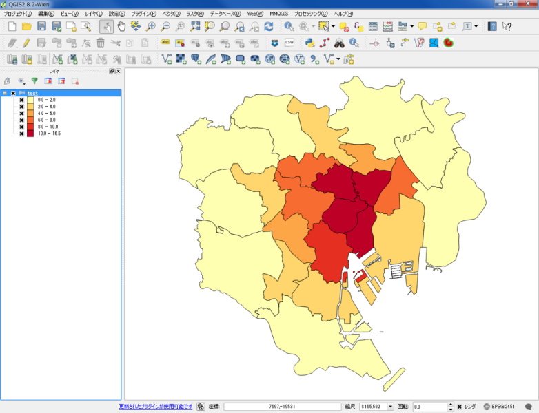

# 空間データベース
　この実習は、空間データベースを用いたデータの検索や分析を行うものです。pgAdminⅲとPostGISを用いて実習をするため、事前にソフトウェアをインストールしてください。実習で使われる用語や概念は、[地理情報科学教育用スライド（GIScスライド）]を参照してください。
　手順とGISオープン教材の[空間データベース]の教材を参考に、完成例のような地図が表示できれば、実習完了となります。実習で利用するデータの一部は、[既存データの地図データと属性データ]の教材を参考にダウンロードしてください。GIS初学者は、本教材を進める前に[GISの基本概念]の教材を確認しておいてください。  

**実習用データ**  

* 国土交通省国土政策局「[国土数値情報] 東京都行政区画データと全国鉄道データ）」を23区のみのデータに加工し、利用。
* [東京都オープンデータ]　地域別人口.xlsx（出典:【地域別人口　（2-3表）】、東京都、クリエイティブ・コモンズ・ライセンス 表示 2.1（http://creativecommons.org/licenses/by/2.1/jp/）
）を利用し、平成25年1月人口をcsvに加工したものを利用。

（行政区画とテーブル結合→面積計算→utf-8で保存したものを用意する。）

---

## 空間データベースの作成と駅密度の計算

**完成例**  

**手順**  
1. pgAdminⅲを起動する  
2. 空間データベースを作成し、データを読み込む  
3. [空間データベース]の教材を参考に、23区の駅密度を計算する
4. QGISデータを読み込み、値ごとに色分けをする  

[△メニューへもどる]

---

#### 完成例で使用したデータ
本ページで使用しているデータの出典については、該当する教材よりご確認ください。

[△メニューへもどる]:空間データ.md#menu
[作業メモ]:https://github.com/yamauchi-inochu/demo/blob/master/GISオープン教材/実習課題/作業メモ.md
[QGISビギナーズマニュアル]:../../QGISビギナーズマニュアル/QGISビギナーズマニュアル.md
[GRASSビギナーズマニュアル]:../../GRASSビギナーズマニュアル/GRASSビギナーズマニュアル.md
[GISの基本概念]:../../01_GISの基本概念/GISの基本概念.md
[既存データの地図データと属性データ]:../../07_既存データの地図データと属性データ/既存データの地図データと属性データ.md
[空間データ]:../../08_空間データ/空間データ.md
[空間データの結合・修正]:../../10_空間データの統合・修正/空間データの統合・修正.md
[視覚的伝達]:../../21_視覚的伝達/視覚的伝達.md
[政府統計局e-stat]:https://www.e-stat.go.jp/SG1/estat/eStatTopPortal.do
[国土数値情報]:http://nlftp.mlit.go.jp/ksj/
[基本的な空間解析]:../../11_基本的な空間解析/基本的な空間解析.md
[ネットワーク解析]:../../12_ネットワーク解析/ネットワーク解析.md
[領域解析]:../../13_領域解析/領域解析.md
[点データの解析]:../../14_点データの解析/点データの解析.md
[ラスタデータの解析]:../../15_ラスタデータの分析/ラスタデータの分析.md
[空間補間]:../../18_空間補間/空間補間.md
[東京都オープンデータ]:http://www.metro.tokyo.jp/SUB/OPENDATA/
[空間データベース]:../../18_空間補間/空間補間.md
