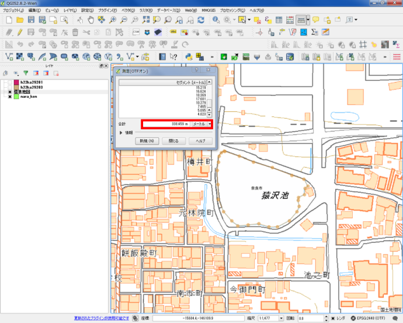
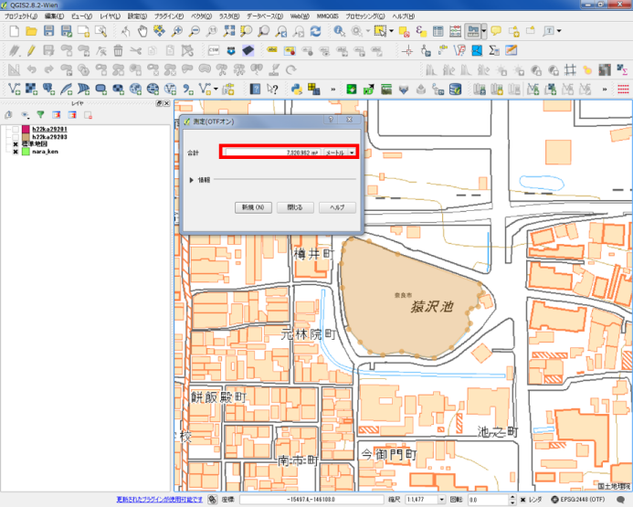
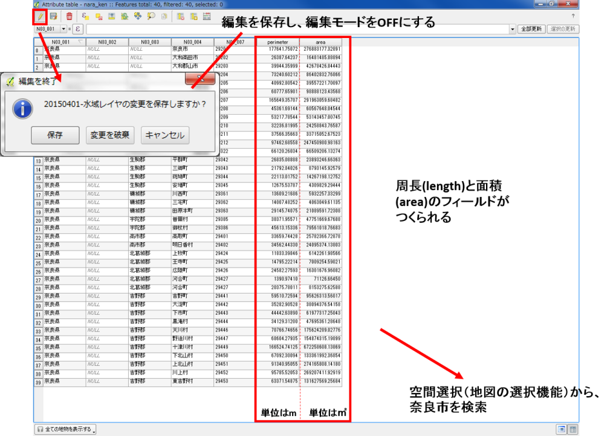
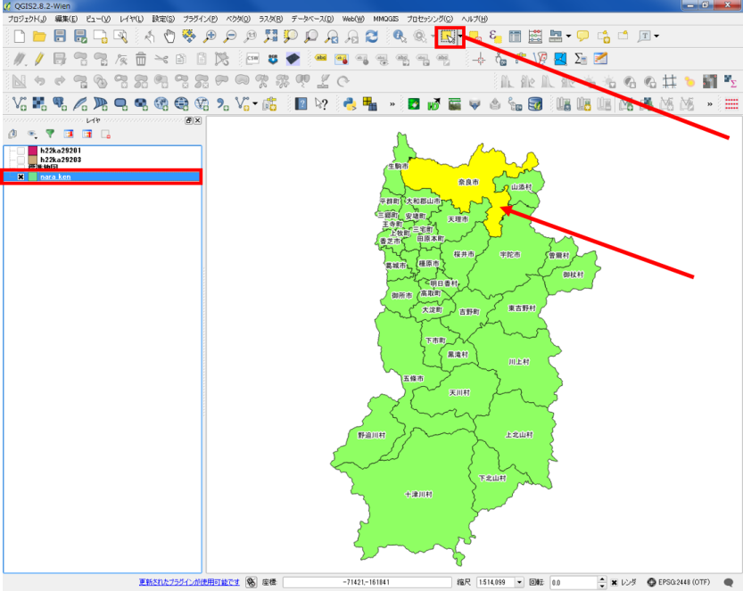
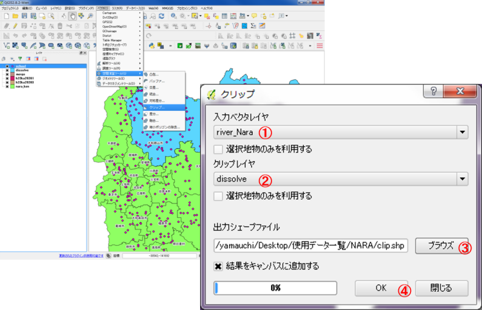
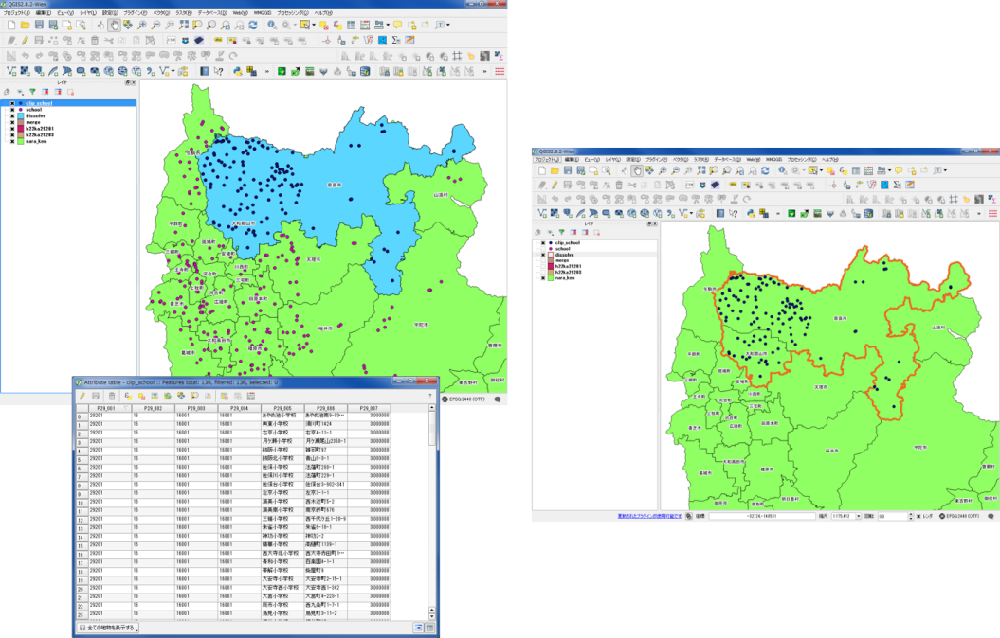
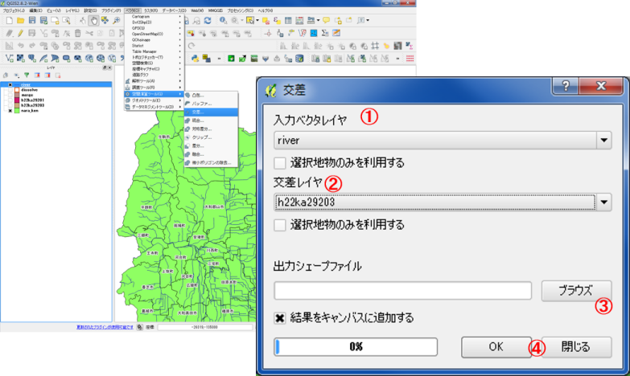
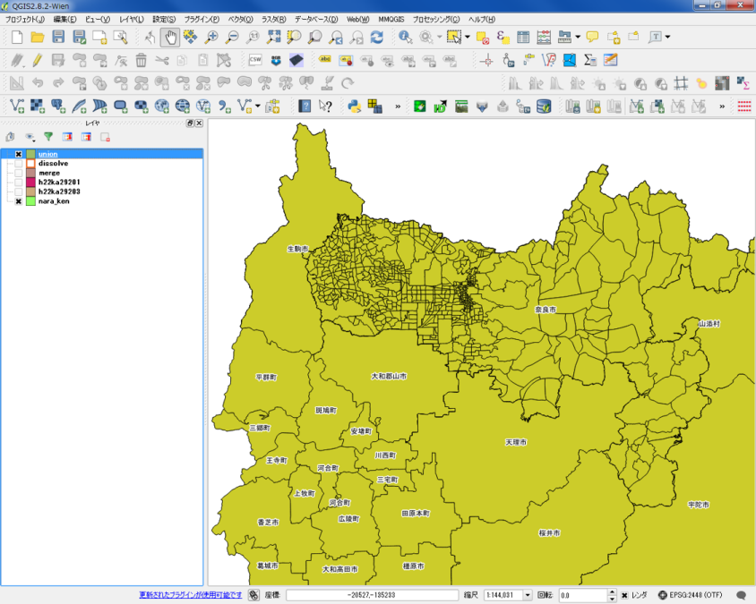

# 基本的な空間解析
本教材は、「基本的な空間解析」の実習用教材です。GISソフトウェア（QGIS）を用いた、地物の計測、ディゾルブ、クリップなどの空間解析手法について解説しています。講義用教材として、[地理情報科学教育用スライド（GIScスライド）]の4章が参考になります。  

本教材を使用する際は、[利用規約]をご確認いただき、これらの条件に同意された場合にのみご利用下さい。

[地理情報科学教育用スライド（GIScスライド）]:http://curricula.csis.u-tokyo.ac.jp/slide/4.html
[利用規約]:../../../master/利用規約.md

**Menu**
------
* [基本量の測定と空間オブジェクトの選択](#基本量の測定と空間オブジェクトの選択)
* [その他の空間データの操作](#その他の空間データの操作)
* [オーバーレイ分析](#オーバーレイ分析)

**使用データ**
* 「国土交通省国土政策局「国土数値情報（奈良県　行政区域、学校、河川データ）」を加工（座標変換[EPSG:2448] ）し利用
* 政府統計の総合窓口([e-Stat]) 奈良市、大和郡山市境界データを利用
* 国土地理院　[地理院タイル]

[国土数値情報]:http://nlftp.mlit.go.jp/ksj/
[e-Stat]:http://www.e-stat.go.jp/
[地理院タイル]:http://maps.gsi.go.jp/development/ichiran.html

**スライド教材**  
スライドのダウンロードは[こちら]
[こちら]:../../../../raw/master/Markdown/11_基本的な空間解析/基本的な空間解析.pptx
--------

## 基本量の測定と空間オブジェクトの選択
地理院タイルを用いて、猿沢池の周長と面積の測定を行う。
奈良市の境界データを読み込み、タイルレイヤプラグインから地理院タイルの標準地図を読み込む。タイルレイヤプラグインについては、[QGISビギナーズマニュアル]を参照。

[QGISビギナーズマニュアル]:

### 手動で、長さ と 面積 を計測する
  
計測ツールをクリックし、線の長さを測るを選択する。

#### 猿沢池の周長を測定
  
池の外周を縁取るように、点を打ち、最初の点と重なったところで右クリックする。  
線の長さが計測できるが、計測結果に個人差がある。  
※　手動　－　周長：338.459m

#### 猿沢池の面積を測定
  
池の外周を縁取るように、点を打ち、最初の点と重なったところで右クリックする。  
線の長さが計測できるが、計測結果に個人差がある。   
※　手動　－　面積： 7,320.962 ㎡

### フィールド演算から、長さ と 面積 を計測する
奈良県の行政区域データから市町村の境界の長さと面積を計算する。
  
① 属性テーブルを開き、編集モードに切り替える。  
② フィールド計算機を開く。

  
① 「新しいフィールドを作る」にチェックする。  
② フィールド名：　perimeter  
③ 出力フィールドタイプ：　real  
④ 出力フィールド幅：　10 ※任意で変更可  
⑤ 精度：　5 ※任意で変更可  
⑥ 関数：　ジオメトリから$perimeterをダブルクリックする。※式に$perimeterが表示される。  
※今回は周長なので$perimeterを選択する。  
線長を計測する場合には、$lengthを使用する。  
⑦ OKをクリックする。  
※面積の計測には、同じ手順で、$areaを使用する。

  
周長(length)と面積(area)のフィールドがつくられる。
空間選択（地図の選択機能）から、奈良市を検索する。

  
属性テーブルから選択しない場合は、選択ボタンを利用する。  
奈良市をクリックし、青色になっているのを確認したのち、地物選択をクリックする。
奈良市をクリックすると、色が黄色（選択色）になる。

  
① 属性テーブルを開き選択した地物を表示する。  
② 地図で選択した地物のみ表示される。  

[▲メニューへもどる]  
[▲メニューへもどる]:基本的な空間解析.md#menu

## その他の空間データの操作
奈良市と大和郡山市にある学校を抽出する。

### 奈良市と大和郡山市のポリゴンをマージ(Merge)する
ベクタ＞データマネージメントツール＞複数のシェープファイルを一つに結合する
  
① ポリゴンを選択する。  
② ブラウズから入力ディレクトリを選択する。  
③ ブラウズから出力するシェープファイルの保存する場所と名前を入力する。  
④ OKをクリックする。  

奈良市と大和郡山市がマージされ、一つのポリゴンになった。
  

### マージしたポリゴンをデイゾルブ(Dissolve)しする
  
ベクタ＞空間演算ツール＞融合
① 入力ベクタレイヤを選択する。  
② 融合フィールドを指定する。  
融合フィールドは、属性が統一されている行を選択する。  
③ ブラウズから、出力場所と名前を入力する。  
④ OKを入力する。  

  
町丁目界がなくなり、単純なポリゴンが作成できた。

### ディゾルブしたポリゴンをもとに学校をクリップ(Clip)する。
  
ベクタ＞空間演算ツール＞クリップ  
① 入力ベクタレイヤに学校レイヤを追加する。  
② クリップレイヤにデイゾルブした市域のレイヤを追加する。  
③ ブラウズから、出力場所と名前を入力する。  
④ OKを入力する。  
※入力レイヤ：　切り取りたいレイヤ  
　クリップレイヤ：　クリップに使うレイヤ

  
奈良市と大和郡山市にある学校が抽出できた。

[▲メニューへもどる]

## オーバーレイ分析

### インターセクト(Intersect)
国土数値情報の河川レイヤを用いて、大和郡山市と交わる水域を、インターセクトし(Intersect)、別のポリゴンにする。  

  
ベクター＞空間演算ツール＞交差
① 入力ベクタレイヤを水域にする。　　
② 交差レイヤを大和郡山市にする。　　
③ ブラウズから、出力場所と名前を入力する。　　
④ OKを入力する。　

  
大和郡山市と交差するレイヤが新規に作成された。
※属性情報をチェックしクリップとの違いを確認する。ポリゴンやラインは、長さや面積の再計算が必要な場合がある。

### ユニオン (Union)
奈良県と奈良市町丁目のポリゴンを一つのポリゴンに統合する。

  
ベクター＞空間演算ツール＞統合
① 入力ベクタレイヤを奈良市にする。  
② 交差レイヤを奈良県にする。  
③ ブラウズから、出力場所と名前を入力する。  
④ OKを入力する。  

  
奈良県と奈良市町丁目のポリゴンを一つのポリゴンに統合できた。

[▲メニューへもどる]
