# 領域分析
本教材は、「領域分析」の実習用教材です。GISソフトウェア（QGIS）を用いた、バッファなどの領域分析の手法について解説しています。  
講義用教材として、[地理情報科学教育用スライド（GIScスライド）]の4章が参考になります。  

本教材を使用する際は、[利用規約]をご確認いただき、これらの条件に同意された場合にのみご利用下さい。

[地理情報科学教育用スライド（GIScスライド）]:http://curricula.csis.u-tokyo.ac.jp/slide/4.html
[利用規約]:../../../master/利用規約.md
**Menu**
------
* [バッファによる領域分析](#バッファによる領域分析)
* [ボロノイ分割による領域分析](#ボロノイ分割による領域分析)
* [ドローネ三角形](#ドローネ三角形)

**使用データ**

* 「国土交通省国土政策局「[国土数値情報]（愛知県　行政区域、郵便局、小学校、小学校区データ　全国　鉄道線、鉄道駅、空港データ）」を加工し、利用」

[国土数値情報]:http://nlftp.mlit.go.jp/ksj/index.html

**スライド教材**  
スライドのダウンロードは[こちら]
[こちら]:https://github.com/yamauchi-inochu/demo/raw/master/Markdown/13_領域分析/領域分析.pptx
-------
## バッファによる領域分析
国土数値情報よりダウンロードしたポイントデータを利用し、バッファの処理を行う。  
空間検索による地物の検索も行う。

### 点バッファの作成
駅のポイントから500mのバッファを表示し、空間検索でバッファと重なる郵便局を抽出する。  
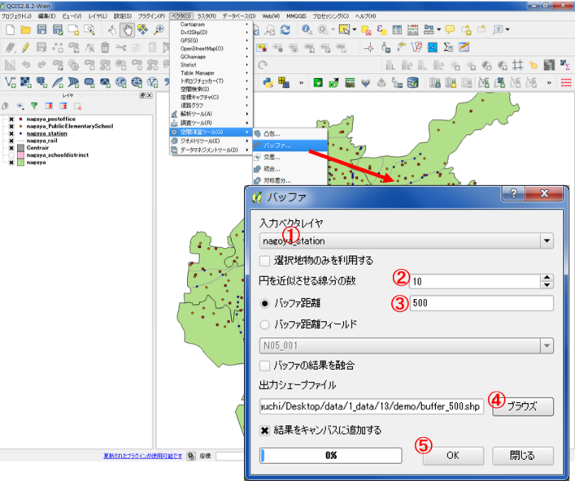  
ベクタ＞空間演算ツール＞バッファ  
① 駅を選択する。  
② 円を近似させる線分の数10を入力する。（数が多いほどきれいな円になる）  
③ 平面直角座標系であることを確認したのちに500を入力する。  
④ 出力先と名称を指定する。  
⑤ OKをクリックする。  

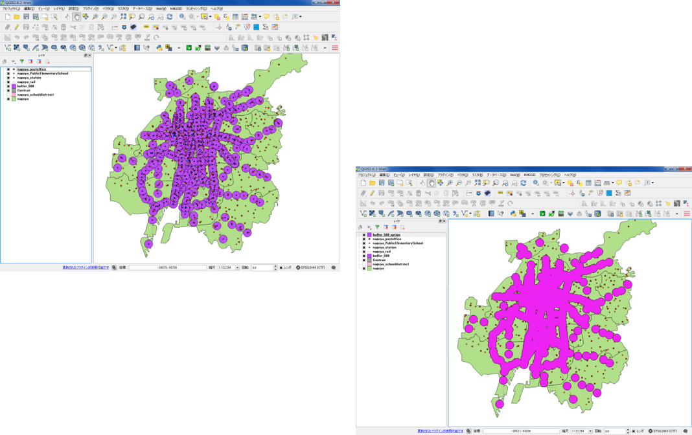  
(左)駅から500mのエリアが表示できた。  
(右)バッファの結果を融合にチェックをいれた場合。

### 空間検索を利用した抽出
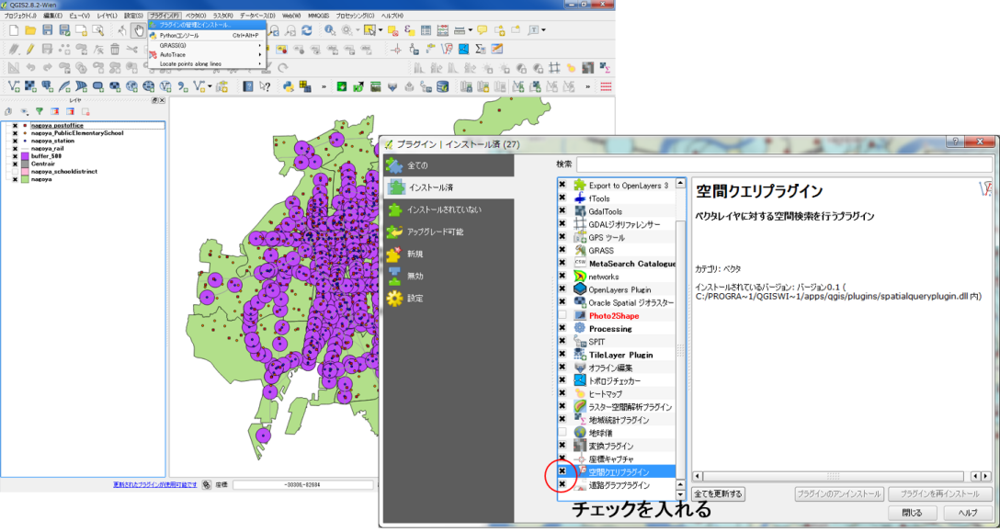  
プラグイン＞プラグインの管理とインストール

  
ベクタ＞空間検索（S）＞空間検索（S）
① ソース地物の選択、郵便局を選択する。  
② 範囲内を選択する。  
③ buffer500mを選択する。  
④ 適用をクリックする。  

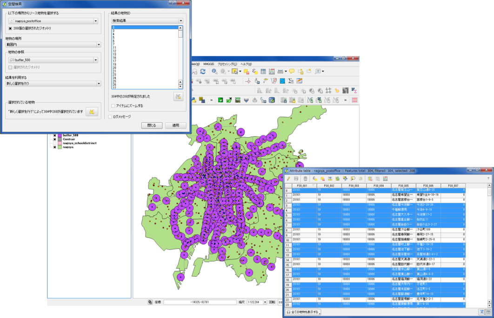  
駅から500m圏内の郵便局が選択された。  
選択した郵便局のみ保存することも可能。
 
  
レイヤの上で右クリックし、「名前をつけて保存する」から「選択地物のみ保存する」にチェックを入れて保存する。

### 多重リングバッファ
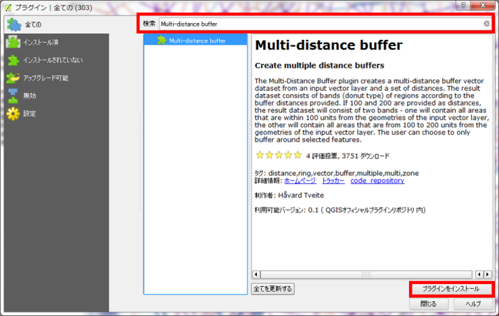  
プラグイン＞プラグインの管理とインストール
Multi-distance bufferを検索する。  
「プラグインをインストール」をクリックする。

  
ベクタ＞Multi-distance buffer＞Multi-distance buffer
① 駅を選択する。  
② Addで距離を追加する。  
③ 出力レイヤ名を入力する。  
④ OKをクリックする。  

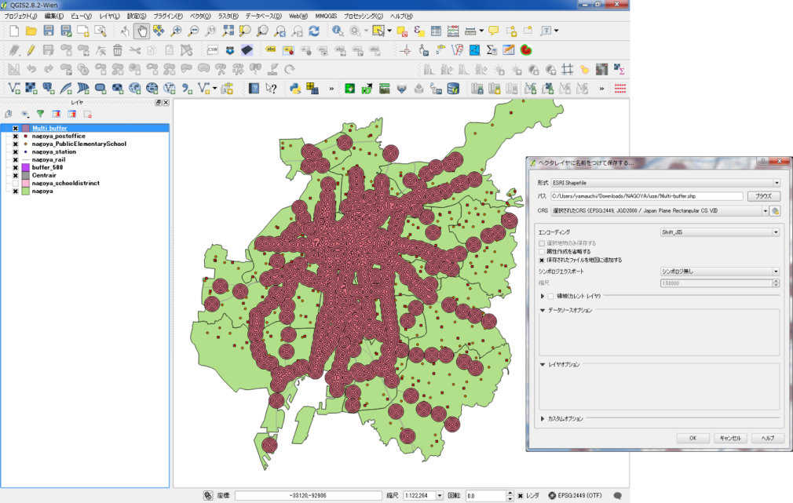  
１００ｍごとの多重リングバッファができた。  
「名前をつけて保存」から新規レイヤとして出力する。
 
  
属性データを用いて、100mごとの色分けを行う。

  
100mごとの多重リングバッファがみやすくなった。

### 線バッファと面バッファ
  
同じ方法で、ラインやポリゴンからのバッファが作成できる。

[▲メニューへもどる]  
[▲メニューへもどる]:領域分析.md#menu

## ボロノイ分割による領域分析
学校の領域をボロノイ分割する。
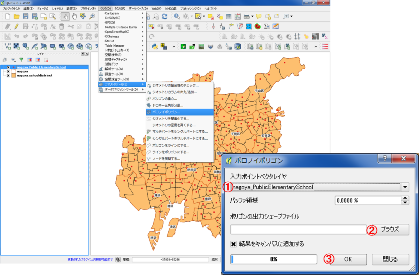  
ベクタ＞ジオメトリーツール＞ボロノイポリゴン
①公立小学校を選択する。  
②出力場所と名称を入力する。  
③OKをクリックする。  
※バッファ領域の値が大きいほど、ボロノイポリゴンの一番外側の領域が大きくなる。

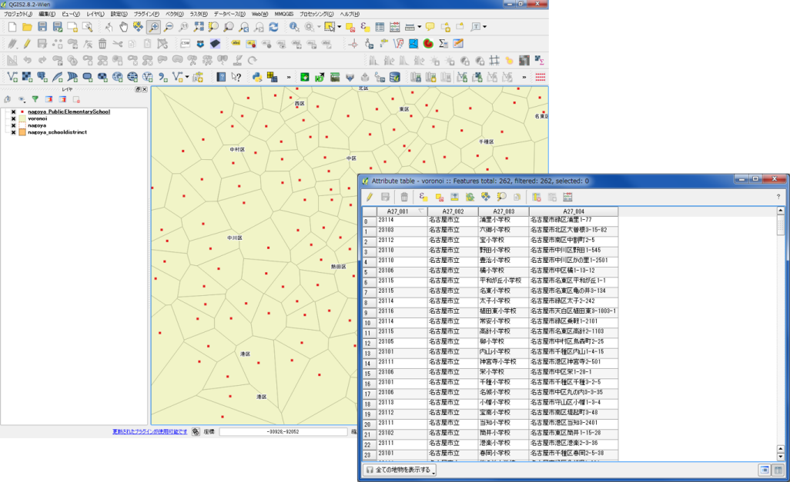  
ボロノイ領域に分割された。  
属性テーブルとして、ポイントの情報を保持する。

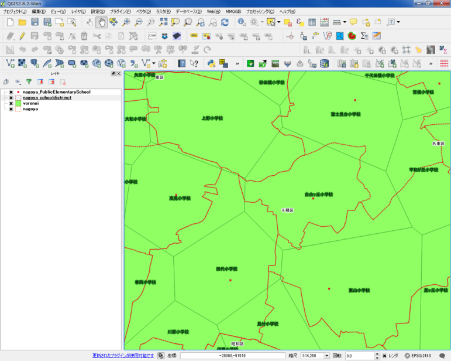  
スタイルを整えて、名古屋市の公立小学校区と勢圏（赤が小学校区、緑がボロノイポリゴン）を表示。

[▲メニューへもどる]  

## ドローネ三角形
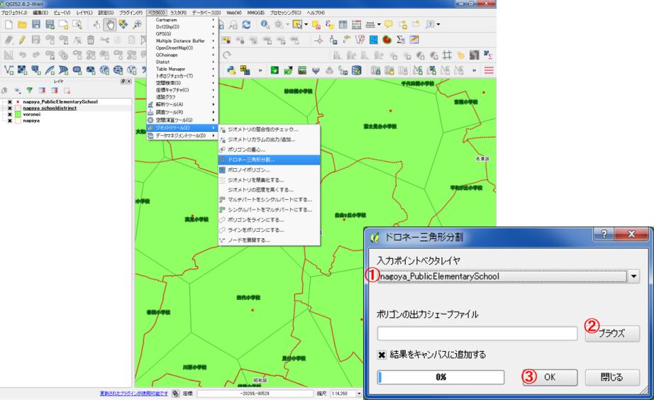  
ベクタ＞ジオメトリーツール＞ドローネ三角形分割
① 小学校を選択する。  
② 出力場所と名称を入力する。  
③ OKをクリックする。  

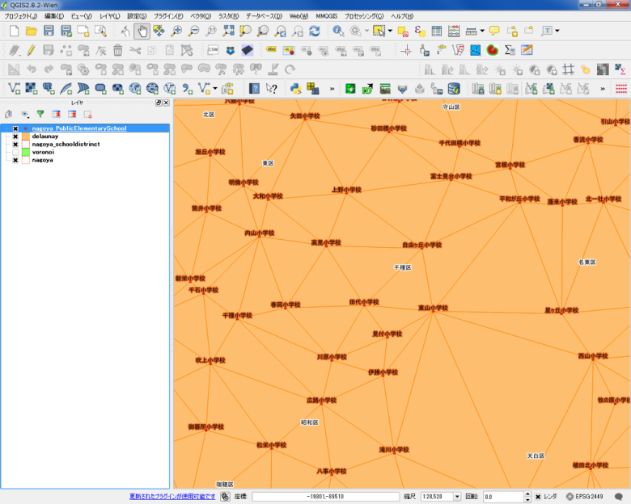  
ドローネ三角形による領域分割ができた。

[▲メニューへもどる]  
