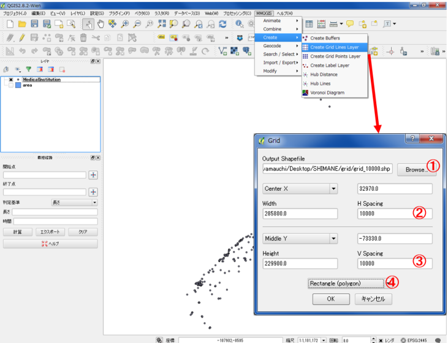
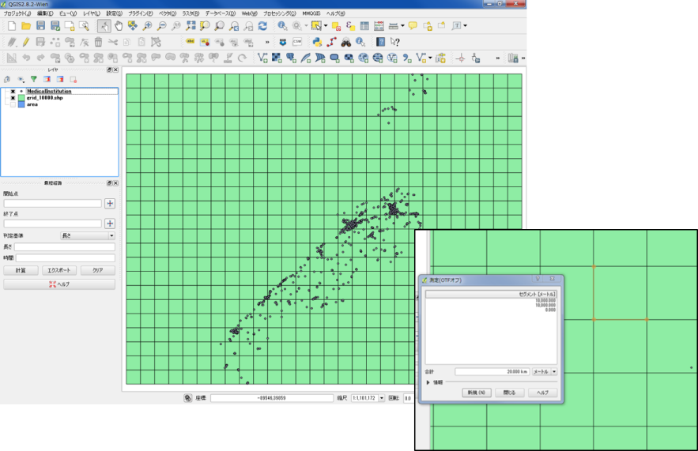
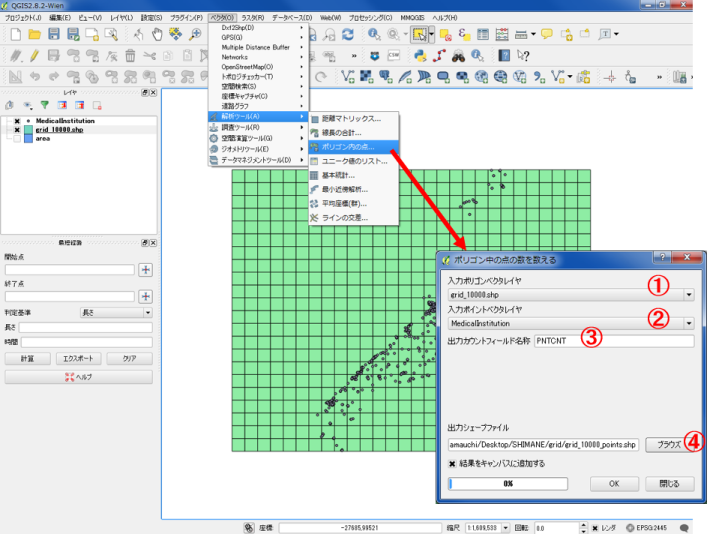
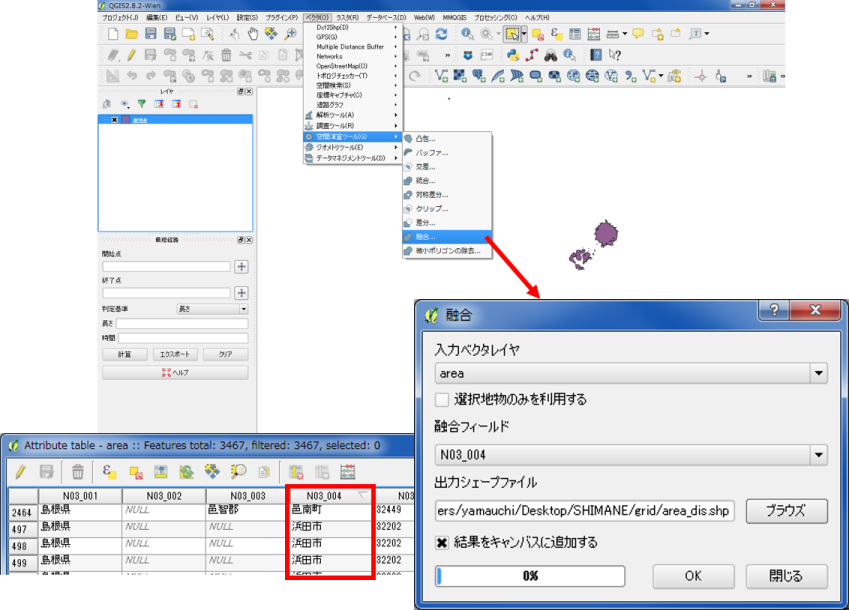
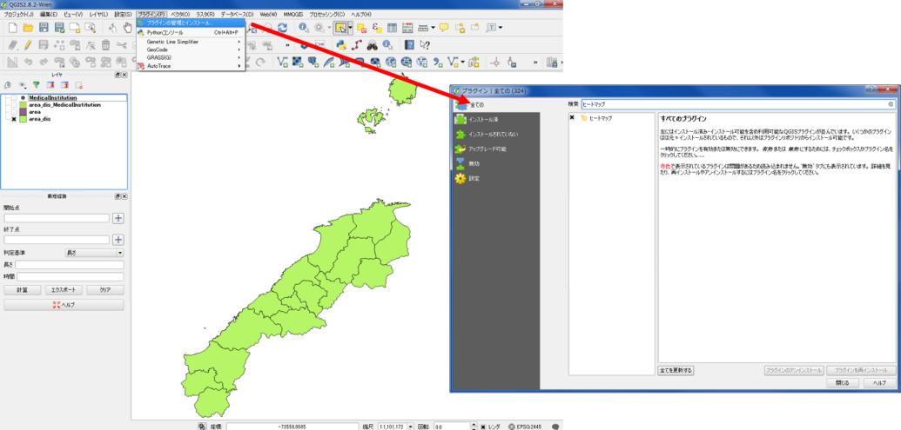
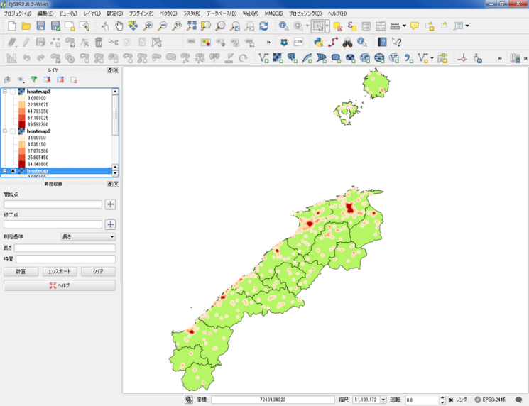

# 点データの分析
本教材は、「点データの分析」の実習用教材です。GISソフトウェア（QGIS）を用いて、点データを可視化し分析する手法について解説しています。
講義用教材として、[地理情報科学教育用スライド（GIScスライド）]の4章が参考になります。  

本教材を使用する際は、[利用規約]をご確認いただき、これらの条件に同意された場合にのみご利用下さい。

[地理情報科学教育用スライド（GIScスライド）]:http://curricula.csis.u-tokyo.ac.jp/slide/4.html
[利用規約]:https://github.com/yamauchi-inochu/demo/blob/master/利用規約.md
**Menu**
------
**視覚的分析**
* [点の分布密度](#点の分布密度)
* [メッシュによる点密度](#メッシュによる点密度)
* [行政区内の点密度](#行政区内の点密度)
* [カーネル密度推計](#カーネル密度推計)

**使用データ**

* 「国土交通省国土政策局「[国土数値情報]（島根県　行政区域、道路、消防署、医療施設データ）」を加工し（座標変換EPSG:2445 ）、利用」

[国土数値情報]:http://nlftp.mlit.go.jp/ksj/index.html

  **スライド教材**  
  スライドのダウンロードは[こちら]
  [こちら]:https://github.com/yamauchi-inochu/demo/raw/master/Markdown/14_点データの分析/点データの分析.pptx
-------

## 点の分布密度
QGISで国土数値情報の病院のデータを表示する。
  
点が密集していることはわかるが、地域ごとの密度の違いはよくわからない  
→　メッシュや行政区画ごとに密度を求める

## メッシュによる点密度の表示
  
プラグイン＞プラグインの管理とインストール  
mmqgisプラグインを検索し、インストールする。

### メッシュの作成
  
MMQGIS＞Create＞Create Grid Lines Layer  
出力先を指定し、H Spacingを10000（m）にする。　　
V Spacingを10000（m）にする。10km×10kmのメッシュを作成する。  
Retangle(polygon)を選択し、OKをクリックする。  
最後に、座標系を選択する（今回は、EPSG:2445）。  
※　表示範囲にメッシュが作成されるため、点データの領域にズームし全体を表示しておく。

  
10km×10kmのメッシュが作成できた。

### メッシュ内のポイント数を計算する
  
ベクタ＞解析ツール＞ポリゴン内の点の数を数える
入力ポリゴンベクタレイヤにメッシュを指定し、入力ポイントベクタレイヤに病院のレイヤを指定する。  
出力フィールド名を入力し、出力先と新規データー名を入力して、OKをクリックする。

  
メッシュ内のポイント数を含んだ、新規ポリゴンが作成された。  
属性テーブルを開き、一番端の列のデータを並び替えて表示すると、計算結果が追加されている。  
メッシュ内のポイント数をもとに色分けを行う。  

### メッシュ内のポイント数で色分けする
  
ポリゴン内のポイント数に応じて色分けを行う。

  
メッシュごとに病院の密度が可視化された。
  

## 行政区内の点密度
※その前に、デイゾルブして、行政区画を簡素化しておく（次スライドを参照）
  
入力レイヤに行政区画のポリゴンを指定し、融合フィールドに市町村名のフィールドを選択する。

行政区画のポリゴンをディゾルブする。
  
ベクタ＞空間演算ツール＞融合  
入力レイヤに行政区画のポリゴンを指定し、融合フィールドに市町村名のフィールドを選択する。

  
計算結果の表示の設定する。  
プロパティから表示やラベル設定を調整する。

  
行政区画ごとのポイント数を円の大きさで表現した。

## カーネル密度推計
ヒートマッププラグインをインストールする。
（ヒートマッププラグインについては、[QGISユーザガイド]を参照）
  
[QGISユーザガイド]:http://docs.qgis.org/2.2/ja/docs/user_manual/plugins/plugins_heatmap.html

  
入力ポイントレイヤと出力ラスタを設定し、半径を1ｋｍに設定する。

  
出力されたラスタの配色を設定し、表示する。

  
半径の値を変えると、値が変化し出力される。

[▲メニューへもどる]
[▲メニューへもどる]:点データの分析.md#menu
