# Carto DBでWeb MAPを作成
本教材は、CartoDBを用いて空間データを表示する手法について解説しています。CartoDBを用いたインターネットによる地図データの分析や公開を行います。
本教材を使用する際は、[利用規約]をご確認いただき、これらの条件に同意された場合にのみご利用下さい。

[利用規約]:../../../../../master/利用規約.md

**Menu**
------
* [CartoDBとは？](#CartoDBとは？)
* [アカウント取得](#アカウント取得)
* [データを読み込む](#データを読み込む)
* [NEWマップを作成する](#NEWマップを作成する)
* [SQLでデータを分析する](#SQLでデータを分析する)

**使用データ**

* [越前市オープンデータ] 越前市防災安全課　一次避難場所（風水害）、浸水想定区域（風水害）のデータを加工し、利用。


[越前市オープンデータ]:http://www.city.echizen.lg.jp/office/010/021/open-data-echizen.html


**スライド教材**  
スライドのダウンロードは[こちら]
[こちら]:../../../../../raw/master/Markdown/インターネットの活用に関する教材/CartoDBでWebMAPを作成/CartoDBでWebMAPを作成.pptx
--------

## CartoDBとは？

- 地図データや地図を編集・共有できるサービス
- データのインポート・表示が簡単にできる
- SQLによるデータの分析がブラウザ上で可能
- 時系列データのなど表現が多様

[▲メニューへもどる]  
[▲メニューへもどる]:CartoDBでWebMAPを作成.md#menu

## アカウント取得
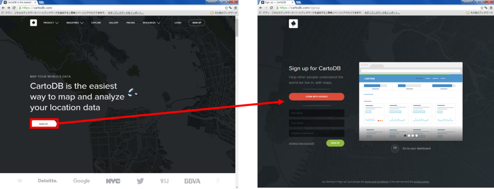  
[CartoDBの公式サイト]にアクセスする、SIGN UPをクリックし、アカウント作成を行う。

[CartoDBの公式サイト]:https://cartodb.com

[▲メニューへもどる]  

## データを読み込む
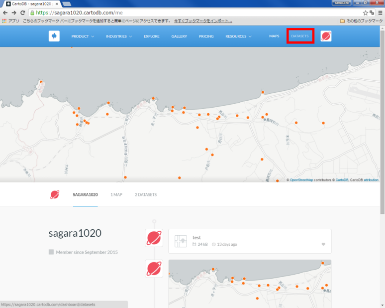  
DATASETSをクリックして、dashboardを開く。

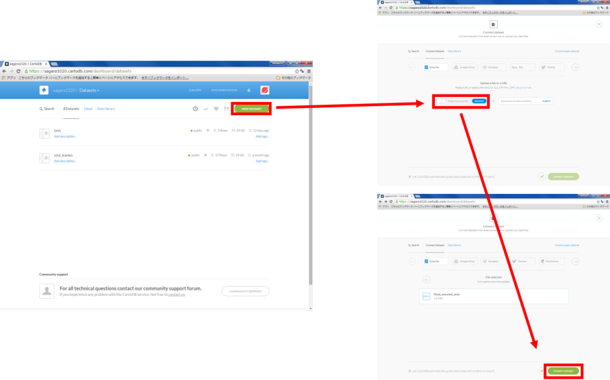  
NEW DATASETをクリックし、Drag & drop か　BROWSEからファイルを選択し、データを読み込む。

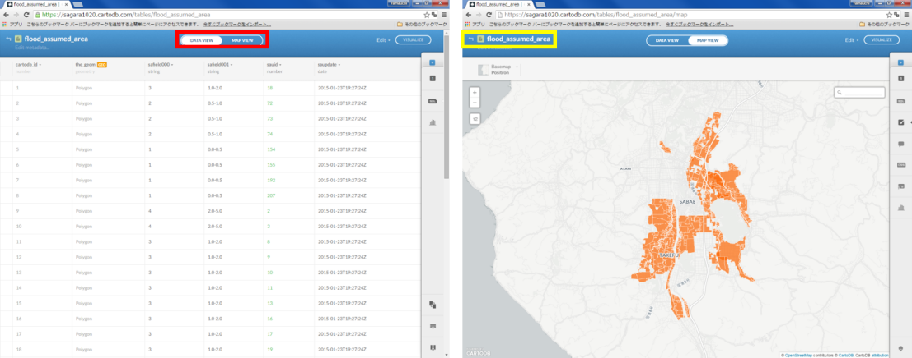  
DATA VIEW でテーブルデータが表示でき、MAP VIEWで地図が表示できる。
黄色枠のボタンで戻ることができるため、一次避難所のデータも読み込む。

[▲メニューへもどる]  

## <a name="NEWマップを作成する">NEWマップを作成する
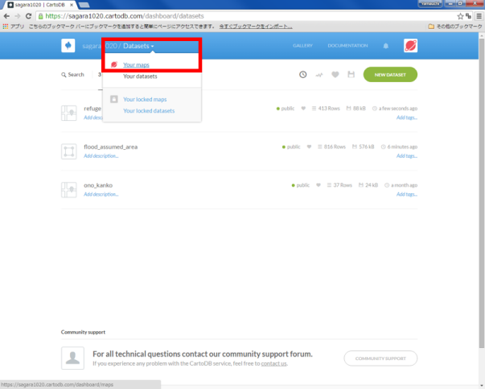  
Datasetsの横の下三角ボタンから、Your mapsをクリックする。

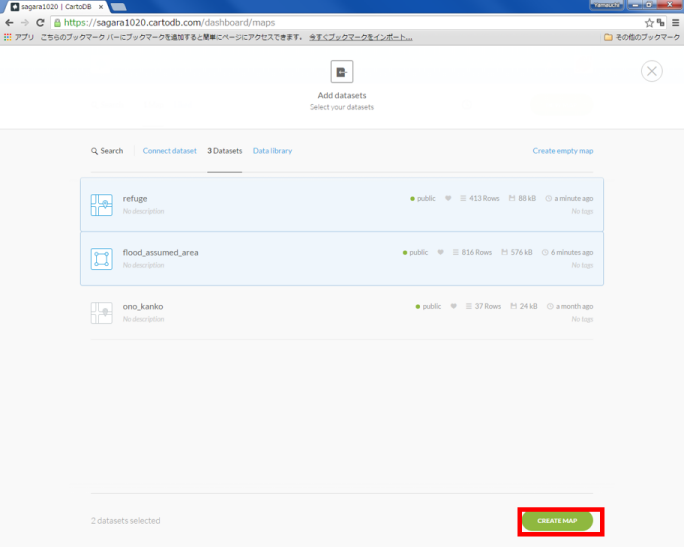  
NEW MAP をクリックし、読み込むデータをDatasetsから選択する。

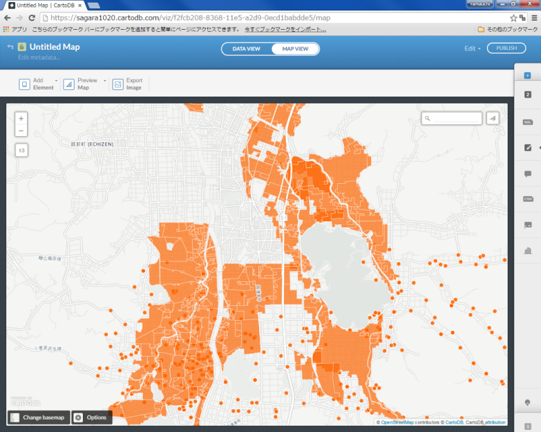  
MAPが表示できたので、各レイヤのスタイル、凡例などを変更する。

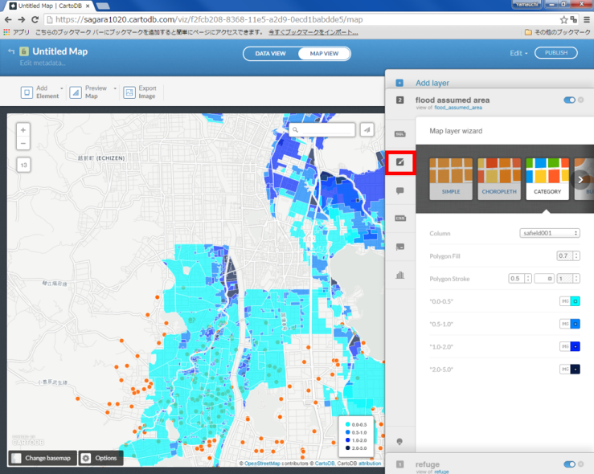  
CATEGORYを選択し、想定浸水深で色分けを行う。

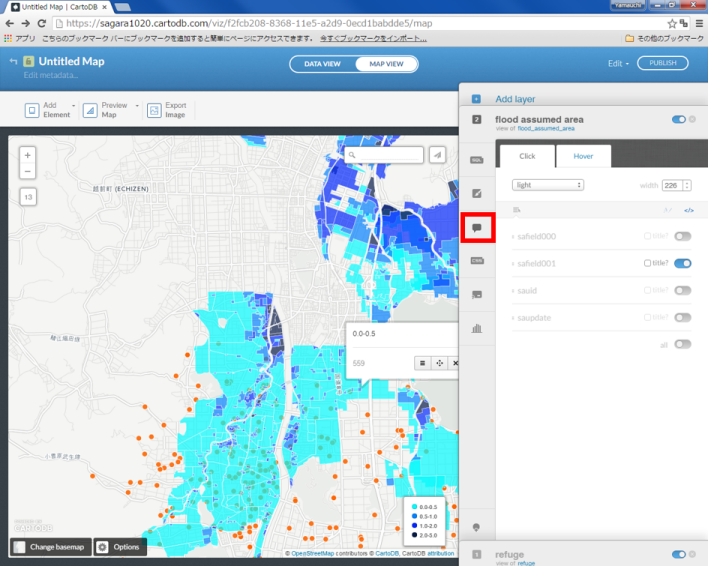  
想定浸水深のフィールドを選択し、ポッポアップで浸水深が表示されるようにする。

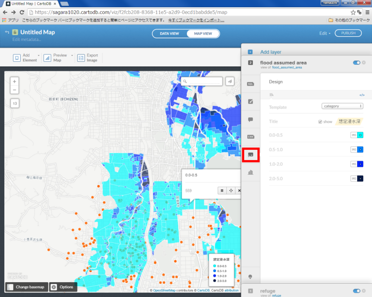  
凡例の設定を行う。

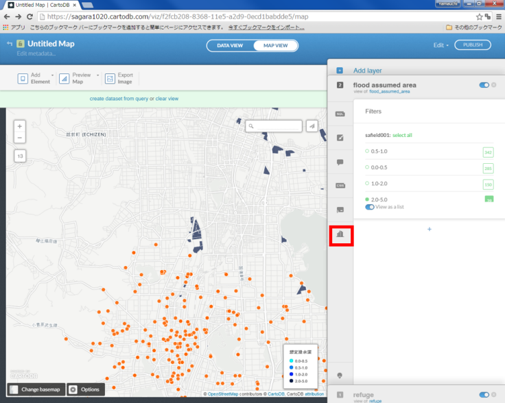  
フィルターをかけ、表示するレイヤを設定することができる。

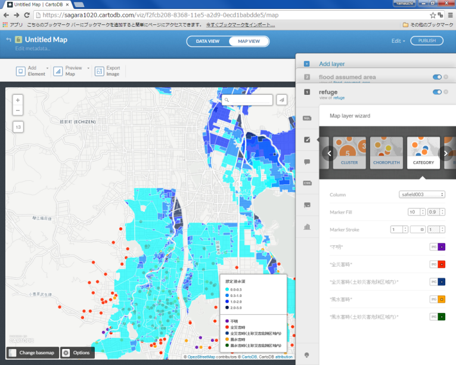  
想定浸水区域のポリゴンと同じように、ポイントデータのスタイルを変更する。

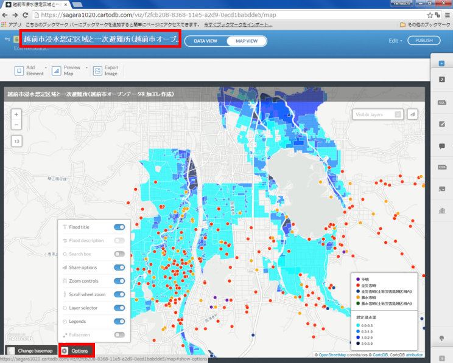  
地図の名前を変更し、Optionsから地図表示の設定を行う。

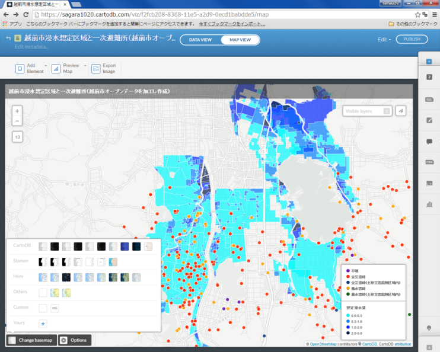  
Change basemap から　ベースマップを変更することができる。  
※　Yoursからタイル読み込みも可能。

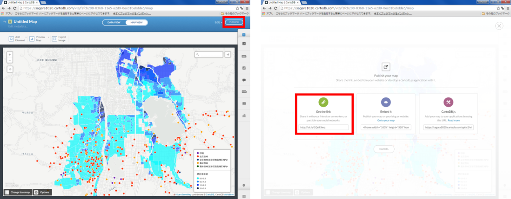  
レイヤの設定が完了したら、右上のPUBLISHをクリックする。  
Get the link からURLをコピーし、ブラウザで検索する。

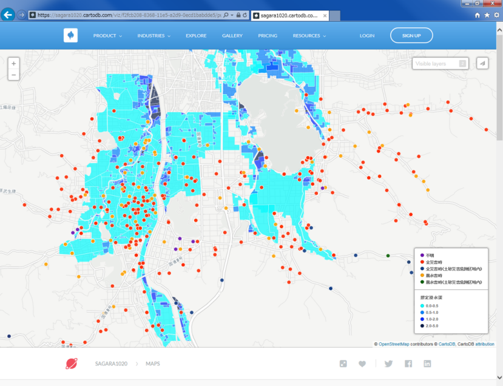  
ブラウザで地図が表示できるようになった。

[▲メニューへもどる]  

## <a name="SQLでデータを分析する">SQLでデータを分析する
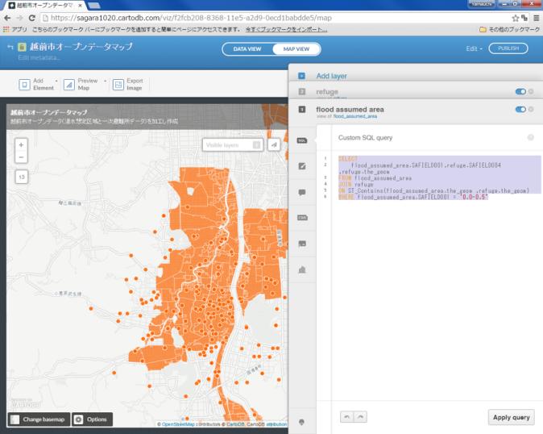  
Apply queryをクリックして、コードを実行する。  
ＳＱＬから、上のコードを入力し、想定浸水区域内の一時避難所を抽出する。

```
SELECT
    flood_assumed_area.SAFIELD001,refuge.SAFIELD004 ,refuge.the_geom
FROM flood_assumed_area
JOIN refuge
ON ST_Contains(flood_assumed_area.the_geom ,refuge.the_geom)

```

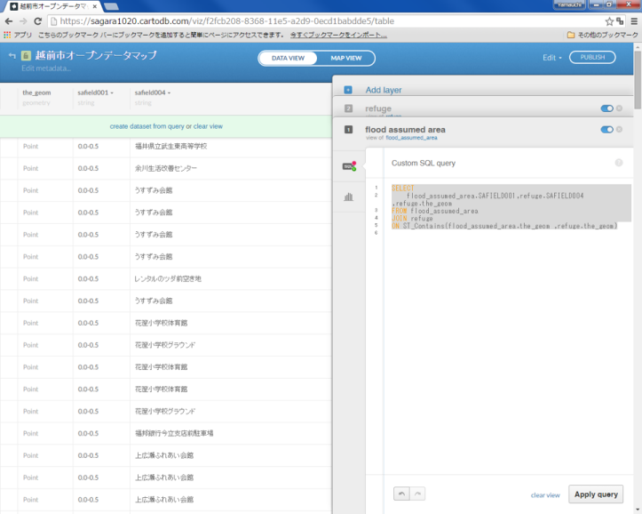  
想定浸水区域内のデータが抽出されたのをDATA VIEWとMAP VIEWで確認する。  
create dataset from query or clear viewをクリックし、新規にデータセットを作成する。

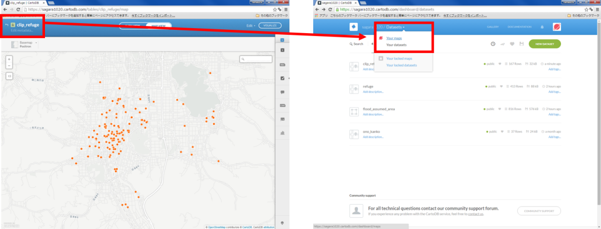  
新規にデータセットが作成できた（必要があれば名称を変更しておく）。  
作成していたマップに戻り、新規に作成したデータセットを追加する。

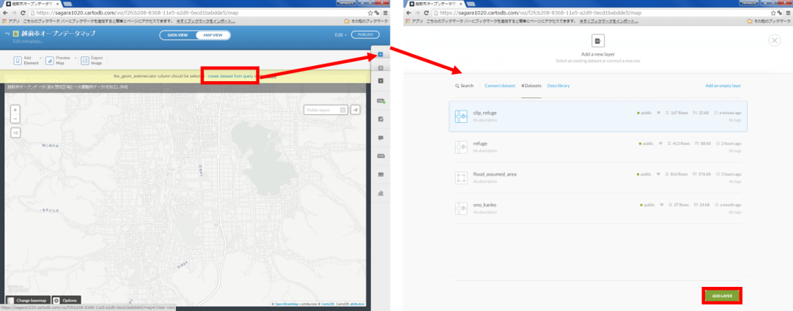  
create dataset from query をクリックし、+ボタンから新規に作成したデータセットを追加する。

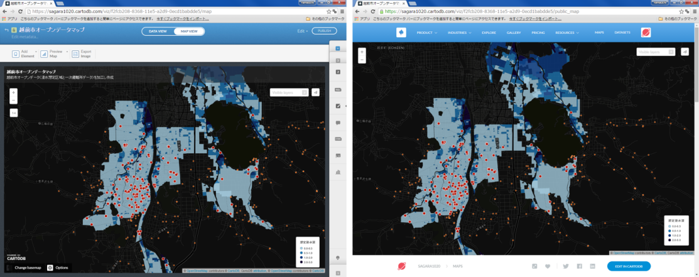  
地図のレイアウトを整え、ブラウザで表示する。

[▲メニューへもどる]  

**その他のライセンス**  
本教材で利用しているキャプチャ画像の出典やクレジットについては、[その他のライセンスについて]よりご確認ください。
[その他のライセンスについて]:../その他のライセンスについて.md
