# GitHubビギナーズマニュアル

本サイトで公開している教材は、GitHubで管理しています。
GISソフトウェアのバージョン変更により、本教材が対応しない場合に利用者による教材の修正案の提出が可能になります。また、教材修正の要望や質問投稿などが行えます。
以下では、GitHubの基本操作と本教材の変更方法（Pull request）や質問投稿(Issue)について解説しています。
教材変更や質問投稿についてのみ知りたい場合は、Pull requestによる教材の変更とIssueによる投稿を参照してください。

本教材を使用する際は、[利用規約]をご確認いただき、これらの条件に同意された場合にのみご利用下さい。

[利用規約]:https://github.com/yamauchi-inochu/demo/blob/master/利用規約.md

**Menu**
------
- [GituHubとは？](#GitHubとは？)
- [GitHubアカウントの取得](#GitHubアカウントの取得)
- [用語の解説](#用語の解説)
- [クライアントソフトのインストール](#クライアントソフトのインストール)
- [Repositoryの作成](#Repositoryの作成)
- [gh-pagesを作成する](#gh-pagesを作成する)
- [Repositoryをcloneする](#Repositoryをcloneする)
- [Pull_requestによる教材修正の提案](#Pull_requestによる教材修正の提案)
- [Issueによる投稿](#Issueによる投稿)

**スライド教材**
スライドのダウンロードは[こちら]
[こちら]:https://github.com/yamauchi-inochu/demo/raw/master/Markdown/インターネットの活用に関する教材/GitHubビギナーズマニュアル/GitHubビギナーズマニュアル.pptx


----------

## <a name=GitHubとは？>GitHubとは？
- Git(バージョン管理システム)をホスティングするサービス
- 複数人による開発（リモート作業）が可能
- コラボレーションツールによる、円滑なコミュニケーション
- web開発や出版などにも活用されている

>塩谷啓,紫竹佑騎,原一成,平木聡（2014）『Web制作者のためのGitHubの教科書 チームの効率を最大化する共同開発ツール』を参考に作成

[▲メニューへもどる]  
[▲メニューへもどる]:GitHubビギナーズマニュアル.md#menu

## <a name =GitHubアカウントの取得>GitHubアカウントの取得

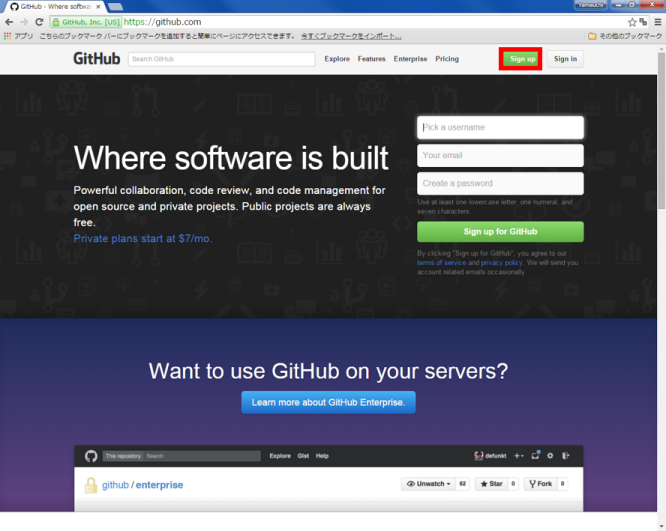  
[GitHubのサイト]にアクセスしてアカウントを作成する。
ページ右上の「Sign up」をクリックする。
[GitHubのサイト]:https://github.com

  
Free を選択し、「Finish sign up 」をクリックする。

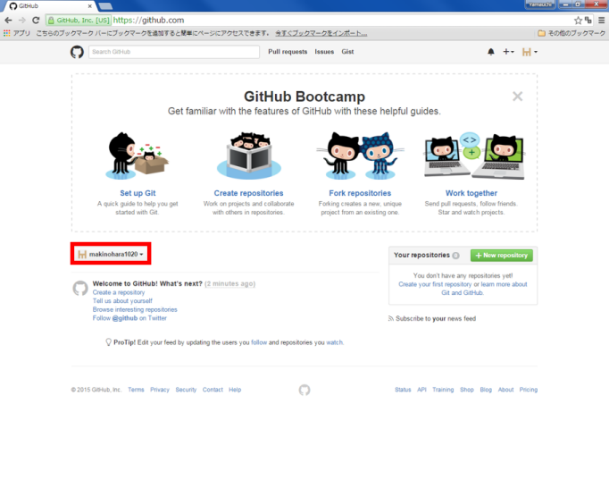  
GitHubアカウントが作成できた。登録したメールアドレス宛に、確認メールが届いているためそれを開き、「Verify email address」をクリックする。

[▲メニューへもどる]  

## 用語の解説
GitHubの操作中に良く出ている言葉を以下にまとめている。


- repository　・・・　プロジェクトが保存される場所、ローカルリポジトリとリモートリポジトリがある。

- fork　・・・　他人のリモートリポジトリを自分のリモートリポジトリにコピーすること。

- branch　 ・・・ プロジェクトを分割したもの、branchをつくることで複数人による同時編集を効率化する。

- clone　・・・　他人もしくは、自分のリモートリポジトリを複製して、ローカルリポジトリにコピーすること。

- commit　・・・　ファイルの変更履歴をまとめて記録すること。

- push　・・・　ローカルリポジトリの編集をリモートリポジトリに反映させること。

- Pull Request　 ・・・　自分の変更を別のリモートリポジトリにマージしてもらうための依頼。

- merge　 ・・・　複数のブランチとコミットをまとめ一つにすること。

- Issue　・・・　作業の進度や疑問点などを報告するためのコミュニケーションの場。  

>塩谷啓,紫竹佑騎,原一成,平木聡（2014）『Web制作者のためのGitHubの教科書 チームの効率を最大化する共同開発ツール』を参考に作成

[▲メニューへもどる]  
## クライアントソフトのインストール

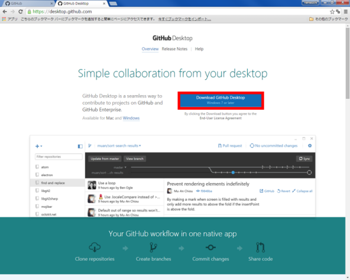  
https://desktop.github.comにアクセスし、クライアントソフトをインストールする。
クライアントソフトは、他にもあるため、環境や作業感に合わせて使いやすいものを選択する。

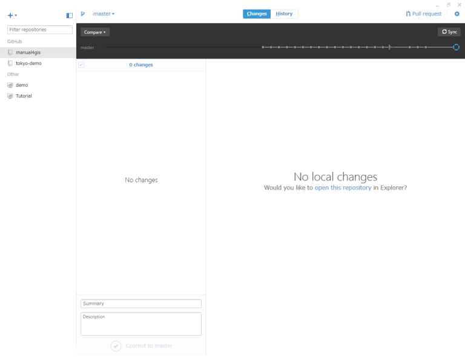  
インストールしたクライアントソフトを起動するとこのような画面が表示される。
※指定した場所にGitHubフォルダーが作成され、そのフォルダーの変更内容がクライアントソフトと連動する。

[▲メニューへもどる]  

## <a name=Repositoryの作成>Repositoryの作成
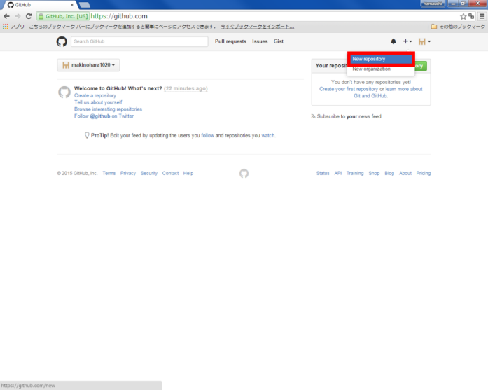  
+ボタンをクリックし、「New repository」を選択する。

  
Repository nameを入力し、READMEをチェックし、「Create Repository」をクリックする。
echizenとい名前のrepositoryが新規に作成された。

[▲メニューへもどる]  

## <a name=gh-pagesを作成する>gh-pagesを作成する
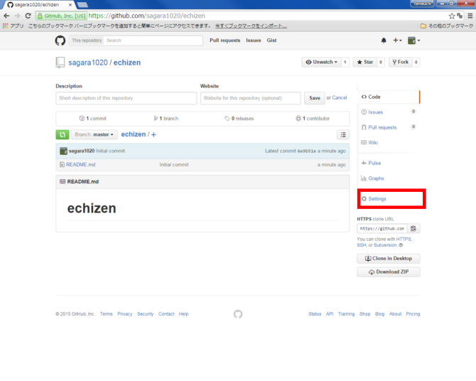  
Repositoryの設定（Settings）をクリックし、gh-pagesのブランチを作成する
※ gh-pages　Webサイトとして表示できる機能　

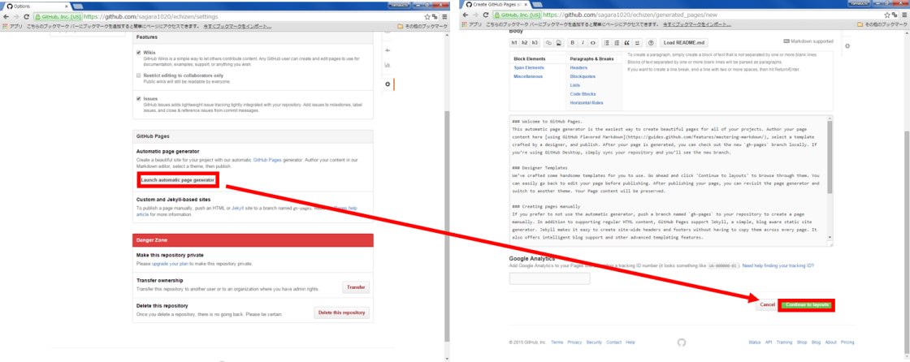  
「Launch automatic page generator」 をクリックし、
「Continue to layouts」 をクリックする。

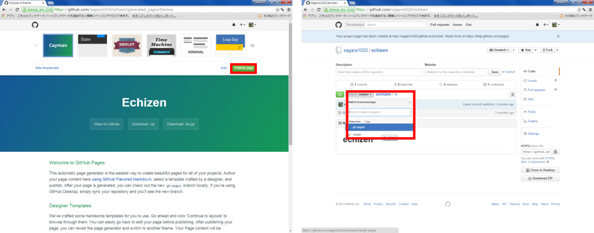  
「Publish page」をクリックすると、新規にgh-pagesというブランチができている。

[▲メニューへもどる]  

## repositoryをCloneする
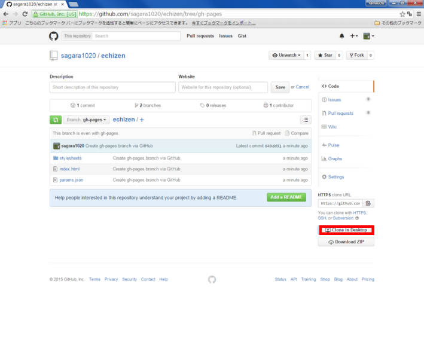  
「Clone In Desktop」 をクリックし、ローカルに複製する。
※repositoryの編集は、ローカルだけでなくweb上でも編集が可能。
 
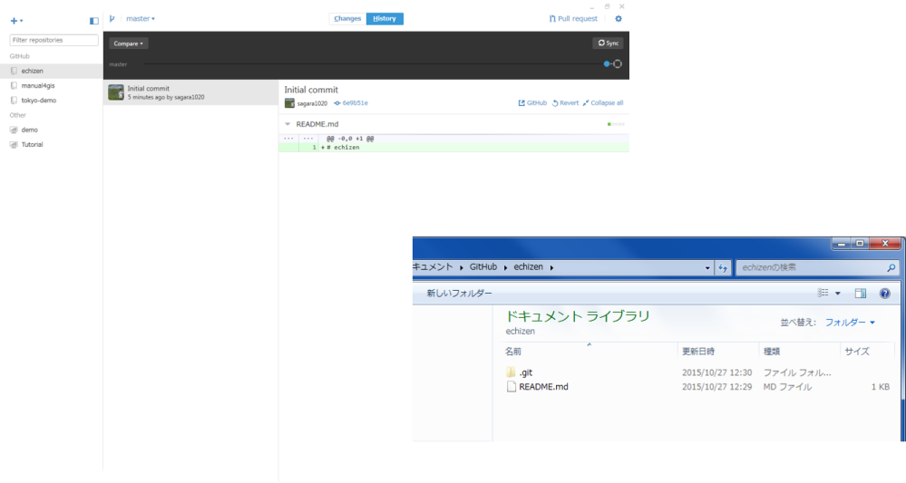  
クライアントソフトが自動的に立ち上がるので、複製するディレクトリを選択する。
※　自動で立ち上がらない場合は、手動でクライアントソフトを立ち上げる。

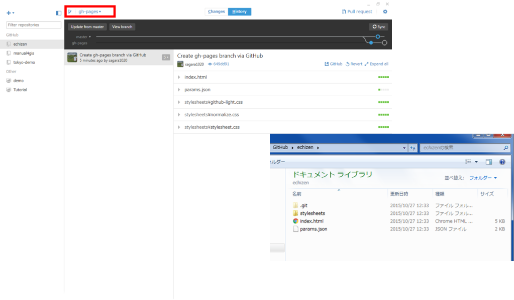  
クライアントソフトに追加されたことを確認し、masterからgh-pagesに切り替える。
切り替えに伴って、ローカルに複製したrepository（フォルダ）の内容が変更することを確認する。

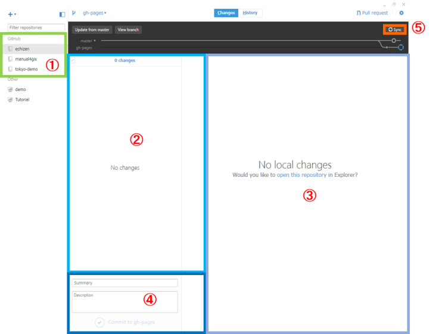  
①ローカルに複製したリポジトリが表示される  
②リポジトリの編集が表示される  
③リポジトリの内の編集の詳細が表示される  　　④Webのリポジトリに繁栄させるため、ローカルの変更内容をタイトルと詳細として記入する（コミット）  
⑤Webのリポジトリに変更内容を反映させる（push）  

### repositoryの編集
練習として、画像ファイルをリポジトリに追加し、webで表示する。
（ローカル環境での編集について解説している。）
  
リポジトリを複製したディレクトリを開き、中身を確認する。

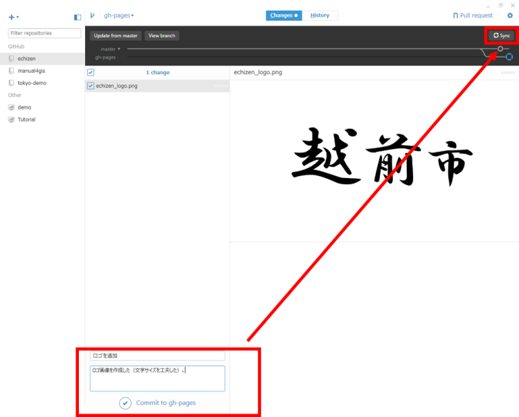  
画像を追加したことが、クライアントソフトに表示される。
コミットメッセージを入力し、 「Commit to gh-pages」をクリックし、 「Sync」 をクリックする。

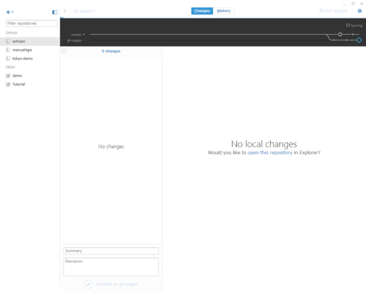  
「Sync」が完了すると、デフォルトの画面が表示される。
（Webのリポジトリにローカルの編集内容が反映されている）

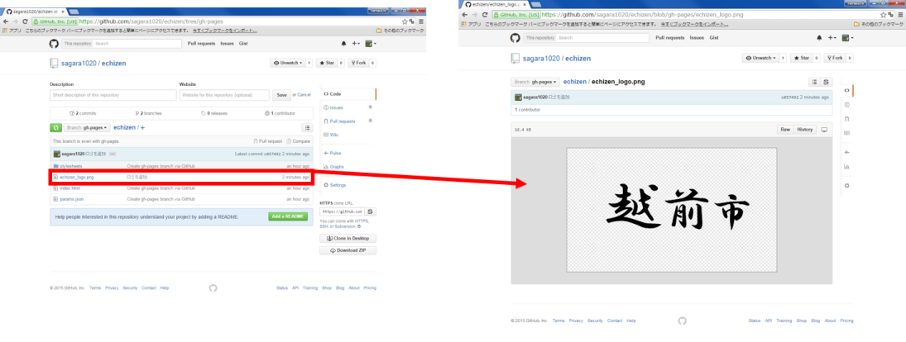  
GitHubで作成したリポジトリにアクセスし、画像が追加されていることを確認する

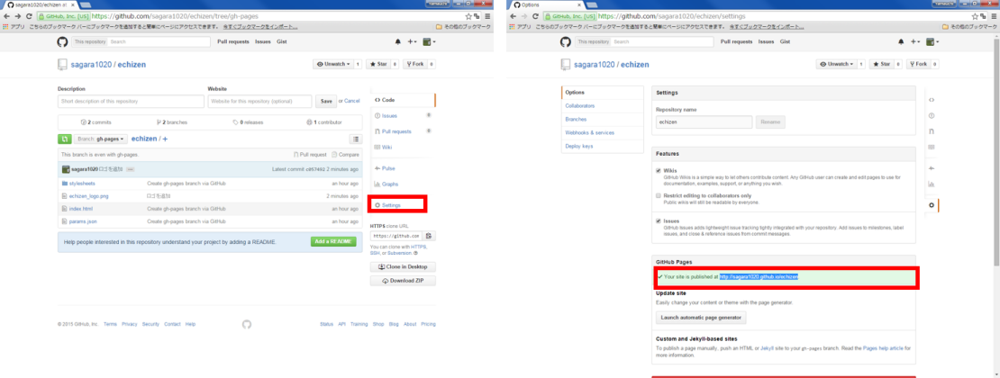  
「Settings」をクリックし、アドレスをコピーし、画像のタイトルと拡張子をつけ、Webブラウザで検索する。
```
 http://（ユーザー名）.github.io/echizen/echizen_logo.png
```
  
Webに画像がアップロードされていることを確認できた
※　gh-pagesを利用した、WebでのGISデータの公開などについては、別ページで解説している。

[▲メニューへもどる]  

## <a name = Pull_requestによる教材修正の提案>Pull_requestによる教材修正の提案

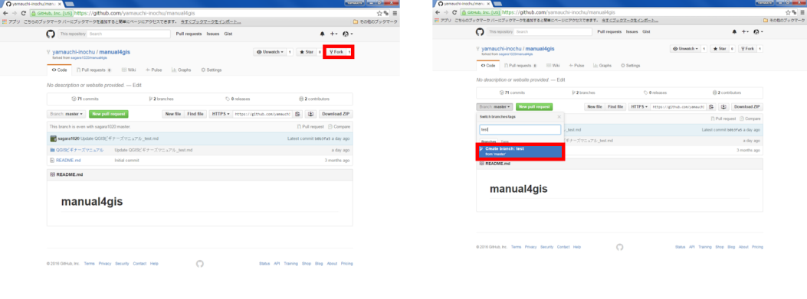  
GitHubで教材ページのリポジトリを開く。
「Fork」をクリックすると自分のリポジトリにコピーされる。
自分のリポジトリに戻り、Forkしたリポジトリを開き、branch名を入力し、編集用のbranchを作成する。

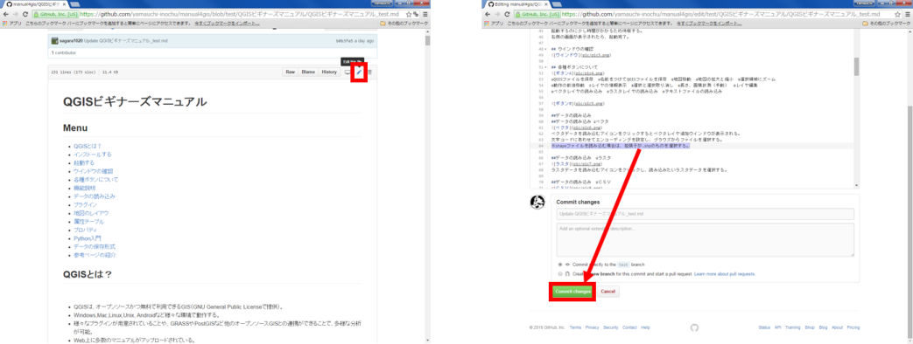  
作成したbranch内の.mdファイルを開き、編集を行う。
今回は、ベクタの読み込みに一文追加している。
編集終了後に、Commit changes をクリックする。

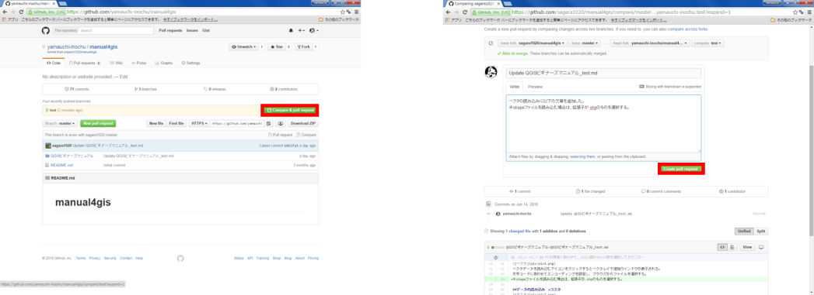  
編集用のリポジトリに戻り、Compare & Pull requestをクリックする。
編集内容を入力し、Create pull request をクリックする。

  
管理者によってPull requestがマージされると右のような画面が表示される。  
ForkしたリポジトリをSettingsから削除する。

※ forkしたリポジトリは、fork元のリポジトリの変更は反映されないため、GitコマンドかSourcetreeの追跡機能を利用することを推奨（[Sourcetreeビギナーズマニュアル]を参照）。
もしくは、本教材と同じく、編集ごとにForkしたリポジトリを削除する。　　
[Sourcetreeビギナーズマニュアル]:Sourcetreeビギナーズマニュアル.md
[▲メニューへもどる]  

## <a name = Issueによる投稿>Issueによる投稿

  
教材ページのリポジトリへいきNew issueをクリックし、issueを立ち上げる。
質問や要望などを入力し、submit new issueをクリックする。

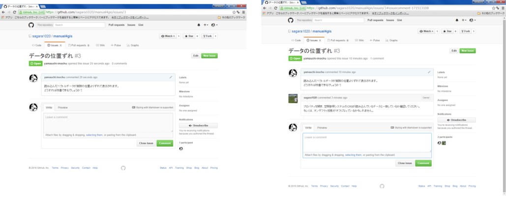  
質問や要望への返答は右の画面のように表示される。
issueでは、画像を送ることも可能。

[▲メニューへもどる]  
