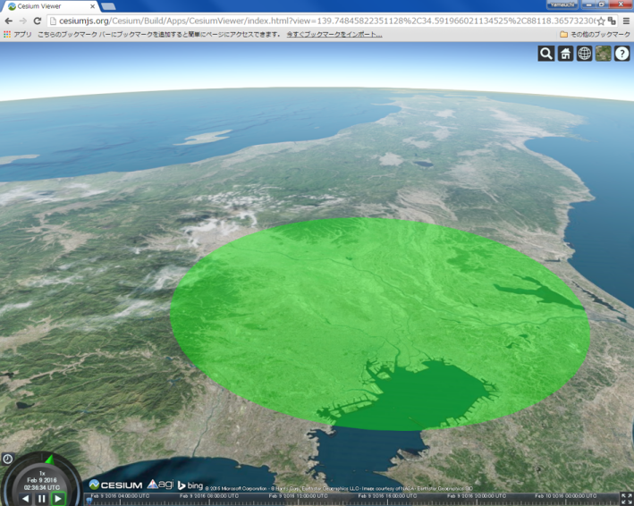
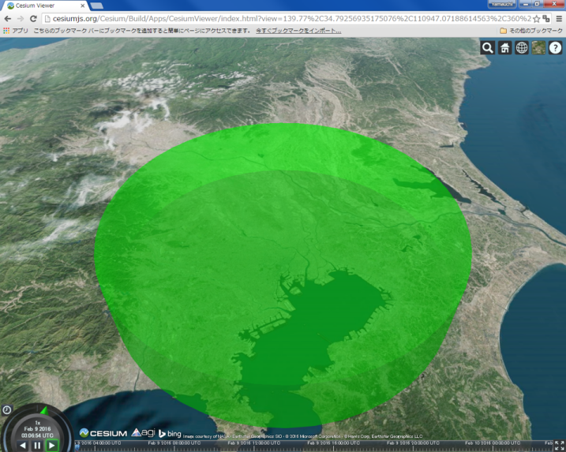
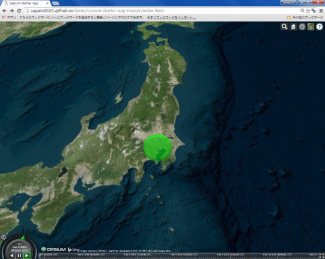
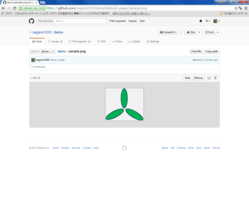
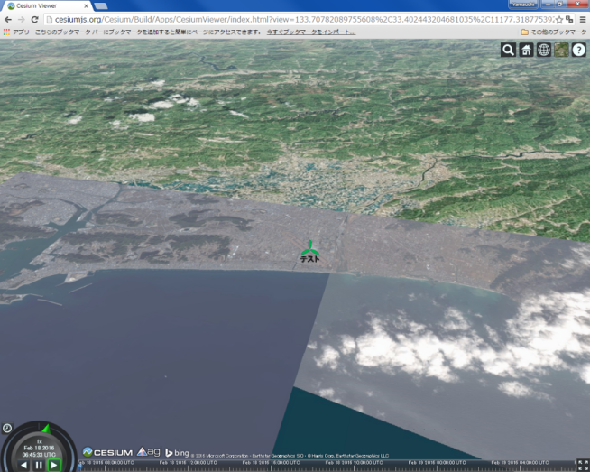
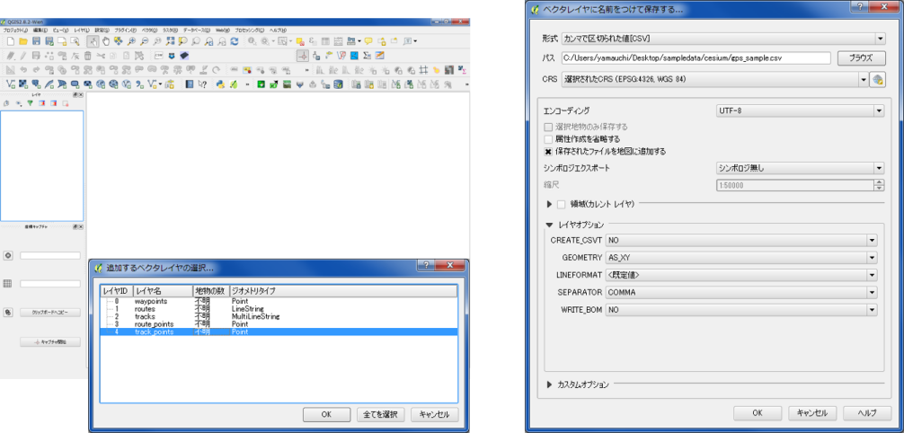
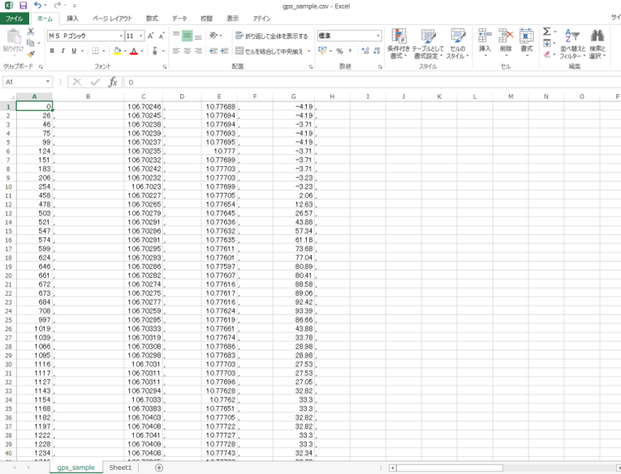
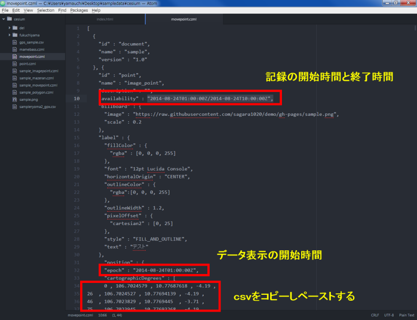
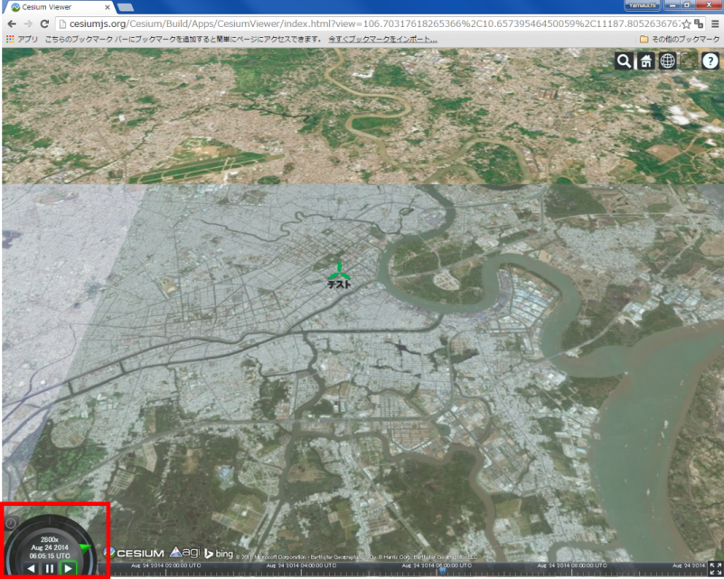

# CZML入門
本教材は、Cesiumで利用できるCZMLファイルの利用手法について解説したものです。cesium viewerを用いて、データの表示、時間によるアニメーションなどを行います。  
コードの解説は[スライド教材]を参照。

本教材を使用する際は、[利用規約]をご確認いただき、これらの条件に同意された場合にのみご利用下さい。

[スライド教材]:https://github.com/yamauchi-inochu/demo/raw/master/Markdown/インターネットの活用に関する教材/czml入門/czml入門.pptx
[利用規約]:https://github.com/yamauchi-inochu/demo/blob/master/利用規約.md

**Menu**
-------
* [CZMLとは?](#CZMLとは?)
* [CZMLでポリゴンを表示する](#CZMLでポリゴンを表示する)
* [Cesiumで実装する](#Cesiumで実装する)
* [オリジナルのアイコンによるポイント表示](#オリジナルのアイコンによるポイント表示)
* [時間によるアイコンの移動](#時間によるアイコンの移動)

------
## <a name = CZMLとは?>CZMLとは?

* CZMLは、Cesiumでデータを表現する際に利用できる。
* JSON形式を基本としているため、軽量。
* 時間の経過による地物変化を表現できる。
* 読み書きしやすく、コンパクトに記述できる。
* オープンフォーマット
* CZMLの活用や詳細については、GitHubで公開している。

> https://github.com/AnalyticalGraphicsInc/cesium/wiki/CZML-Guideを参考に作成

## <a name = CZMLでポリゴンを表示する>CZMLでポリゴンを表示する
### 東京駅から半径25ｋｍ圏をCZMLで作成する
以下のコードをコピーし、テキストファイルを作成する。  
拡張子を.czmlとして保存する。


```
[{
   "id" : "document",
   "name" : "CZML",
   "version" : "1.0"
 },
 {
   "id" : "shape1",
   "name" : "TOKYO",
   "position" : {
     "cartographicDegrees" : [139.77, 35.68, 20000.0]
   },
   "ellipse" : {
     "semiMinorAxis" : 50000.0,
     "semiMajorAxis" : 50000.0,
     "height" : 20000,
     "material" : {
       "solidColor" : {
         "color" : {
           "rgba" : [0, 255, 0, 100]
         }
       }
     },
     "outline" : true,
     "outlineColor" : {
       "rgba" : [255, 0, 0, 0]
     }
   }
 }]

```



[ビューワー]を開き.czmlをドラックアンドドロップする。  
東京駅から25km圏が表示できた（高さを保持していることを確認しておく）。

[ビューワー]:http://cesiumjs.org/Cesium/Build/Apps/CesiumViewer/index.html

### 3Dポリゴンの作成

```
"extrudedHeight" : {
      "number" : 20000.0
    },
    "rotation" : {
      "number" : 0.8
    },
```

“height” : 20000,を削除し上のコードを追加する。


ビューワーを開き.czmlをドラックアンドドロップする。  
3Dポリゴンが作図できたことを確認する。

## <a name = Cesiumで実装する>Cesiumで実装する


```
var czml = [{
   "id" : "document",
   "name" : "CZML",
   "version" : "1.0"
 },
 {
   "id" : "shape1",
   "name" : "TOKYO",
   "position" : {
     "cartographicDegrees" : [139.77, 35.68, 20000.0]
   },
   "ellipse" : {
     "semiMinorAxis" : 50000.0,
     "semiMajorAxis" : 50000.0,
     "extrudedHeight" : {
       "number" : 20000.0
     },
     "rotation" : {
       "number" : 0.8
     },
     "material" : {
       "solidColor" : {
         "color" : {
           "rgba" : [0, 255, 0, 100]
         }
       }
     },
     "outline" : true,
     "outlineColor" : {
       "rgba" : [255, 0, 0, 0]
     }
   }
 }];
var viewer = new Cesium.Viewer('cesiumContainer');
viewer.dataSources.add(Cesium.CzmlDataSource.load(czml));
```
## オリジナルのアイコンによるポイント表示
PowerPointやペイントなどを利用し、図を作成する（拡張子は.png or .jpg）
サイズは200×200ピクセル程度で作成する。

作成した画像をGitHubなどでwebにあげておく。
画像のurlを取得する。
GitHubの場合は、RAWをクリックしURLをコピーする。

```
[{
    "id" : "document",
    "name" : "sample",
    "version" : "1.0"
  }, {
    "id" : "point",
    “name” : “名称を記述する",
    “description” : “ポイントの詳細を記述する。",
    "billboard" : {
      “image” : “コピーしたURLを貼り付ける",
      "scale" : 0.2
    },
    "label" : {
      "fillColor" : {
        "rgba" : [0, 0, 0, 255]
      },
      "font" : "12pt Lucida Console",
      "horizontalOrigin" : "CENTER",
      "outlineColor" : {
        "rgba":[0, 0, 0, 255]
      },
      "outlineWidth" : 1.2,
      "pixelOffset" : {
        "cartesian2" : [0, 25]
      },
      "style" : "FILL_AND_OUTLINE",
      "text" : "テスト"
    },
    "position" : {
      "cartographicDegrees": [
        133.672028,33.544614,200
      ] }}]
```
コードをコピーし必要な箇所(日本語の箇所)
を変更後、.czmlで保存する。


ビューワーを開き.czmlをドラックアンドドロップする。
作成したイメージが位置情報を持って表示されている。

## 時間によるアイコンの移動


.gpxファイルをQGISに、ドラックアンドドロップする。  
「ベクタレイヤに名前をつけて保存する」から、CSVファイルで保存する。


.gpxファイルをQGISに、ドラックアンドドロップする。
「ベクタレイヤに名前をつけて保存する」から、CSVファイルで保存する。  
A列に秒（何秒で移動するか）をC列に経度、E列に緯度、G列に標高を追加する。全体をコピーする。


ポイントの表示に使用したczmlファイルを開き、赤枠の箇所を追加する。


タイマーの速度を変更すると、アイコンの動く速度が変化する。

[▲メニューへもどる]
[▲メニューへもどる]:czml入門.md#menu
